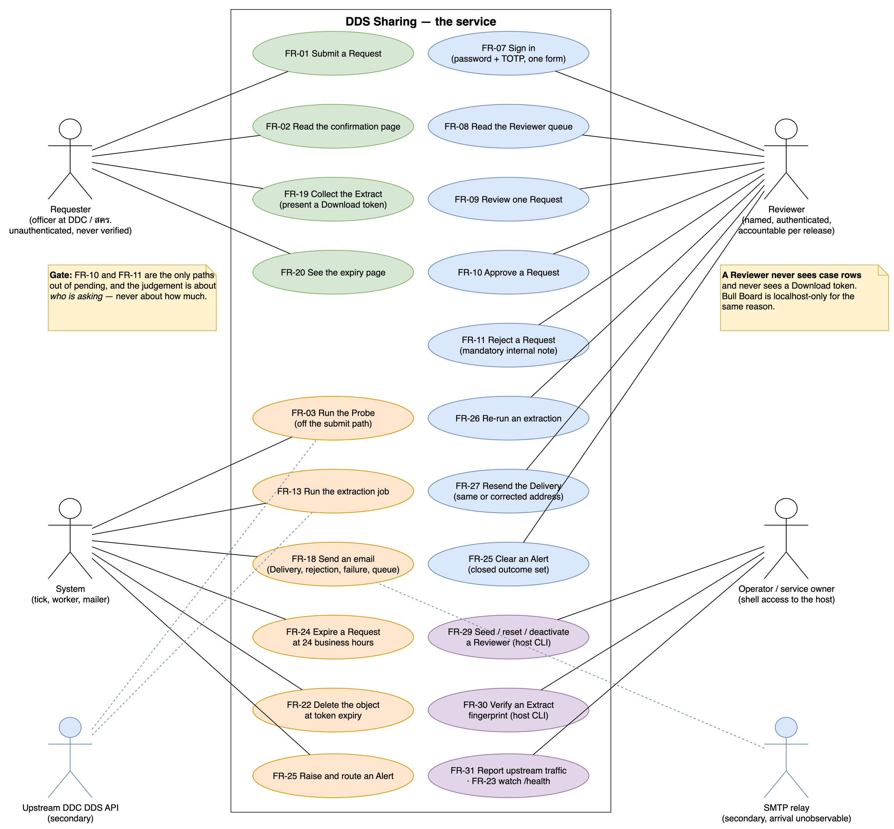
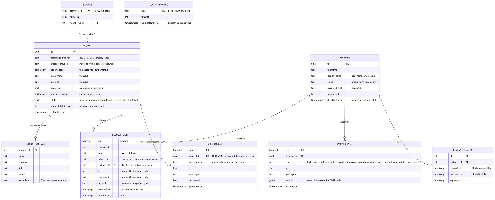
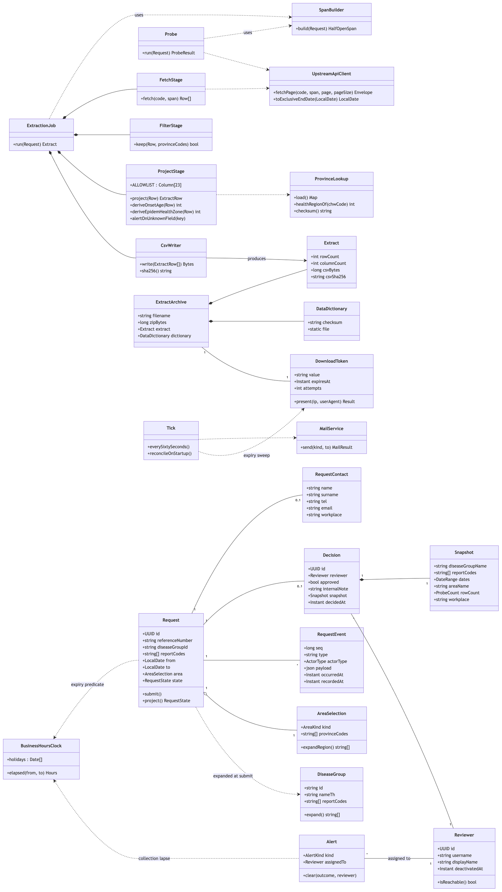
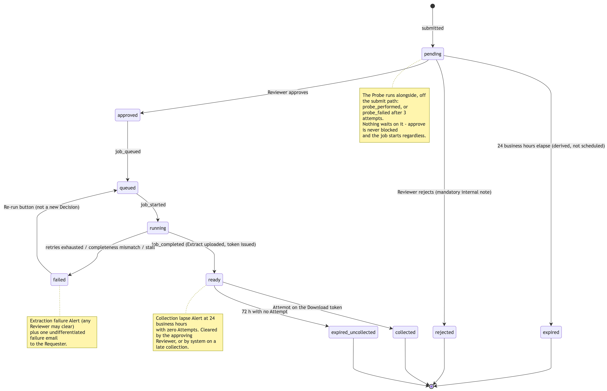
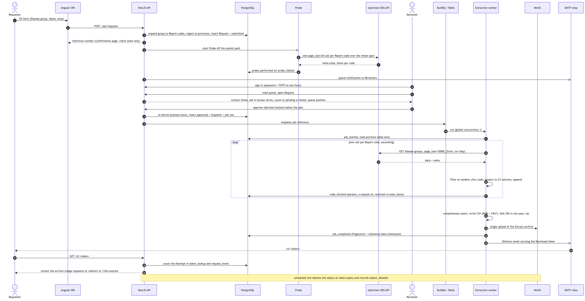
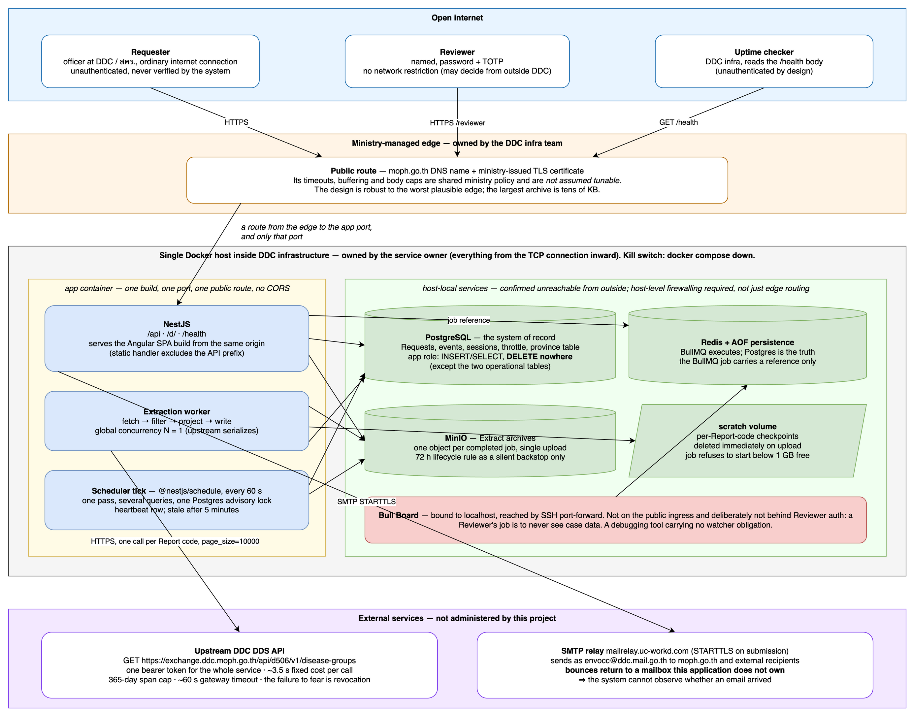

# Software Requirements Specification — DDS Sharing

**Product:** DDS Sharing (`DDS-ENVOCC-Sharing`) — a web application for requesting
de-identified, case-level extracts of Thai DDC (กรมควบคุมโรค) **DDS**
occupational- and environmental-disease surveillance data.

| | |
|---|---|
| **SRS version** | 1.0 |
| **Date** | 2026-09-03 |
| **Status** | Derived. Adds no requirement that is not already decided in the repository. |
| **Derived from** | [`docs/spec.md`](spec.md) v1.1 (2026-09-02) · [`CONTEXT.md`](../CONTEXT.md) · [`docs/adr/0001`–`0008`](adr/) · [`docs/disease-groups.md`](disease-groups.md) · [`docs/research/003-disease-group-codes.md`](research/003-disease-group-codes.md) · [`docs/project-charter.md`](project-charter.md) · closed issues [#2](https://github.com/rawinan-soma/dds-sharing/issues/2)–[#34](https://github.com/rawinan-soma/dds-sharing/issues/34) on [Map #1](https://github.com/rawinan-soma/dds-sharing/issues/1) |
| **Authority** | `spec.md` is the authoritative specification and `CONTEXT.md` is the canonical glossary. **Where this SRS and either of them disagree, they win and the disagreement is a bug in this document — report it.** This SRS restates their content in SRS form; it does not amend them. |

> **This document invents nothing.** Every requirement below traces to a section
> of `spec.md`, an ADR, or a closed issue, and the trace is printed on the
> requirement. Where the repository has genuinely not decided something, it is
> listed in [§6.4 Open questions](#64-open-questions) rather than guessed at.

---

## 1. Introduction

### 1.1 Purpose of the software

Officers at DDC and the regional disease-control offices (สคร.) need **case-level**
DDS occupational- and environmental-disease (EnvOcc) surveillance data to do
surveillance work: situation assessment, trend and signal detection, targeting
interventions, programme evaluation, regional operational work, and statutory
reporting under พ.ร.บ.ควบคุมโรคจากการประกอบอาชีพและโรคสิ่งแวดล้อม พ.ศ. 2562. Every one of
those uses is a cross-tabulation the analyst does not know in advance, which is
why the product is a **line list — one row per reported event** — and not a
pre-aggregated report or a dashboard.

Today there is no route to that data that is at once usable, safe and
accountable (`project-charter.md`, *Problem or issue*):

1. **The request process is manual and undocumented.** Two administrators handle
   requests by hand; there is **no record of who released what to whom**, and no
   named person is accountable for any individual release.
2. **De-identification is done by hand, or not at all.** The upstream record
   carries encrypted names and national ID, plaintext passport number, address,
   village, sub-district, point coordinates and free-text clinical prose.
   Removing these correctly *and identically every time* is not something a
   manual process can guarantee.
3. **The upstream API cannot be used naively.** It costs ~3.5 s per call
   near-independently of rows returned, paginates by `OFFSET` with a ~60 s
   gateway timeout, and hard-caps a date range at 365 days. Every requester who
   tries meets these alone.
4. **There is a real disclosure risk if this is done casually.** A careless
   extract is a disclosure that cannot be recalled.

**The purpose of this software is to replace that manual favour with a
predictable, auditable, human-gated release path**, in which:

- **a named human reads and decides every Request before any data is fetched**;
- **de-identification is a strict allowlist enforced in code** — 23 columns,
  never a judgement call;
- **surveillance data is never stored at rest** — fetched live, projected in
  memory, written only after de-identification;
- the Extract is delivered as **one zipped CSV through a time-limited link in an
  email, and destroyed 72 hours later**;
- **the release is recorded permanently** so it can be audited years later.

The software is **retrieval infrastructure for a surveillance scheme that already
exists** — the missing return path in a cycle whose collection arm is already
instrumented. It does not change what is reported, add a surveillance code, or
alter the พ.ร.บ. scheme in any way.

### 1.2 Document conventions

**Vocabulary.** Capitalised domain terms — **Requester, Reviewer, Request,
Decision, Workplace, DDS, Disease group, Report code, Extract, Extract archive,
Data dictionary, Derived column, Span builder, Probe, Download token, Attempt,
Delivery, Send failure, Collection lapse, Extraction failure, Alert, Re-run, Area
selection, Duplicate suppression, Request event, Reviewer event, Actor, Snapshot,
Extract fingerprint, Redaction** — mean exactly what
[`CONTEXT.md`](../CONTEXT.md) says they mean, including the words it rules out.
They are not redefined here; [§6.1](#61-glossary) is an index back to it.

**Thai domain terms are kept where the repository keeps them** (สคร., เขตสุขภาพ,
รพ.สต., รหัสรายงานโรค, กรมควบคุมโรค, the ten Disease group names). English prose
around them is this document's own.

**Requirement identifiers.**

| Prefix | Meaning | Stability |
|---|---|---|
| `FR-nn` | Functional requirement (§4) | Stable. Referenced by the use-case diagram and the traceability matrix. |
| `NFR-nn` | Non-functional requirement (§5) | Stable. |
| `OQ-nn` | Open question (§6.4) — **not** a requirement | Closes when the repository decides it. |

**Modal verbs.** *Must* / *shall* = mandatory. *Must not* = prohibited. *May* =
genuinely optional. **There are no "should"s in §4 and §5**: the repository
decided each of these, so a soft verb would misrepresent it.

**Source citations.** Every requirement carries a **Source** line naming the
`spec.md` section, ADR and/or issue number it comes from. `§n` without
qualification means a section of `spec.md`.

**⚠️ *Do not "fix" this*.** The specification marks several decisions that read as
bugs to a competent implementer and are not. This SRS reproduces those marks
verbatim in the requirement they belong to. A change to any of them is a
reopening of the decision that made it, not a defect fix.

**Numbers.** All volumetric figures are the measured ones from
[#33](https://github.com/rawinan-soma/dds-sharing/issues/33) (2026-09-02). Figures
from the pre-#33 model — 1.14 M rows, 10–25 minutes, 20–30 MB, ~5 GB — are
**withdrawn** and appear in this document only where they are explicitly labelled
as withdrawn.

**Times and dates.** Stored UTC, rendered ICT (Asia/Bangkok). The business-hours
clock is defined in ICT. The reference number renders a Buddhist-era year.

### 1.3 Scope

#### 1.3.1 In scope

| # | In scope | Source |
|---|---|---|
| S1 | A **Thai-language web application**, internet-facing, on a single Docker host inside DDC infrastructure, reached through the ministry-managed edge | §1, §3.1, §17.4, [#13](https://github.com/rawinan-soma/dds-sharing/issues/13), [#16](https://github.com/rawinan-soma/dds-sharing/issues/16) |
| S2 | An **unauthenticated Requester surface** at `/` and an **authenticated Reviewer surface** at `/reviewer`, on the same app, the same build and the same public ingress | §3.1, §16.1–§16.2, [#26](https://github.com/rawinan-soma/dds-sharing/issues/26) |
| S3 | **Human approval of every Request** by a named Reviewer before any data is fetched | §3.2, §10, [#1](https://github.com/rawinan-soma/dds-sharing/issues/1) |
| S4 | **De-identification to a fixed 23-column allowlist**, geography no finer than district (`amp_code`), governed by six standing rules | §6, [#2](https://github.com/rawinan-soma/dds-sharing/issues/2), [#14](https://github.com/rawinan-soma/dds-sharing/issues/14), [#21](https://github.com/rawinan-soma/dds-sharing/issues/21), [#24](https://github.com/rawinan-soma/dds-sharing/issues/24), [#30](https://github.com/rawinan-soma/dds-sharing/issues/30) |
| S5 | **Live extraction from the upstream DDC DDS API** — one call per Report code over the Request's whole span, sequential, global concurrency 1 | §5, §7, §13.2, [ADR 0008](adr/0008-the-pipeline-is-sized-for-one-page.md) |
| S6 | **One zipped CSV per approved Request** (Extract + Data dictionary), delivered by an emailed Download token, expiring and deleted at 72 hours | §8, §9, [#9](https://github.com/rawinan-soma/dds-sharing/issues/9), [#25](https://github.com/rawinan-soma/dds-sharing/issues/25) |
| S7 | A **permanent, append-only audit record** of Requests, Decisions, upstream traffic, Deliveries and download Attempts | §12, [#10](https://github.com/rawinan-soma/dds-sharing/issues/10) |
| S8 | **Reviewer account management** — username + password + TOTP, minimum two reachable named Reviewers, CLI-seeded on the host | §17.5, [#18](https://github.com/rawinan-soma/dds-sharing/issues/18) |
| S9 | **Health endpoints and operational alerting** to two distinct watchers — the operator via `/health`, the approving Reviewer via must-clear Alerts | §14, [#27](https://github.com/rawinan-soma/dds-sharing/issues/27) |
| S10 | **Scheduled work** — one 60-second tick, the business-hours clock, object deletion, stall detection, derived expiry materialisation | §15, [#20](https://github.com/rawinan-soma/dds-sharing/issues/20) |
| S11 | **Host CLI commands** — Reviewer seeding / password reset / TOTP re-enrolment / deactivation, Redaction, fingerprint verification, upstream traffic report | §17.3, §17.5, §12.8, §8.4, §13.6 |
| S12 | **Build artefacts** — the static Thai/English Data dictionary CSV, the province seed migration, the Thai holiday config, a fake upstream dev harness | §17.3 |
| S13 | **Everything from the TCP connection inward** on the VM | §17.4 |

**The service's data scope is the 25 EnvOcc Report codes** — `201`–`224` plus
`501` — classified into **ten Disease groups** in
[`docs/disease-groups.md`](disease-groups.md). ⚠️ These 25 are *this service's
scope*, not upstream's vocabulary: the same endpoint also answers to the general
D506 notifiable-disease block (`02` acute diarrhoea, `301` tuberculosis, `601`
hepatitis B and more nobody has enumerated). **Adding a communicable-disease code
to the classification is a scope change, not a classification fix**
([#33](https://github.com/rawinan-soma/dds-sharing/issues/33), §4.9).

#### 1.3.2 Explicitly out of scope

Named so nobody adds them back without reopening the decision (§1.2,
`project-charter.md` *Outside of scope*).

| # | Out of scope | Why, and where it was declined |
|---|---|---|
| X1 | **Mechanical identity verification** — email-domain rules, staff-directory matching, a `workplace` picklist | The check is human judgement; a mechanical layer would be false comfort, not defence in depth. §1.2, §3.3, [#7](https://github.com/rawinan-soma/dds-sharing/issues/7) |
| X2 | **Reviewer editing of a Request before approval** | Approve or reject only. An editable Request breaks the audit chain: what was approved would no longer be what was asked. §10.3 |
| X3 | **Live job progress for the Requester** | The flow is fully asynchronous: submit → confirmation page → close the tab → email. §1.2, [#8](https://github.com/rawinan-soma/dds-sharing/issues/8) |
| X4 | **Ingesting or storing surveillance data at rest** | Premise 1. §1.1, §7.1 |
| X5 | **A gated case-level or tambon-granularity service for outbreak investigation** | A different service, with real authentication and a lawful basis per request. §1.2 |
| X6 | **Scraping resistance, per-client quotas, or any row cap** | §13.1–§13.3, [#5](https://github.com/rawinan-soma/dds-sharing/issues/5), [ADR 0007](adr/0007-the-reviewers-gate-is-identity-not-size.md) |
| X7 | **A fake upstream service as a product deliverable** | Required as an implementers' dev harness (§17.3), not part of the destination. [#6](https://github.com/rawinan-soma/dds-sharing/issues/6) |
| X8 | **Server-side rendering and prerendering** of the SPA | Rejected on all three of SSR's benefits. §16.1, [ADR 0003](adr/0003-plain-spa-and-a-collection-path-that-bypasses-it.md) |
| X9 | **Any retention or deletion job for the audit record** | Nothing is ever deleted. §12.7, [ADR 0004](adr/0004-personal-data-is-retained-indefinitely.md) |
| X10 | **Self-service password or email reset for Reviewers, and TOTP recovery codes** | The second Reviewer is the recovery mechanism; anything else is a written-down bypass. §17.5 |
| X11 | **A `mail_bounced` event and any bounce handling** | Bounces return to a mailbox the application does not own; an application-owned bounce mailbox was offered and declined. §11.1, §12.4, [ADR 0001](adr/0001-email-delivery-is-unobservable.md) |
| X12 | **The ministry-managed edge itself** | Owned by DDC infra; its timeouts, buffering and body caps are shared ministry policy and are **not assumed tunable**. §17.4 |
| X13 | **Multi-language UI** | Thai is the only language shown to a person. §16.3, [#26](https://github.com/rawinan-soma/dds-sharing/issues/26) |
| X14 | **A facility (hospital) reference list in this repository** | `hospital_code` ships raw; MoPH publishes the register openly. §6.7, [#23](https://github.com/rawinan-soma/dds-sharing/issues/23) |
| X15 | **Date-chunking, adaptive page sizing, a drain projection, or a submit-time size gate** | Removed by [ADR 0008](adr/0008-the-pipeline-is-sized-for-one-page.md). Do not reintroduce without new measurements. §7.2, §13.3 |
| X16 | **A PDPO consultation and a recorded PDPA §26 lawful basis for the Extract** | Ruled out of scope by the repo owner, by decision and not by oversight. §18.1, [#22](https://github.com/rawinan-soma/dds-sharing/issues/22) — carried as a risk, see [§6.3](#63-accepted-risks) |

### 1.4 Intended audience and reading order

| Reader | Read |
|---|---|
| **Implementer** | `CONTEXT.md` first, then `spec.md`, then this SRS as the requirement index and the ADRs for the reasoning behind anything that looks wrong |
| **Reviewer of the design** (DDC, legal, whoever owns the data agreement) | §1.3, §2.5, §5 (privacy and auditability), [§6.3](#63-accepted-risks) |
| **Project sponsor** | `project-charter.md`, then §1.1 and [§6.3](#63-accepted-risks) |
| **Operator** | §2.4, §3, FR-22 to FR-25, FR-28 to FR-31, NFR-05, NFR-11, NFR-19 to NFR-23, NFR-31, NFR-32 |

### 1.5 References

| Ref | Document |
|---|---|
| R1 | [`docs/spec.md`](spec.md) v1.1, 2026-09-02 — the authoritative specification, 19 sections |
| R2 | [`CONTEXT.md`](../CONTEXT.md) — the canonical glossary |
| R3 | [`docs/adr/0001`](adr/0001-email-delivery-is-unobservable.md)–[`0008`](adr/0008-the-pipeline-is-sized-for-one-page.md) — the eight ratified decisions |
| R4 | [`docs/disease-groups.md`](disease-groups.md) — the authoritative Disease group classification |
| R5 | [`docs/research/003-disease-group-codes.md`](research/003-disease-group-codes.md) — the Report code seed and its provenance |
| R6 | [`docs/provinces.csv`](provinces.csv) (77 rows), [`docs/districts.csv`](districts.csv) (929), [`docs/sub_districts.csv`](sub_districts.csv) (7,451) — geography reference data |
| R7 | [`docs/project-charter.md`](project-charter.md) — sponsor-facing charter (⚠️ written against `spec.md` v1.0; see [OQ-16](#64-open-questions)) |
| R8 | [`messages/th.json`](../messages/th.json) + [`project.inlang/settings.json`](../project.inlang/settings.json) — the normative Thai copy catalogue |
| R9 | Closed issues [#2](https://github.com/rawinan-soma/dds-sharing/issues/2)–[#34](https://github.com/rawinan-soma/dds-sharing/issues/34) on [Map #1](https://github.com/rawinan-soma/dds-sharing/issues/1) — the decisions and their rationale |
| R10 | `docs/DDS_Envocc_080169.pdf` — the primary DDC EnvOcc deck cited by R5. ⚠️ **Cited but not checked into this repository** ([OQ-17](#64-open-questions)) |
| R11 | MoPH facility register — <https://hcode.moph.go.th/> — the public route by which a reader resolves `hospital_code` (§6.7) |

---

## 2. Overall Description

### 2.1 Product perspective

DDS Sharing is a **new, self-contained product** — not a component of an existing
system and not a replacement for one. It sits beside the DDS scheme rather than
inside it, and it consumes the upstream DDC DDS API as a client holding one
bearer token issued for the whole service.

```
   DDS scheme (already built)                    DDS Sharing (this product)
   ─────────────────────────                     ──────────────────────────
   HIS API · Semi-Offline API      ┌────────►  Requester submits a Request
   DDS Portal key-in · vendor APIs │           Reviewer decides it
             │                     │           Extractor fetches it live
             ▼                     │           De-identifier projects it
   DDS collection / Data Hub ──────┘           Writer emits one CSV
             │      (GET /api/d506/v1/          Delivery emails a token
             ▼       disease-groups,            Object dies at 72 h
        DDS analytics              bearer)      Record survives for ever
```

Three properties of that position are load-bearing:

- **The collection arm of the surveillance cycle is instrumented; the analysis
  arm is not.** Every documented path *into* the upstream system is MoPH account
  / Provider ID RBAC, scoped to a reporting unit rather than to an analytic
  question, and there is **no de-identified case-level extract route at all**.
  This product is that route (`project-charter.md`, R5).
- **The product absorbs *upstream's* limits, not its own.** Strip away the
  365-day cap, the `OFFSET` timeout cliff and the ~3.5 s fixed request cost and
  the extraction pipeline collapses to a controller method (§1.1 premise 7). ⚠️
  **And the volumes are tiny** — 3,861 rows a year across the whole in-scope
  domain. The pipeline is shaped by upstream's *call cost and cliffs*, never by
  data size. A later reader will otherwise assume the complexity is
  self-inflicted.
- **The product is a weaker door than upstream's, deliberately.** Upstream is
  authenticated for everyone; the Requester surface here has no login, and a
  human gate stands where a credential would (§18.4).

**The eight premises the whole design rests on** (§1.1). An implementer who
quietly reverses one of them breaks something that is not local to the code they
are editing.

| # | Premise |
|---|---|
| P1 | **Surveillance data is never stored at rest.** Upstream responses are fetched live, projected in memory, and written only after de-identification. PostgreSQL holds Requests, parameters, timestamps and audit records — never case rows. |
| P2 | **De-identification is a strict allowlist**, and it is the safety control the whole service rests on. |
| P3 | **A human reads every Request before any data is fetched.** The gate is the second control, and it is an *accountability record, not a lawful basis*. |
| P4 | **The system cannot observe whether an email arrived.** A premise, not a caveat. |
| P5 | **Rate limiting is a load control on the upstream DDC relationship and on this server's disk. It is not a data-protection control.** |
| P6 | **"Data does not linger" is a claim about surveillance data only.** The patient-derived Extract is destroyed after 72 hours; the officer's telephone number is kept for ever. |
| P7 | **Everything the machinery does absorbs upstream's limits, not ours** — and the volumes are tiny. |
| P8 | **No PDPA §26 lawful basis and no DDC sign-off are on record**, by decision, not by oversight. |

### 2.2 Product functions

At the level of *what the product does*, in the order a Request meets them.
Each maps to the numbered functional requirements in §4.

| Function | Requirements |
|---|---|
| **Take an ask** — three parameters and five contact fields, on one unauthenticated scrolling page, validated server-side, expanded into stored Report codes and provinces, protected from double-posting | FR-01, FR-02, FR-04, FR-05, FR-06 |
| **Count it, off the critical path** — one `page_size=20` upstream call per Report code, purely to catch a Request whose codes matched nothing and to make reject-path traffic accountable | FR-03 |
| **Gate it on identity** — a named Reviewer authenticates, reads five unverified contact fields and the ask in human terms, and approves or rejects. Size never grounds the Decision | FR-07, FR-08, FR-09, FR-10, FR-11 |
| **Extract it** — release a job, fetch one call per Report code over one shared span, filter to the area, project to 23 allowlisted columns, assert completeness, write one CSV, zip it with the Data dictionary, fingerprint it, upload once | FR-12, FR-13, FR-14, FR-15, FR-16, FR-17 |
| **Deliver it** — one email carrying an unguessable, time-limited, attempt-capped Download token to a `/d/<token>` endpoint that bypasses the SPA entirely | FR-18, FR-19, FR-21 |
| **Destroy it** — 72 hours from job completion, by an application job that writes a deletion record, with the bucket lifecycle as a silent backstop only | FR-20, FR-22 |
| **Notice what went wrong** — `/health` for the operator, must-clear Alerts for the approving Reviewer, one undifferentiated failure email for the Requester, and a terminal `expired_uncollected` state so silence is measurable | FR-23, FR-24, FR-25 |
| **Repair it by hand** — Re-run, Resend, Redaction, Reviewer account lifecycle, fingerprint verification, upstream traffic accounting — each a deliberate human act, several of them gated behind shell access | FR-26, FR-27, FR-28, FR-29, FR-30, FR-31 |

**Two functions the product deliberately does not have**, restated here because
their absence is a decision: it does not tell a Requester how many rows they will
get (FR-01), and it does not tell a rejected Requester why (FR-11).

### 2.3 User classes and characteristics

| Class | Count | Authenticated | Characteristics | Frequency |
|---|---|---|---|---|
| **Requester** | Unbounded; officers at DDC and the 13 สคร., plus hospitals and universities that may legitimately ask | **No, and never verified.** The five contact fields are an audit record, never a credential | Reads Thai. Analyses in Excel, R or Python. Works from an ordinary internet connection, not a ministry VPN. No IT background assumed — the de-identification block exists because a Requester who never opens it files a name-less CSV as broken | Occasional. Submits, closes the tab, waits for email |
| **Reviewer** | **Minimum two reachable people**, enforced by the CLI, not merely documented | **Yes** — username + password + TOTP, named account, `display_name` is the person's real name | Today's two administrators, who stop assembling extracts by hand and spend minutes per Request on judgement. Accountable: their name goes permanently onto every release they approve. **Never sees case rows and never sees a Download token.** Unavailability converts directly into expired Requests | Daily during business hours |
| **Operator / service owner** | One, today the repo owner | **Shell access to the Docker host** — the bar for every privileged operation | Runs the host CLI commands, watches `/health`, resizes volumes, holds the kill switch, owns the DDC data agreement. ⚠️ Single-developer project: there is no second person who knows the system (`project-charter.md` R4) | As faults arise |
| **DDC infra team** | Small | n/a | Owns the VM and the registration of the public route through the ministry-managed edge. Consumes `/health` with an uptime checker | Provisioning, then rarely |
| **Incident reader** | Rare | Shell access | Operator, DDC or legal, months to years later: *an Extract surfaced where it should not — who collected it, did it come from here?* Uses FR-30 | Rare, high stakes |
| **Accountability reader** | Rare | Read access to the record | DDC, legal, or a future maintainer, years later: *who authorised this release?* The record must satisfy this reader, which is why it carries fields (IP, user agent) only the short-lived readers use | Years later |

**Two populations are told what is recorded about them**, on a surface they
actually see (§12.9): the **Requester** at submit, in one Thai sentence above the
form; the **Reviewer** at account seeding and once at first login — deliberately
**not** in the specification, which Reviewers never read.

### 2.4 Operating environment

| Layer | Environment |
|---|---|
| **Client** | Any modern browser on an ordinary internet connection. Thai UI. Downloaded Extracts are opened in **Excel** (primary), R or Python |
| **Edge** | Ministry-managed reverse proxy, public DNS name under `moph.go.th`, ministry-issued TLS certificate. **Production only** — no public hostname or ministry certificate exists during development |
| **Host** | A **single Docker host** (VM) inside DDC infrastructure. One container serving the app on one port, plus PostgreSQL, Redis, MinIO and the worker, none of them publicly reachable. NTP-synchronised |
| **Application** | **Angular SPA** (one build, no SSR, no prerendering) served by **NestJS** from the same origin as the API. **BullMQ on Redis (AOF)** executes jobs; **PostgreSQL** is the system of record; **MinIO** stores Extract archives; **Bull Board** bound to localhost |
| **Upstream** | `GET https://exchange.ddc.moph.go.th/api/d506/v1/disease-groups`, `Authorization: Bearer <token>`, one token for the whole service |
| **Mail** | `mailrelay.uc-workd.com` over STARTTLS on the submission port, sending as `envocc@ddc.mail.go.th`. **Mailpit covers development** |
| **Timezone** | Storage UTC; rendering and the business-hours clock ICT (Asia/Bangkok) |

### 2.5 Design and implementation constraints

**Imposed by upstream — absorbed, not chosen** (§5, §1.1 premise 7):

| # | Constraint | Consequence |
|---|---|---|
| C1 | **365-day maximum span** per call (`HTTP 400`) | The Request is capped at 365 days and **rejected, never split**. The message names the cap as upstream's |
| C2 | **`end_date` is exclusive** — the interval is half-open `[start, end)` | The API client adds one day on the wire and **nowhere else**. A second copy of that conversion once lost 3,196 rows |
| C3 | **~3.5 s fixed cost per call**, near-independent of rows returned | Request *count* is the cost driver. Always `page_size=10000`. Group *width* in Report codes sets the floor, not data volume |
| C4 | **`OFFSET` pagination with a ~60 s gateway timeout** — pages past ~50 are unreachable | Nothing in scope comes near it (the largest Request is one page). Handled by one loud failure, and by nothing else |
| C5 | **Concurrency buys nothing** — 8 concurrent calls degraded from ~3.9 s to ~14.3 s each | Extraction is sequential; global budget `N = 1`, and the config must record *why* |
| C6 | **`page_size` minimum 20** (undocumented), maximum 10,000 | Never emit below 20 |
| C7 | **An unknown `group_code` returns `200` with `data: []`** | A stale or mistyped code is indistinguishable from "no cases this period". This is why the picker is seeded and why the Probe's zero-row catch exists |
| C8 | **Unknown query parameters are silently ignored**; there is **no field-projection parameter** | Send only known-good names and assert `meta` echoes the ask. De-identification is **ours, post-fetch**: plaintext identifiers transit the extractor on every Request (never to disk) |
| C9 | **No fixed upstream schema** — 56–62 keys per group, 63 in union, varying even within one group by date range | The Extract's columns are the **allowlist**, fixed, absent fields written empty — never the observed response keys |
| C10 | **Two error-body shapes** — `{status, message}` and `{status, message, errors[]}` | The client must handle both |
| C11 | **The failure to fear is not a throttle** — no `429` was ever observed — but **DDC noticing our traffic and revoking the token**, which no retry recovers from | Upstream traffic must be accountable (FR-31) |

**Imposed by the environment** (§16.1, §17.4):

- The **ministry edge is not administered by this project** and is not a
  dependency. No setting on it is a precondition for the system working.
- **No public hostname and no ministry TLS certificate exist during
  development** — so the base URL is explicit configuration, never derived from
  the `Host` header.
- **Single Docker host**, one container, one port, one public route.
  `docker compose down` is the whole kill switch.
- **สคร. staff work from ordinary internet connections, not a ministry VPN** — so
  a network boundary is not available as a control.

**Imposed by decision:**

- **Thai is the only language shown to a person.** English survives as the
  message-key layer and in the Extract's column headers.
- **Nothing in the audit record is ever deleted.** No retention job, no deletion
  role, no `retention` health component.
- **Minimum two active Reviewers**, enforced by the CLI.
- **No real patient data ever seeds the dev harness.**
- **Reviewer passwords are 12–20 characters** — the ceiling is deliberate and is
  the binding constraint on password strength.
- **No account lockout, throttling only** — a lockout an anonymous stranger can
  trigger against a named account *is* the denial of service.
- **The copy is normative; the appearance is not** (the exact inverse of the
  ruling on styling).
- **No budget.** Internal staff time on existing DDC infrastructure.

### 2.6 Assumptions and dependencies

| # | Assumption | Status | Source |
|---|---|---|---|
| A1 | The existing DDC data agreement, together with the human approval gate, covers the release of de-identified case-level DDS data | ⚠️ **Unverified, and deliberately not tested.** No PDPO consultation was sought and no §26 basis is recorded | §18.1, [#22](https://github.com/rawinan-soma/dds-sharing/issues/22) |
| A2 | The 23-column allowlist, with geography no finer than district, renders the Extract non-personal for PDPA purposes | ⚠️ Unverified. The finest *effective* geography is narrower than the finest *named* geography | §18.2, [#21](https://github.com/rawinan-soma/dds-sharing/issues/21), [#23](https://github.com/rawinan-soma/dds-sharing/issues/23) |
| A3 | Indefinite retention of contact, network, accountability and staff-performance data is lawful on **legal obligation and legitimate interest** | Decided, recorded, with reasons. Consent was rejected on the merits | §12.7, [ADR 0004](adr/0004-personal-data-is-retained-indefinitely.md) |
| A4 | DDC infra provides a VM, a public route, a `moph.go.th` DNS name and a ministry TLS certificate | **Requested and verified after the fact — explicitly not preconditions** | §17.4, [#16](https://github.com/rawinan-soma/dds-sharing/issues/16) |
| A5 | The upstream DDS API remains available on its current contract and the token is not revoked | Measured 2026-08-27 and 2026-09-02. Revocation is the failure no retry recovers from | §5, §5.5 |
| A6 | Upstream `meta.total_items` is trustworthy as a completeness check | **Enforced**: a code whose received count disagrees fails the job and publishes nothing | §7.5 |
| A7 | Two named Reviewers are **reachable** during business hours | Reviewer unavailability converts directly into expired Requests. The two-account minimum is also the only TOTP recovery mechanism | §3.1, §17.5 |
| A8 | Requesters read Thai and analyse in Excel, R or Python | Drives the Thai-only UI, the BOM, and the Excel caveats | §16.3, §18.5 |
| A9 | A Requester's self-declared identity, checked by human judgement, is an adequate identity control | By decision — mechanical verification is a named non-goal | §1.2, §3.3 |
| A10 | `epidem_chw_code` is mandatory in DDS reporting, so the null case does not arise | **Instrumented rather than assumed**: count absences and raise an operational alert if non-zero | §4.4 |
| A11 | The current manual process has a measurable request volume and per-request effort | ⚠️ Not yet measured. Blocks the monetised benefit rows of the charter | `project-charter.md` A11 |
| A12 | A ministry-edge round trip carries an Extract archive successfully | Untestable before production; a first-deploy gate. The archive is tens of KB, so the margin is overwhelming | §17.4, [#33](https://github.com/rawinan-soma/dds-sharing/issues/33) |

**Dependencies:**

- **Upstream DDC DDS API** and its bearer token — no fallback exists.
- **The SMTP relay** — but the design *deliberately never requires email*: a dead
  mail path surfaces on `/health` and on the Reviewer-queue banner, both in-band.
- **`docs/provinces.csv`** as the seed of the province table, asserted at startup
  (77 rows + checksum) and treated as a **boot failure** when wrong.
- **`docs/disease-groups.md`** and `docs/research/003-disease-group-codes.md` as
  the only seed of the Disease group picker.
- **NTP on the host** — TOTP, the business-hours clock and the UTC/ICT rendering
  are all clock-dependent, and there is no email reset path.
- **The Thai holiday config file**, reviewed annually.

### 2.7 User documentation

The product ships very little prose documentation, deliberately: several of the
things a manual would say are instead **normative Thai copy in the UI** or **a
command on the host**.

| Artefact | Audience | Nature | Source |
|---|---|---|---|
| **The Data dictionary** — a static Thai/English CSV, 23 column rows **plus the Disease group classification**, checked into the repo and copied into **every** Extract archive under a fixed filename | Whoever opens the Extract | Build artefact, identical in every archive. Carries the `utf-8-sig` note for pandas readers | §8.2 rule 8, [#25](https://github.com/rawinan-soma/dds-sharing/issues/25) |
| **The Requester page copy** — the approval-gate notice, the open de-identification block, the 365-day cap notice attributed to upstream, the *"เคสที่ฉันสอบสวน"* framing, the email-typo warning, the retention sentence | Requester | **Normative.** `messages/th.json`; a change to a sentence is a change to a decision | §16.3–§16.4, [#11](https://github.com/rawinan-soma/dds-sharing/issues/11), [#26](https://github.com/rawinan-soma/dds-sharing/issues/26) |
| **The confirmation page** — reference number, restatement of the ask, the 24-business-hour promise, the telephone number | Requester | Must read as *you are done*, not as *something went wrong* | §16.4 |
| **The expiry page** — one sentence and the telephone number, **always identical** across all four states | Anyone presenting a dead token | Normative copy | §9.4 |
| **The seeding ceremony output** — one-time password, terminal QR, **and what is permanently recorded about this Reviewer** | Reviewer | Printed by the CLI; repeated once at first login | §12.9, §17.5 |
| **An operator runbook / handover** | Operator | Charter close-out deliverable | `project-charter.md` schedule |
| **`spec.md`, `CONTEXT.md`, the ADRs** | Implementers and design reviewers | Already delivered | R1–R3 |

> **What is deliberately not written:** a fingerprint-verification *procedure*
> (it is a command — a procedure performed by hand is how a wrong answer gets
> made under pressure, §8.4), and a Reviewer-facing statement of retention inside
> the specification (Reviewers never read it, §12.9).

### 2.8 Diagrams

Sources are draw.io files under [`docs/diagrams/`](diagrams/); each PNG embeds its
own editable XML, so opening the exported image in draw.io recovers the diagram.

#### 2.8.1 Use case diagram

Actors, the system boundary, and every functional requirement that a human or the
system itself initiates. Secondary actors — the upstream API and the SMTP relay —
are drawn in blue: the service depends on them and can observe neither's outcome
fully.



*Source: [`diagrams/use-case.drawio`](diagrams/use-case.drawio). The two notes on
it are requirements, not decoration: the gate judges **who is asking**
([ADR 0007](adr/0007-the-reviewers-gate-is-identity-not-size.md)), and a Reviewer
never sees case rows or a Download token (§10.8, §14.4).*

#### 2.8.2 Entity–relationship diagram

The persistent model. **No table holds case rows** — that is premise P1 expressed
as a schema. Note three deliberate shapes: `token_lookup.request_id` is
**nullable**, because an unknown token resolves to no Request; `request_contact`
is split from `request` so that every query except the Reviewer queue touches no
personal data; and `request_event` carries **two timestamps**, because a
late-materialised event must record both when the predicate became true and when
the row was written.



*Source: [`diagrams/erd.drawio`](diagrams/erd.drawio). Tables and columns from
§12.3; `reviewer_session` and the login-throttle table are the only two tables the
application role may `DELETE` from (§15.4).*

#### 2.8.3 Class diagram

The runtime model — the domain objects and the collaborating services. Two edges
carry decisions rather than structure: **`Probe` and `ExtractionJob` both depend
on the single `SpanBuilder`** (one expression of the date range, so the two can
never disagree — [ADR 0008](adr/0008-the-pipeline-is-sized-for-one-page.md)), and
**`CsvWriter` has no dependency on `ProjectStage`'s column semantics** (give the
writer column semantics and allowlist rule 6 is what gets violated later, §7.4).



*Source: [`diagrams/class.drawio`](diagrams/class.drawio).*

#### 2.8.4 Request lifecycle — state diagram

Every state a Request can occupy and every transition between them, including the
four terminal states. `expired_uncollected` is distinct from `collected` on
purpose: **it is the only number that measures whether email is working** (§11.5).



*Source: [`diagrams/state.drawio`](diagrams/state.drawio). The Probe is drawn as a
note rather than as a nested state because **nothing waits on it** — it gates
neither the human nor the job (§5.4).*

#### 2.8.5 End-to-end sequence

Submit → Probe → Decision → extraction → Delivery → collection → deletion, with
the participants that actually exchange messages. Read it beside FR-01, FR-03 and
FR-10 through FR-22.



*Source: [`diagrams/sequence.drawio`](diagrams/sequence.drawio). Note that the
Probe branches off the submit path immediately after the confirmation is returned,
and that the collection leg touches NestJS only — never the Angular bundle
([ADR 0003](adr/0003-plain-spa-and-a-collection-path-that-bypasses-it.md)).*

#### 2.8.6 Deployment diagram

Who owns what, and where the boundaries are. The three ownership bands — open
internet, ministry-managed edge, the service owner's Docker host — are the same
split §17.4 names, and the diagram states the two facts that follow from it: the
edge is **not a dependency**, and internal reachability is a **separate and larger
question** than internet reachability, requiring host-level firewalling.



*Source: [`diagrams/deployment.drawio`](diagrams/deployment.drawio).*

---

## 3. External Interface Requirements

### 3.1 User interfaces

**One Angular SPA, one build, Thai only, no language prefix in any address.**
NestJS serves the built files from the same origin as the API, excluding the API
prefix from the SPA fallback (§16.1, [ADR 0003](adr/0003-plain-spa-and-a-collection-path-that-bypasses-it.md)).

**Routes** (§16.2):

| Path | Served by | Notes |
|---|---|---|
| `/` | Angular | The Request form, **one scrolling page** |
| `/submitted` | Angular | Confirmation. **Client state only — nothing in the address** |
| `/link-expired` | Angular | The one-sentence expiry page. Reached only by redirect |
| `/reviewer/...` | Angular | Sign-in, queue, one Request. Sign-in accepts a return-to address |
| `/api/...` | NestJS | |
| `/d/<token>` | NestJS | Download token presentation. ⚠️ **Fixed — it travels in email, so a live token outlives any redeployment that moves it** |
| `/health`, `/health/scheduler` | NestJS | Unauthenticated; `/health/scheduler` is kept as an alias |

**The Requester page** (§16.4) is a single scrolling page in this order: the
approval-gate notice, the de-identification block, the parameters, the contact
fields, submit.

> **Requirement, not styling: the de-identification block is open, above the form,
> not collapsed.** *What you will and will not get is visible before any field is
> filled in, without interaction.* A Requester who never opens it receives a CSV
> with no names in it and files it as broken.
>
> **Consequence (ADR 0009): the Requester page contains no `<details>` element,
> anywhere.** A collapsible is how this requirement gets lost during a tidy-up.

**The Reviewer surface** (§10) is a **split queue** — list left, detail right —
that **does not auto-refresh** (a polling screen resets the idle timer for ever,
and an idle timeout that never fires is not a timeout, §10.5).

> **Requirement, not styling: the decision buttons sit BELOW the identity fields
> and the ask.** Approve must not be reachable without passing what is being
> judged. This is the **weak** form — it costs a scroll, not a click; a hard gate
> was available and declined.
>
> **Consequence (ADR 0009): the decision block is the last element in the
> document and is neither sticky nor a fixed footer bar.** A sticky action bar
> returns the click this rule exists to cost while still satisfying a reading of
> "below" that only checks source order.

`/reviewer` is **not linked from the public app, `noindex`, and no security is
claimed for the URL.** Reviewers arrive by bookmark. Say so, so nobody later
treats the path as a secret worth protecting.

> ✅ **Visual design is settled, 2026-09-04.** The #11 prototype settled
> **structure, ordering and copy only**, and its styling never was normative. The
> visual layer is
> [`prototypes/dds-sharing-ui/`](../prototypes/dds-sharing-ui/) — runnable HTML
> and CSS covering all seven routes, the reviewer password-change form, the
> session toast, the scheduler banner, the Alert items, and the four Thai emails.
> The decisions behind it — **no component library, one shared CSS token
> stylesheet, IBM Plex Sans Thai self-hosted, the spacing / type / colour scales,
> and a WCAG 2.2 AA contrast target** — are recorded in
> [ADR 0009](adr/0009-the-visual-layer.md), which is where they are reopened.
> Carry the two ordering rules above as requirements; the design tightens both
> (see the consequences noted with each) but does not change them.

**Copy.** All human-visible text is Thai, held in `messages/th.json` (122 strings)
through Paraglide configured single-locale (`baseLocale: "th"`, `locales: ["th"]`).
`messages/en.json` is deliberately not maintained. **The copy is normative** — a
change to a sentence is a change to a decision (§16.3). Six strings are
load-bearing:

| String | Carries |
|---|---|
| *"นี่ไม่ใช่ปุ่มดาวน์โหลด"* | the approval gate, stated first, before anything else on the page |
| *"การไม่อนุมัติจะไม่แจ้งเหตุผล"* | the no-reason rejection, said **up front** rather than sprung at rejection time |
| the 365-day cap notice | the cap attributed to **upstream**, not to us |
| *"เคสที่ฉันสอบสวน"* | the `epidem_chw_code` vs `chw_code` trap, made visible at the point of choosing |
| the email-field warning | the only place a Requester is told a typo will not be caught |
| the retention sentence | what is kept, that it is indefinite, why, and that Redaction can be requested by phone |

**CLI interfaces** (§17.3) — all on the Docker host, all requiring shell access,
which is the deliberate bar for privileged operations: Reviewer seeding /
password reset / TOTP re-enrolment / deactivation, Redaction, Extract fingerprint
verification, and the upstream traffic report. **Bull Board** is bound to
localhost and reached by SSH port-forward.

### 3.2 Hardware interfaces

**None.** The product has no hardware interface of its own. It runs on one
virtual machine provisioned by the DDC infra team and uses no device, no
peripheral and no specialised hardware.

Two host-level facts are nevertheless requirements on the machine (§17.4):

- **NTP synchronisation.** TOTP is clock-dependent and there is no email reset
  path, so drift beyond ~30 seconds locks out **every** Reviewer simultaneously,
  and the only fix is shell access to the machine that is broken. NTP is doubly
  required because the business-hours clock and the UTC-stored / ICT-rendered
  timestamps are unauditable across a drifting clock.
- **A volume sized for the disk bound**, warned at 75% and unhealthy at 90%. The
  Extract archives themselves are ~31 MB worst case; the volume also carries
  PostgreSQL, logs and container images, which is the real reason the check
  stays (§13.5).

### 3.3 Software interfaces

| Interface | Direction | Contract |
|---|---|---|
| **Upstream DDC DDS API** | Outbound | `GET https://exchange.ddc.moph.go.th/api/d506/v1/disease-groups`, `Authorization: Bearer <token>`. Parameters: `group_code`, `start_date`, `end_date` (**exclusive**), `page`, `page_size`. Response: `{status, message, data[], meta{page, page_size, total_items, total_pages, has_next, has_previous}}`. Capture `x-request-id` (**the one field here with no substitute** for a DDC support conversation) and `x-process-time-ms`. Handle **both** error-body shapes. **The published field dictionary is unreliable — four documented errors; verified behaviour supersedes it** (§5) |
| **PostgreSQL** | Outbound | The system of record. Application role: `INSERT`/`SELECT` on event tables, `DELETE` **nowhere** except `reviewer_session` and the login-throttle table; read-only on `province`. The Redaction command connects as a **separate admin role** (§12.2, §15.4) |
| **Redis + BullMQ** | Outbound | Executor only. **AOF persistence required.** The BullMQ job carries a reference; Postgres carries the authoritative state. BullMQ repeatable jobs are rejected — a schedule living only in Redis is a schedule a Redis loss silently cancels (§7.7, §15.3) |
| **MinIO (S3-compatible)** | Outbound | One object per completed job, uploaded in **one** operation, so *"an object exists in the bucket"* means exactly *"a complete, publishable Extract"*. Bucket lifecycle 72 h as a **backstop only** (§7.8, §9.5) |
| **SMTP relay** | Outbound | `SMTP_HOST=mailrelay.uc-workd.com`, `SMTP_STARTTLS=true`, `SMTP_SECURE=false`, `SMTP_USER=envocc@ddc.mail.go.th`. `SMTP_PORT` and `SMTP_PASS` supplied at dev cycle. Four message kinds: `delivery`, `queue_notification`, `rejection`, `extraction_failure`. **No inbound mail interface exists and none may be added without reopening [ADR 0001](adr/0001-email-delivery-is-unobservable.md)** |
| **Reference data files** | Inbound, build time | `docs/provinces.csv` → a checked-in seed migration (77 rows + checksum asserted at startup, **failing fast**); `docs/disease-groups.md` + `docs/research/003-disease-group-codes.md` → the Disease group picker and the Data dictionary's classification block; the Thai holiday config file, reviewed annually |
| **Fake upstream dev harness** | Outbound, development | Must expose a **500 mid-loop, a slow page, a truncated page, an auth expiry mid-job, and a `total_items` that shifts between attempts** — that last one is what tests the retry guard, and no fixture can produce it. **Standing constraint: no real patient data ever seeds it** (§17.3) |
| **Mailpit** | Outbound, development | Covers mail in development |

### 3.4 Communication interfaces

| # | Requirement | Source |
|---|---|---|
| CI1 | **HTTPS on the public route in production**, terminated at the ministry-managed edge with a ministry-issued certificate. No TLS exists before production, which is why the `Secure` cookie flag is **on by default and disabled only by an explicit development config flag** | §17.4, §10.5 |
| CI2 | **One public route to one app port, and only that port.** Postgres, Redis, MinIO and the worker must be confirmed unreachable **from outside, by testing**. ⚠️ MinIO is the sharp one — a bucket reachable directly would bypass the Download token and the download audit entirely | §17.4 |
| CI3 | ⚠️ **Internal reachability is a separate and larger question than internet reachability.** Being unreachable *through the edge* is automatic; being unreachable from any DDC desktop is not. **Host-level firewalling is required, not just edge routing** | §17.4 |
| CI4 | **The base URL is explicit configuration (`FRONTEND_URL`), never derived from the `Host` header.** Behind an edge this project does not control, inbound headers are not trustworthy, and the download link in the Delivery email is an absolute URL — deriving it from `Host` is how a poisoned link reaches a Requester's inbox | §16.2, §17.4 |
| CI5 | **The download endpoint supports range requests** (`Accept-Ranges: bytes`, honouring `Range`), so no single request has to last long and a dropped สคร. connection resumes rather than restarting | §16.2 |
| CI6 | **Same origin for SPA and API. No CORS.** One container, one port, one public route for DDC infra to register | §16.1 |
| CI7 | **Outbound SMTP over STARTTLS on the submission port.** ⚠️ Confirm the relay hostname **verbatim** before it lands in config — `uc-workd` is close enough to a typo to warrant one deliberate check | §11.2 |
| CI8 | **Outbound HTTPS to upstream**, sequential, `page_size=10000`, 60 s per-request timeout matching the gateway | §5.3, §7.6 |
| CI9 | **No outbound internet dependency for liveness.** An external dead-man's-switch service was rejected: an outbound dependency on a ministry host, and a new vendor in the compliance conversation. Liveness surfaces in-band, on `/health` and the Reviewer-queue banner | §15.3 |
| CI10 | **Kill switch: `docker compose down` on the VM** — minutes, not the edge team's queue. Removing the *route* is the edge team's and is slower, but is not needed to stop serving data | §17.4 |

---

## 4. Functional Requirements

Each requirement below carries **Actor · Purpose · Pre-conditions ·
Post-conditions · Exception conditions · Alternate conditions · Workflow**, and a
**Source** line tracing it to `spec.md`, an ADR and/or an issue.

### 4.1 FR-01 — Submit a Request

**Actor:** Requester (unauthenticated, never verified).

**Purpose:** Take a Requester's parameterised ask plus the contact details a
Reviewer will judge them on, and place it in the Reviewer queue. Submitting
starts no extraction: *"นี่ไม่ใช่ปุ่มดาวน์โหลด"*.

**Pre-conditions:**
- The Requester has the address (given to them by DDC; the service is not
  indexed and is not found through search).
- The Disease group picker is seeded from `docs/disease-groups.md` — ten groups —
  and from nowhere else.
- The Requester's IP has no unfinished Request (FR-06).

**Post-conditions:**
- A `request` row exists carrying **the ask as the human made it** — inclusive
  dates, the Disease group's id and name — **and the two expansions** (Report
  code list, province list), which are authoritative (FR-05).
- A `request_contact` row exists with the five free-text fields.
- A `submitted` Request event exists carrying IP and user agent.
- The Request is `pending` and visible on the Reviewer queue **immediately**,
  with its row count showing *pending*.
- A reference number (`REQ-2569-0142` in shape) is stamped and returned.
- A queue notification email is dispatched to Reviewers (FR-18).
- The Probe is started **off the submit path** (FR-03).

**Exception conditions:**
- **Span > 365 days** → rejected with a message that **names the cap as
  upstream's**; the Request is not stored (FR-04).
- **Missing or malformed required parameter** → rejected; not stored.
- **An unfinished Request already exists for this IP** → rejected as a duplicate
  (FR-06).
- **The Disease group id is not in the seeded classification** → rejected; this
  can only happen on a direct API call, because the surface is a picker.

**Alternate conditions:**
- **Area selection empty** → national. This is the default and is not an error.
- **A health region is chosen** → expanded server-side into its province list
  *before* the Request is stored (FR-05).
- **The ask will return zero rows** → accepted normally. **There is no zero-row
  gate**: a header-only CSV is a true answer, and a Disease group returning zero
  rows for a quarter is a normal outcome for this audience.
- **The dates precede any usable history** → accepted. **There is no date
  floor**: bounding the picker would hardcode one Report code's sample as if it
  held for all 25.

**Workflow:**
1. The Requester opens `/`, and reads — without interaction — the approval-gate
   notice and the open de-identification block stating what they will and will
   not receive.
2. They choose **exactly one Disease group** from the picker, by Thai family
   name. **They never see a Report code.**
3. They choose **one inclusive date range**. The picker greys out any `to` beyond
   `from + 365 days`.
4. They optionally choose **one** Area selection — one province *or* one health
   region (`เขตสุขภาพ`, 1–13), never both, never two. The copy states plainly that
   this is MoPH's health-region geography and **not** สคร.'s catchment, and that
   the filter answers *"เคสที่ฉันสอบสวน"*.
5. They fill the five contact fields — name, surname, tel, email, workplace —
   having read that the email field is where a typo will not be caught, and the
   sentence stating what is kept about them, indefinitely, and why.
6. They submit. The server re-validates (FR-04), applies duplicate suppression
   (FR-06), expands the group and any region (FR-05), inserts the Request, the
   contact row and the `submitted` event in one transaction, and returns the
   reference number.
7. The confirmation page renders from client state (FR-02); the Probe starts
   behind (FR-03); the Reviewer queue notification is dispatched (FR-18).

> **No row count is shown to the Requester at submit** — two reasons. Upstream's
> count ignores the area filter, so a Requester filtering to one province could
> be shown a number 70× what they will receive, and **a wrong number is worse
> than none**. And since the Probe moved off the submit path the count does not
> *exist* at submit. *The count is shown to the Reviewer* — same number, different
> audience, different meaning. **Do not "fix" the inconsistency.**

**Source:** §4.1, §4.2, §4.3, §4.4, §4.5, §4.7, §4.8, §4.9, §16.4, §12.9 ·
[#7](https://github.com/rawinan-soma/dds-sharing/issues/7),
[#11](https://github.com/rawinan-soma/dds-sharing/issues/11),
[#15](https://github.com/rawinan-soma/dds-sharing/issues/15),
[#28](https://github.com/rawinan-soma/dds-sharing/issues/28),
[#30](https://github.com/rawinan-soma/dds-sharing/issues/30) ·
[ADR 0006](adr/0006-a-disease-group-is-a-family-of-report-codes.md)

### 4.2 FR-02 — Read the confirmation page

**Actor:** Requester.

**Purpose:** Tell the Requester the ask was received, what happens next, and how
long it will take — and give them the reference number, which appears here first
and nowhere else until the Decision email arrives.

**Pre-conditions:** FR-01 succeeded in this browser session.

**Post-conditions:** The Requester holds the reference number and the contact
telephone number. **No server state changes.**

**Exception conditions:** None. The page cannot fail independently of the submit
that produced it.

**Alternate conditions:**
- ⚠️ **The Requester closes the tab.** They lose the reference number until the
  Decision email arrives. **Nothing breaks** — the reference number is a display
  label and the UUID is the key — but state it plainly rather than let an
  implementer discover it.
- **The Requester reloads or bookmarks the page.** It renders empty:
  `/submitted` holds nothing in the address, because a confirmation page
  addressable by reference number would be a second unauthenticated capability
  exposing a Requester's own ask.

**Workflow:**
1. `/submitted` renders from client state only.
2. It shows: the reference number; a restatement of the ask; the
   **24-business-hour** service promise (จันทร์–ศุกร์ 08:30–16:30, minus Thai public
   holidays); the contact telephone number; and the statement that **no receipt
   email is sent** and the next email will be the Decision.
3. It must read as *you are done*, not as *something went wrong*.

**Source:** §12.5, §16.2, §16.4 ·
[#9](https://github.com/rawinan-soma/dds-sharing/issues/9),
[#26](https://github.com/rawinan-soma/dds-sharing/issues/26)

### 4.3 FR-03 — Run the Probe

**Actor:** System.

**Purpose:** Read exact `meta.total_items` per Report code so that **a Request
whose codes matched nothing is caught before the Requester waits**, and so that
**upstream traffic spent on the reject path exists in the record**. Those are its
only two jobs.

**Pre-conditions:** A Request has been stored with its Report code expansion.

**Post-conditions (success):** A `probe_performed` event exists, actor `system`,
carrying the Report codes probed, the calls made (**one per code**), the probed
span, the **per-code and total `total_items`**, and the upstream `x-request-id`s.
The Reviewer queue shows the **summed** count.

**Post-conditions (abandonment):** A `probe_failed` event exists carrying the
code, the relay of upstream errors and their `x-request-id`s. **Terminal for the
Probe** — the count never lands and is displayed as **failed**. The job still
runs; only the zero-row catch is lost.

**Exception conditions:**
- **A code's calls exhaust 3 attempts** (exponential backoff, 60 s per-request
  timeout) → the **whole Probe is abandoned** and recorded as `probe_failed`.
- **`total_items` is 0 across every code** → surfaced on the queue as a zero
  count. This is the catch the Probe exists for; it is **information, not a
  block**.

**Alternate conditions:**
- **A Decision is made before the count lands** → legitimate and expected. The
  Snapshot records `pending`; that is the correct reading years later, not a gap.
- **The extraction job starts before the count lands** → legitimate. Since the
  disk pre-check became a fixed floor, the job has no dependency on the Probe.

**Workflow:**
1. Immediately after submit returns, and **off the synchronous path**, take the
   Request's Report code list.
2. Obtain the half-open span from the **shared span builder** (FR-14). ⚠️ *The
   Probe must not know how to build a date range.*
3. For each Report code in ascending order, issue **one** upstream call at
   `page_size=20` over the whole span, retrying on the same discipline as a fetch
   — 3 attempts, exponential backoff, 60 s timeout.
4. Read `meta.total_items` only; **fetch no data for the Extract** and write no
   response data anywhere.
5. On success, write `probe_performed` with the per-code and summed counts and
   the `x-request-id`s. On exhaustion, write `probe_failed` and stop.

> ⚠️ **A Reviewer MAY approve before the count lands, and there is deliberately no
> "Probe stalled" Alert. Do not "fix" either.** An earlier draft blocked approve
> on the count, on the ground that it was "the proportionality signal the gate
> exists for". **That ground is false** — the gate is about *who is asking*
> ([ADR 0007](adr/0007-the-reviewers-gate-is-identity-not-size.md)). Blocking
> approve made a real person wait for a number they are not permitted to act on,
> and the Alert existed only to rescue them.

> **The Probe's total and the run's fetched total will differ, and that is
> legitimate.** Hours to days pass between them and upstream keeps receiving
> reports for past dates. The difference is **recorded on `job_completed`, never
> asserted** — failing on it would fail correct jobs. It is kept because it is the
> only witness that would ever show the Probe's and the job's range builders had
> diverged.

**Source:** §5.4, §7.8, §10.2, §10.6, §12.4, §13.6 ·
[#5](https://github.com/rawinan-soma/dds-sharing/issues/5),
[#27](https://github.com/rawinan-soma/dds-sharing/issues/27),
[#31](https://github.com/rawinan-soma/dds-sharing/issues/31),
[#34](https://github.com/rawinan-soma/dds-sharing/issues/34) ·
[ADR 0007](adr/0007-the-reviewers-gate-is-identity-not-size.md),
[ADR 0008](adr/0008-the-pipeline-is-sized-for-one-page.md)

### 4.4 FR-04 — Validate the Request parameters server-side

**Actor:** System, on the submit path.

**Purpose:** Guard the parameter surface against a direct API call, and surface
upstream's own cap honestly rather than hiding it.

**Pre-conditions:** A submit reached the API.

**Post-conditions:** Either the Request is admitted to FR-05, or it is refused
with a message and **nothing is stored**.

**Exception conditions:**
- **`to - from > 365 days`** → refuse. **The message names the cap as
  upstream's**, because when a Requester asks why, *"the DDC API caps it"* is the
  true answer. **Splitting a wider Request server-side stays rejected** — upstream
  refuses the span, and a split Request is one ask a Reviewer would have to judge
  as several.
- **`to < from`**, a malformed date, more than one Disease group, or both a
  province and a region → refuse.
- **A Disease group id absent from the seeded classification** → refuse.

**Alternate conditions:**
- The date picker already greys out any `to` beyond `from + 365 days`, so in
  practice a human never reaches this error. **The server check exists for the
  direct API caller**, and both places must enforce it.

**Workflow:**
1. Assert exactly one Disease group id, present in the seed.
2. Assert one `from` and one `to`, both valid dates, `from <= to`, and
   `to - from <= 365 days`.
3. Assert the Area selection is empty, or exactly one province, or exactly one
   health region — never a combination.
4. Accept the five contact fields **as free text, unvalidated and unverified**.
   ⚠️ **Mechanical identity verification is a named non-goal**: no email-domain
   rule, no staff-directory match, no `workplace` picklist. A picklist with an
   "Other" box proves nothing.
5. On any failure, refuse with the specific message and store nothing.

**Source:** §4.1, §4.2, §4.7, §1.2, §3.3 ·
[#4](https://github.com/rawinan-soma/dds-sharing/issues/4),
[#7](https://github.com/rawinan-soma/dds-sharing/issues/7)

### 4.5 FR-05 — Expand the Disease group and the Area selection at submit

**Actor:** System, on the submit path.

**Purpose:** Store what was actually asked of upstream, so that a Re-run months
later refetches **what the first run fetched, not what the names mean today**, and
so that an old Request still means what it meant if a taxonomy or a boundary is
redrawn.

**Pre-conditions:** FR-04 passed.

**Post-conditions:**
- The stored Request carries the **Report code list** the Disease group expanded
  to, **and** the Disease group's stable id and name.
- The stored Request carries the **province list** any health region expanded to.
  **A stored Request never names a region.**
- **Both expansions are authoritative**; the names are for display and for the
  Snapshot.

**Exception conditions:**
- **A Disease group whose code list is empty** → a classification error; refuse
  and alert. The partition test (`docs/disease-groups.md` covering every seeded
  Report code exactly once) exists to make this unreachable in a released build.
- **A health region with no provinces** → impossible against a province table
  asserted at startup to hold 77 rows and match its checksum; treat as a boot-time
  fault, not a request-time one.

**Alternate conditions:**
- **National area** → no province list is stored and no filter is applied at
  extraction time.
- **A single province** → stored as a one-element province list, identically to a
  region expansion.

**Workflow:**
1. Look the Disease group up by stable id in the seeded classification.
2. Copy its Report code list into the Request. **The merge is a plain union** —
   no ICD-10 predicate narrows it, and no de-duplication is possible or needed,
   since one case carries exactly one Report code.
3. If a health region was chosen, read its province list from the province table
   and copy that into the Request.
4. Store the Request with both expansions and the human-form ask side by side.

> **No runtime width cap.** A Request is never rejected for spanning many Report
> codes. `โรคจากสารกำจัดศัตรูพืช` is the widest group — ten codes — and its cost is
> **calls, not rows**. If a family is ever too wide to serve, that is the
> classification's problem at design time, not a runtime rejection: *a rejection
> the Requester could only satisfy by shortening their dates is a bad
> conversation.*

**Source:** §4.4, §4.9, §12.3, §6.4 ·
[#15](https://github.com/rawinan-soma/dds-sharing/issues/15),
[#30](https://github.com/rawinan-soma/dds-sharing/issues/30) ·
[ADR 0006](adr/0006-a-disease-group-is-a-family-of-report-codes.md)

### 4.6 FR-06 — Suppress duplicate submits

**Actor:** System, on the submit path.

**Purpose:** Catch the page refresh and the double-posted form. ⚠️ **This is a UX
control, not a security control.** Naming it a "rate limit" is how it gets
miscounted as a safeguard that is not there.

**Pre-conditions:** A submit reached the API from a given IP.

**Post-conditions:** Either the Request proceeds, or the submit is refused and
nothing is stored.

**Exception conditions:** **An unfinished Request already exists for this IP** →
refuse the submit with a message distinguishing *queued* from *refused*, so a
Requester does not resubmit six times.

**Alternate conditions:**
- **An adversary rotating IPs** → not caught, and **not a goal**. They rotate for
  free via any phone hotspot. Per-client quotas were rejected outright: a 1000×
  cost spread between Requests makes counting submissions meaningless, and the
  audit email is never verified, so using it as a control key is precisely how a
  later reader comes to assume it *is* verified.
- **Two officers behind one NAT** → the second is refused. Accepted: the gate,
  not this rule, is the volume control.

**Workflow:**
1. Look up any Request from this IP that has not reached a terminal state.
2. If one exists, refuse; otherwise proceed.

**Source:** §4.8, §13.1–§13.3 ·
[#5](https://github.com/rawinan-soma/dds-sharing/issues/5)

### 4.7 FR-07 — Sign in to the Reviewer surface

**Actor:** Reviewer.

**Purpose:** Establish a live authenticated session in which — and only in which
— a Decision can be made.

**Pre-conditions:**
- The Reviewer holds a seeded account with `deactivated_at IS NULL`.
- The account has completed enrolment: first login forced a password change and
  one TOTP code confirmed the secret. **A seeded-but-unconfirmed account is
  inert and can approve nothing.**
- The host clock is NTP-synchronised.

**Post-conditions (success):** A `reviewer_session` row exists with a **1-hour
sliding idle timeout inside a 6-hour absolute ceiling from login**. A
`login_succeeded` Reviewer event is written. If a return-to address was carried,
the Reviewer lands on the Request they were reading.

**Post-conditions (failure):** A `login_failed` Reviewer event is written with IP
and user agent and **never the submitted password or TOTP code** — the pattern is
the signal, not the credential. The per-account and per-IP backoff advances.

**Exception conditions:**
- **Wrong password, wrong TOTP, or both** → **one generic message**
  (`ข้อมูลเข้าสู่ระบบไม่ถูกต้อง`). **The audit record keeps which factor failed; the
  screen does not.**
- **Repeated failures** → exponential backoff **per account and per IP**, capping
  around 30 seconds, with **throttle state in Postgres so it survives a restart**.
  ⚠️ **There is no lockout at all.** A lockout an anonymous internet stranger can
  trigger against a named account *is* the denial of service, and Reviewer
  unavailability converts directly into expired Requests. **Do not "fix" this.**
- **A TOTP code valid one or two steps ago** → recorded **distinctly**. That is
  host clock drift, not an attack, and distinguishing it is what makes an NTP
  failure diagnosable rather than mysterious.
- **A deactivated account** → refused; live sessions were already invalidated by
  a Postgres query at deactivation.

**Alternate conditions:**
- **A fourth concurrent session** → allowed, capped at **3 per Reviewer, oldest
  evicted**. A hygiene bound, not a control.
- **The 6-hour ceiling fires mid-work** → hard cut, redirect to sign-in with a
  return-to URL. Re-login lands on the same screen with the Request still
  pending: ~15 seconds lost. **The ceiling always wins and is never extended** —
  a ceiling with an exception is not a ceiling.
- **Password change while authenticated** → allowed, requiring the **current
  password plus a fresh TOTP code**. Not a bypass; without it, *"I think someone
  saw me type it"* has no answer short of reaching the host.
- **Lost phone / forgotten password** → **no self-service reset, ever.** The CLI
  is the only path, and it requires shell access. **The second Reviewer is the
  recovery mechanism** — there are no TOTP recovery codes, because they are a
  written-down second-factor bypass for a data-release surface.

**Workflow:**
1. The Reviewer opens `/reviewer` from a bookmark (the path is not linked from
   the public app and is `noindex`; **no security is claimed for the URL**).
2. **Password and TOTP are submitted on ONE form and checked together.** A
   two-step form tells an attacker when the password is right, which is the signal
   that makes attacking the second factor worthwhile.
3. On success, mint the session cookie: `httpOnly`, `SameSite=Lax`, `Secure` **on
   by default, disabled only by an explicit development config flag** — there is
   no TLS before production, so the insecure setting must be opted into and can
   never be reached by silent degradation.
4. Warn at **T-5 minutes** before the ceiling with a bottom-left toast — not a
   modal, not a banner.
5. **Only user-initiated requests extend the session.** This is why the queue does
   not auto-refresh.

**Source:** §10.5, §17.5, §12.4, §16.2 ·
[#18](https://github.com/rawinan-soma/dds-sharing/issues/18),
[#26](https://github.com/rawinan-soma/dds-sharing/issues/26)

### 4.8 FR-08 — Read the Reviewer queue

**Actor:** Reviewer.

**Purpose:** Let a Reviewer see what is waiting, feel the clock, and pick — and
carry the two in-band operator signals that reach the one screen a named,
accountable human opens daily.

**Pre-conditions:** A live authenticated session (FR-07).

**Post-conditions:** No state change. Elapsed business hours are **computed at
render time**, so a Request past the threshold is simply not actionable.

**Exception conditions:**
- **The scheduler heartbeat is stale (> 5 minutes)** → a **Thai banner** states
  plainly that automatic processing has stopped and what that means for their work
  — not an error code.
- **Two or more concurrent mail send failures**, or a **queue-notification send
  failure on the first try** → the operator banner, for the same reason: in-band
  alerting about mail cannot travel by mail.

**Alternate conditions:**
- **Alerts are present** → they appear as **must-clear queue items**, never a
  passive list (FR-25). The queue does not auto-refresh, so a passive list is a
  list nobody looks at.
- **The queue is empty** → normal.

**Workflow:**
1. Render a **split queue**: list on the left, detail on the right.
2. Order oldest-first and show, per item: the submit time, the **time remaining
   on the business-hours clock**, and **how many Requests are ahead of this one** —
   and nothing more precise.
3. Render any must-clear Alerts.
4. **Do not auto-refresh.** Mail is the notification channel; the screen does not
   need to be live.

> **Queue position, not a drain estimate.** A projected drain time was specified,
> shown to the Reviewer as advisory, and then **removed**: the Reviewer may not act
> on size, so a number its only reader is forbidden to use is decoration on the one
> screen this design depends on being read — and since the pipeline became one call
> per Report code there is nothing left to project.

**Source:** §10.1, §10.2, §13.3, §15.1, §15.3, §14.2 ·
[#20](https://github.com/rawinan-soma/dds-sharing/issues/20),
[#27](https://github.com/rawinan-soma/dds-sharing/issues/27) ·
[ADR 0008](adr/0008-the-pipeline-is-sized-for-one-page.md)

### 4.9 FR-09 — Review one Request

**Actor:** Reviewer.

**Purpose:** Present exactly what is being judged — **who is asking** — and
nothing that would invite a different judgement.

**Pre-conditions:** A live session; the Request is `pending`.

**Post-conditions:** No state change. The Reviewer has seen the five contact
fields, the ask in human terms, and the count or its absence.

**Exception conditions:**
- **The Request expired while it was being read** → FR-10/FR-11 refuse at
  Decision time and the screen says so plainly (see FR-24).

**Alternate conditions:**
- **The Probe has not finished** → the count reads **"pending"**.
- **The Probe was abandoned** → the count reads **"failed"**.
- In **both** cases the Decision proceeds unimpeded.

**Workflow:**
1. Show the **five contact fields**: name, surname, tel, email, workplace.
2. Show the **Request parameters in human terms** — Disease group *name*,
   inclusive dates, area *name*. **Never codes** as the headline. The Report codes
   the group expanded to sit **beneath the name**: the name is what is being
   judged, the expansion is what makes the Decision legible years later.
3. Show the **Probe row count as a single summed number**, or *pending*, or
   *failed*. The per-code breakdown lives on `probe_performed` and is deliberately
   not the headline — **ten numbers on a screen read as something to judge**, and
   there is nothing there to judge.
4. Show submit time, time remaining on the business-hours clock, and queue
   position.
5. Place the decision buttons **below** all of the above.

> **The system presents and records. It does not judge, score, or match.** A
> Reviewer reads five contact fields, one of which (`workplace`) is free text
> nobody validates, and forms a judgement. **Prior-Request history was offered and
> declined**; the Reviewer never sees case rows, and there is no facility
> parameter.

**Source:** §3.3, §10.2, §5.4 ·
[#11](https://github.com/rawinan-soma/dds-sharing/issues/11),
[#31](https://github.com/rawinan-soma/dds-sharing/issues/31)

### 4.10 FR-10 — Approve a Request

**Actor:** Reviewer.

**Purpose:** Put a named human's accountability permanently onto one release, and
release the extraction job.

**Pre-conditions:**
- A **live** authenticated session (a submit arriving on a dead session is
  rejected outright).
- The Request is `pending` and **within** 24 elapsed business hours, re-derived
  at insert time.
- A valid CSRF double-submit token accompanies the post.

**Post-conditions:**
- An `approved` Request event exists, actor `reviewer`, carrying the **Snapshot**:
  the Disease group's **name over the Report codes it expanded to**, the dates,
  the Area selection, the Probe row count **as it appeared** (possibly `pending`
  or `failed`), and the `workplace`. **It does not copy the contact fields.**
- A job row is written to Postgres and a BullMQ job carrying a **reference** is
  enqueued, in the same transaction as the Decision (FR-12).
- The Request is `approved`.

**Exception conditions:**
- **The Request crossed 24 business hours while being read** → the Decision
  handler **re-derives elapsed business hours before it inserts and refuses**.
  The screen says plainly that it expired while they were reading, and **the
  `expired` event payload records that a Decision was attempted and refused** —
  a rare event worth having, because it is the signal that the 24-hour window is
  too tight for the Reviewers actually staffing it.
- **The session ended before the post arrived** → rejected outright; the Request
  stays `pending` and the Reviewer must click approve **again**, deliberately, in
  a new session. ⚠️ **An in-flight Decision is never replayed after
  re-authentication.** Auto-replay would put a Reviewer's name permanently on a
  release for a click made in a session that had already ended.
- **Missing or bad CSRF token** → rejected.

**Alternate conditions:**
- **The Probe count is `pending` or `failed`** → **approve anyway.** ⚠️ *Do not
  "fix" this.*
- **Free disk is below the 1 GB floor** → the job is deferred, not the Decision;
  a `job_deferred_low_disk` event is written (FR-13).

**Workflow:**
1. The Reviewer scrolls past the identity fields and the ask, then presses
   approve.
2. The handler re-derives elapsed business hours and refuses if past threshold.
3. In one transaction: insert `approved` with the Snapshot, insert the job row,
   set the Request state.
4. Enqueue the BullMQ job reference. Two events sharing a timestamp here is
   routine — **the sequence answers *in what order*, the timestamp answers
   *when*.**

> **A Decision is about who is asking — identity, Workplace, legitimacy — never
> about how much they ask for.** A large Request is slow, not illegitimate, and a
> long extraction completes rather than being refused. **Size never blocks or
> grounds a Decision**, which is why nothing about a Decision waits on the Probe
> and why there is no queue admission control anywhere in this system.

**Source:** §10.3, §10.4, §10.5, §12.3, §12.4, §13.3 ·
[#10](https://github.com/rawinan-soma/dds-sharing/issues/10),
[#20](https://github.com/rawinan-soma/dds-sharing/issues/20),
[#31](https://github.com/rawinan-soma/dds-sharing/issues/31) ·
[ADR 0007](adr/0007-the-reviewers-gate-is-identity-not-size.md)

### 4.11 FR-11 — Reject a Request

**Actor:** Reviewer.

**Purpose:** Refuse a release, record **why** for the record, and tell the
Requester **that** they were refused without telling them why.

**Pre-conditions:** As FR-10 — live session, `pending`, within the window, CSRF
token present.

**Post-conditions:**
- A `rejected` Request event exists carrying the **Snapshot** and the
  **mandatory internal note**.
- A rejection email is dispatched (FR-18) giving **no reason**.
- The Request is `rejected` — terminal.

**Exception conditions:**
- **The internal note is empty** → refuse. The note is mandatory; it is never
  shown to the Requester and never sent anywhere.
- **Expiry, dead session, bad CSRF** → as FR-10.

**Alternate conditions:**
- **The Reviewer mistyped the note** → it is corrected by a **`note_amended`
  event citing the event it corrects**, never by an edit. A correctable audit
  record is not an audit record.
- **The ask is too broad** → **reject and let them resubmit narrower.** A Reviewer
  **cannot modify a Request**: what was approved would no longer be what was
  asked, and the record could not say which the human actually judged.

**Workflow:**
1. The Reviewer presses reject and types the internal note. **The note is never
   persisted client-side** — it is retyped after a session ceiling, because a
   shared สคร. desktop is the wrong place for internal notes to linger.
2. Insert `rejected` with the Snapshot and the note.
3. Dispatch the rejection email: *"not approved; contact … if you believe this is
   an error"*.

> **The rejection email gives no reason.** A Requester-visible reason field is a
> trap: it invites the Reviewer to write something that becomes a disclosure or a
> negotiation. Silence about *whether* a Request was refused would guarantee
> resubmission loops, so the refusal itself is stated; only the reason is not. **The
> no-reason rule is stated to the Requester up front, on the form**, rather than
> sprung at rejection time.

**Source:** §10.3, §10.5, §12.2, §12.4, §16.3 ·
[#7](https://github.com/rawinan-soma/dds-sharing/issues/7),
[#10](https://github.com/rawinan-soma/dds-sharing/issues/10)

### 4.12 FR-12 — Queue and reconcile extraction work

**Actor:** System (API on approval; worker at startup).

**Purpose:** Make "this Request has work outstanding" a durable fact that a Redis
restart cannot erase, and make a crash mid-job recoverable without human action.

**Pre-conditions:** An `approved` Decision exists (FR-10), or the worker is
starting.

**Post-conditions:**
- A Postgres job row in `queued`, and a BullMQ job carrying **a reference,
  never the authoritative state**.
- After a startup reconcile: no Postgres job sits in `queued`/`running` without a
  live BullMQ job.

**Exception conditions:**
- **Redis restarted without AOF persistence** → queued jobs are lost while
  Postgres still says those Requests exist, leaving a Requester waiting for ever
  on a job in no queue. **Redis runs with AOF persistence**, and the reconcile is
  the second guard.
- **The process died mid-job** → the reconcile re-enqueues a `running` job.
  Code-atomic retry makes this safe: at most one Report code is redone.

**Alternate conditions:**
- **A `pending` Request** → ⚠️ **the reconcile never touches it.** An unapproved
  Request has no work, and its clock is derived.
- **A `failed` job** → **never** auto-re-enqueued. It has exhausted its retries;
  re-running it automatically burns the single upstream slot against an unchanged
  cause and blocks every Request behind it. A human presses the button (FR-26).

**Workflow:**
1. On approval, write the Postgres job row and enqueue the BullMQ reference in
   the Decision's transaction.
2. **Global extraction concurrency is 1.** Not a conservative guess — what the
   measurements force: eight concurrent upstream calls degraded to ~14.3 s each
   with zero throughput gained. `N` is configurable; **record why it is 1** so a
   future operator does not tune it upward expecting throughput.
3. On worker startup, run the reconcile as the same tick pass with no lower bound
   on "due": any Postgres job in `queued`/`running` with no live BullMQ job is
   re-enqueued or failed; expired Download tokens whose objects still exist are
   swept (FR-22).

**Source:** §7.7, §13.2, §15.3 ·
[#5](https://github.com/rawinan-soma/dds-sharing/issues/5),
[#8](https://github.com/rawinan-soma/dds-sharing/issues/8),
[#20](https://github.com/rawinan-soma/dds-sharing/issues/20)

### 4.13 FR-13 — Run the extraction job

**Actor:** System (extraction worker).

**Purpose:** Turn one approved Request into one complete, de-identified Extract —
or into a loud failure and nothing at all.

**Pre-conditions:**
- An `approved` Request with a `queued` job row.
- Free disk **at or above the fixed 1 GB floor**.
- The province table asserts 77 rows and its checksum at startup; a failed assert
  is a **boot failure, never a warning**.

**Post-conditions (success):** `job_started`, one `code_fetched` per Report code,
and `job_completed` carrying the two-group payload — the **Extract fingerprint**
(`row_count`, `column_count`, `csv_bytes`, `zip_bytes`, `csv_sha256`) and the
**reference data** checksums (`provinces_checksum`, `data_dictionary_checksum`) —
plus the Extract archive filename, the count of impossible derivation inputs, and
the **Probe-vs-run drift, recorded and never asserted**. Exactly one object exists
in the bucket; scratch is deleted; a Download token is issued (FR-21) and the
Delivery is dispatched (FR-18).

**Post-conditions (failure):** `job_failed` carrying the **cause** —
`upstream_5xx` / `auth_expiry` / `completeness_mismatch` / `stall` / `internal` —
and the upstream `x-request-id`. **Operator-facing only.** No object, no token, no
partial Extract, no link. An extraction-failure Alert is raised (FR-25) and one
undifferentiated failure email goes to the Requester (FR-18).

**Exception conditions:**
- **A Report code exhausts 3 attempts** → the job fails. The Report code is the
  **atomic unit**.
- **Received rows ≠ that code's `meta.total_items`** → **fail the job and publish
  nothing.** A truncated CSV that looks complete is worse than an error; that
  judgement is why this pipeline exists at all instead of synchronous streaming.
- **No code completes for 2 minutes** → **stall**; the job is killed
  **automatically, not flagged for a human**, because a stalled job holds the
  single upstream slot and blocks every Request behind it. Waiting costs more than
  being wrong.
- **A Report code exceeds ~50 pages over its span** → a `504` the retry cannot
  clear, then a failed job. That is an upstream-volume event that **must fail
  loudly**; the remedy is a human act against the classification, not machinery.
- **Free disk below 1 GB** → do not start; write `job_deferred_low_disk` and wait
  loudly. Below the floor the right move is to wait rather than run and die at the
  upload step.
- **An `epidem_chw_code` that is not one of the 77 provinces** → the scheduler
  banner and the `/health` signal, **not** a silently blanked column (FR-16).

**Alternate conditions:**
- **Zero rows across every code** → a valid **header-only** Extract, delivered
  normally. Zero rows is a true answer and the completeness invariant is
  satisfied.
- **The Probe never completed** → the job starts anyway.
- **The worker restarted mid-job** → resume from the per-code checkpoints on the
  scratch volume; at most one code is redone (~3.5 s for a one-code group).
- **A retry finds `total_items` has moved** → **discard the code and restart it**.
  There is **no mid-code resume**: restarting at page 7 assumes the `OFFSET`
  window has not shifted, and a partial walk plus a fresh tail is how a
  quietly-wrong file ships.

**Workflow:**
1. Check free disk against the fixed floor. Write `job_started`.
2. Read the province table **once** and hold it — not for speed, for
   **consistency**: a per-row join would let a mid-job edit put two different
   regions for one province inside one Extract, and the fingerprint would then
   attest to a file no single state of the database ever produced.
3. Build the half-open span **once**, from the shared span builder.
4. For each Report code **in ascending order** — that order is the Extract's row
   order and **must not be varied for throughput**, of which there is none to gain:
   fetch (FR-14) → filter (FR-15) → project (FR-16) → append to that code's output,
   page by page, before the next page is fetched. Write `code_fetched` carrying the
   exact upstream parameters, the page count, the `x-request-id`, and rows received
   vs `total_items`.
5. Assert completeness **on rows received, per code**, against that code's
   `meta.total_items` — never on rows written, which the area filter legitimately
   changes.
6. Write the Extract and build the archive (FR-17). Assert the final CSV's line
   count equals the sum of per-code rows written.
7. Upload the archive to MinIO in **one** operation, so *"an object exists in the
   bucket"* means exactly *"a complete, publishable Extract"*.
8. **Delete scratch immediately on successful upload**, code checkpoints included.
   **Exactly one copy exists after completion.**
9. Write `job_completed`, issue the Download token, dispatch the Delivery.

> **Invariant — raw upstream data never lands anywhere.** Each page's rows are
> projected in memory and appended before the next page is fetched. **Raw responses
> are never persisted — not to the scratch volume, not to logs, not to the audit
> table.** Only post-allowlist output ever touches disk.

> **The completeness assert is not sized for anything and never was.** It costs one
> integer comparison and it is the only thing standing between a truncated fetch
> and a CSV that looks complete. **It stays whatever the volumes do.**

**Source:** §7.1, §7.5, §7.6, §7.7, §7.8, §7.9, §6.4, §12.4, §14.3 ·
[#8](https://github.com/rawinan-soma/dds-sharing/issues/8),
[#24](https://github.com/rawinan-soma/dds-sharing/issues/24),
[#27](https://github.com/rawinan-soma/dds-sharing/issues/27),
[#34](https://github.com/rawinan-soma/dds-sharing/issues/34) ·
[ADR 0008](adr/0008-the-pipeline-is-sized-for-one-page.md)

### 4.14 FR-14 — Fetch (stage 1) and the shared span builder

**Actor:** System (extraction worker; also the Probe, for the span only).

**Purpose:** Answer *which rows exist upstream*, at the lowest call count that is
correct, and hold **one** expression of the Request's date range so that the Probe
and the job can never disagree about which days they covered.

**Pre-conditions:** A stored Request with its Report code list; a valid bearer
token.

**Post-conditions:** For each Report code, every row upstream holds for that code
over that span has been received in memory and handed to filter, and
`meta.total_items` for that code is known from the first response.

**Exception conditions:**
- **`401` Token invalid** → `auth_expiry`; fail the job. No retry recovers from a
  revoked token.
- **`400` "Date range must not exceed 1 year"** → an internal error: the span
  builder and FR-04 both prevent it. Fail loudly.
- **`422`** on `page_size` or a malformed date → an internal error; fail loudly.
- **`504`** → retry within the 3-attempt discipline; on exhaustion, fail the job.
- **`meta` does not echo what was asked** → treat as a fault. A mistyped parameter
  *name* yields a cheerful `200` with unfiltered data rather than an error.

**Alternate conditions:**
- **`data: []` with `total_items: 0`** → a legitimate empty code, not an error —
  **and indistinguishable from an unknown code**, which is why the picker is
  seeded and the Probe's zero-row catch exists.
- **A short final page followed by `has_next: false`** → the normal terminator.
  Requesting past the end returns `200` with `data: []`.

**Workflow:**
1. Call the **shared span builder** once: it turns the Request into the half-open
   range `[from, to + 1 day)`. ⚠️ **The half-open arithmetic lives in the span
   builder and the API client, and nowhere else.** Upstream's `end_date` is
   exclusive; the human's `to` is inclusive. **The 3,196-row loss in the record
   came from a second copy of that conversion disagreeing with the first. One
   expression, every caller.**
2. For each Report code in ascending order, issue **one upstream call over the
   Request's entire span** at `page_size=10000`. The Request's 365-day cap matches
   upstream's own, so **the span is always one legal call**.
3. **Walk the pagination loop** — `while page <= meta.total_pages` — and keep it.
   It is the correct way to read a paged endpoint. At today's volumes it executes
   once per Disease group; **that is an observation about the data, never an
   assumption the code may make.**
4. Capture `x-request-id` and `x-process-time-ms` from every response.
5. Send **only known-good parameter names**, and assert `meta` echoes the ask.

> ⚠️ **There is no date-chunking, no adaptive page sizing, and no machinery
> guarding the ~50-page cliff.** Every Disease group's whole year fits in a single
> page: the largest Request anyone can submit is 1,952 rows against a 10,000-row
> page, so the cliff sits ~50× beyond the widest thing this service serves. Monthly
> tiling was inherited from a design sized against out-of-scope code `02`, and its
> only surviving effect was cost — it turned `pesticides` into **120 calls to fetch
> 28 rows**. **Do not reintroduce it**, and do not let a later reader infer a load
> that has never existed.

**Source:** §4.3, §5.1–§5.3, §5.5, §7.2 ·
[#4](https://github.com/rawinan-soma/dds-sharing/issues/4),
[#7](https://github.com/rawinan-soma/dds-sharing/issues/7),
[#34](https://github.com/rawinan-soma/dds-sharing/issues/34) ·
[ADR 0008](adr/0008-the-pipeline-is-sized-for-one-page.md)

### 4.15 FR-15 — Filter (stage 2)

**Actor:** System (extraction worker).

**Purpose:** Answer *which rows* — keep only cases whose **survey-time** province
matches the Request's stored province list.

**Pre-conditions:** Rows received from fetch; the Request's stored province list
(empty means national).

**Post-conditions:** Only matching rows continue to project. Rows dropped here are
**expected** and are exactly why completeness is asserted on rows *received*, not
rows *written*.

**Exception conditions:**
- **`epidem_chw_code` absent on a row** → **count it and raise an operational
  alert if the count is non-zero**, rather than silently dropping the row.
  `epidem_chw_code` is mandatory in DDS reporting, so *"this cannot happen"* is
  exactly the assumption worth instrumenting.

**Alternate conditions:**
- **National Request** → no predicate is applied; every row continues.
- **Upstream ships the code as a number rather than a string** → **normalise to
  string before comparing**. The JSON type is unconfirmed
  ([OQ-07](#64-open-questions)).

**Workflow:**
1. If the province list is empty, pass every row through.
2. Otherwise apply a **post-fetch row predicate** on **`epidem_chw_code`**,
   comparing as strings. Province codes occupy 10–96, uniformly two digits — there
   is no leading-zero case to normalise at province level — and the hierarchy is
   strictly prefix-nested at 2 / 4 / 6 digits, so **a province filter is a prefix
   test, not a join.**

> ⚠️ **The filter matches `epidem_chw_code`. It never matches `chw_code`.** Both
> columns ship in the Extract and both use the same province codes, so a filter
> written against the wrong one produces a plausible, well-formed, **silently
> wrong** Extract that no gate in this system would catch. This is the question a
> สคร. is asking — *"cases I investigated"*, not *"cases among my registered
> residents"* — and for EnvOcc groups it matters, because workers are frequently
> surveyed far from where they are registered.

> **Filtering does not reduce upstream cost.** A provincial Request costs the queue
> exactly what a national one does.

**Source:** §4.4, §4.6, §7.3 ·
[#7](https://github.com/rawinan-soma/dds-sharing/issues/7),
[#15](https://github.com/rawinan-soma/dds-sharing/issues/15)

### 4.16 FR-16 — Project (stage 3): the de-identification allowlist

**Actor:** System (extraction worker).

**Purpose:** Answer *which columns and what is in them*. **This is the load-bearing
safety control; everything else in the system assumes its output.**

**Pre-conditions:** Filtered rows; the province table held in memory since job
start.

**Post-conditions:** Every row is exactly **23 columns in the fixed order**, all
values either upstream passthrough or one of the two derived columns, with absent
inputs written as empty cells and impossible derivation inputs counted.

**The six standing rules** — stated as rules, not as field verdicts, so that an
upstream schema change cannot slip a field through:

| # | Rule |
|---|---|
| 1 | **Strict allowlist.** A field reaches the Extract only by appearing in the 23-column list. Not on the list ⇒ not in the Extract. An **unknown field name** ⇒ operational alert. An **absent** field is normal and must never alert. |
| 2 | **No free text, ever.** Coded and delimited-code fields only. |
| 3 | **No sub-district geography, and no point coordinates.** |
| 4 | **`epidem_`-prefixed twins follow their originals exactly.** Asymmetry is what leaks. The twin set is closed and exhaustively verified. |
| 5 | **No small-cell suppression.** The Extract is a case-level line list; suppression means dropping rows, which breaks the completeness invariant. |
| 6 | **A derived column may read only fields that are themselves kept.** Adding a derived column is therefore an **allowlist change, reviewed as one, never a pipeline change.** |

**The 23 columns — 21 upstream passthrough + 2 derived, fixed, in this order:**

| # | Column | Class | Source |
|---|---|---|---|
| 1 | `epidem_report_guid` | record identity | upstream |
| 2 | `epidem_report_group_code` | disease | upstream |
| 3 | `diagnosis_icd10` | disease | upstream |
| 4 | `diagnosis_icd10_list` | disease | upstream |
| 5 | `birth_date` | person | upstream |
| 6 | `gender` | person | upstream |
| 7 | `prefix` | person | upstream |
| 8 | `nationality` | person | upstream |
| 9 | `occupation` | person | upstream |
| 10 | `marital_status_id` | person | upstream |
| 11 | `chw_code` | geography (registered) | upstream |
| 12 | `amp_code` | geography (registered) | upstream |
| 13 | `epidem_chw_code` | geography (survey-time) | upstream |
| 14 | `epidem_health_zone` | geography (survey-time) | **derived from 13** |
| 15 | `epidem_amp_code` | geography (survey-time) | upstream |
| 16 | `hospital_code` | facility | upstream |
| 17 | `onset_date` | dates | upstream |
| 18 | `onset_age` | person | **derived from 17 + 5** |
| 19 | `treated_date` | dates | upstream |
| 20 | `diagnosis_date` | dates | upstream |
| 21 | `death_date` | dates | upstream |
| 22 | `report_datetime` | dates | upstream |
| 23 | `update_datetime` | dates | upstream |

**Ordering rule:** each derived column sits **immediately after its input**, so a
reader scanning the header sees each computed column beside what produced it.
**Column 2 is the Report code the row was fetched under** — with a Disease group
spanning several codes it is the only thing telling merged rows apart, and it
discloses nothing: it is what the Requester asked for.

**Exception conditions:**
- **An upstream field name not in the allowlist and not previously seen** → raise
  the rule-1 operational alert. **Project already compares observed keys against
  the allowlist; the unknown-name check is that same comparison read the other
  way**, which keeps rule 1 living in one place.
- **A null `epidem_chw_code`** → a gap in the source; emit an empty
  `epidem_health_zone`.
- ⚠️ **An `epidem_chw_code` that is not one of the 77** → *our table is stale.*
  Raise the **scheduler banner and the `/health` signal** rather than silently
  blanking a column a regional analyst is about to group by.

**Alternate conditions:**
- **A key absent from the response** → an empty cell. Absence is normal: per-group
  key counts run 56–62, the union is 63, and the count varies even **within** one
  group by date range. **The Extract's columns are the allowlist, fixed — never
  the observed response keys.**
- **`birth_date` is null** → `onset_age` is **empty**, even though upstream ships
  a populated `age_y`. Falling back to it is precisely what rule 6 forbids. The
  blank is accepted; if the null rate proves material, the answer is to
  **re-admit upstream `age_y` to the allowlist as an allowlist change**, never a
  quiet fallback inside the derivation ([OQ-04](#64-open-questions)).
- **`onset_date` before `birth_date`, a future `birth_date`, an age over 120** →
  an **empty cell**, never a sentinel (`-1`/`UNKNOWN` is read as data by an R
  loader), never a dropped row (it breaks the completeness assert), never a clamp
  to 0 (it invents a newborn). **Impossible values are counted per job and the
  count goes in the record**: three is bad source data, four hundred thousand
  means the derivation is broken, and those must be distinguishable.

**Workflow:**
1. Emit exactly the 23 columns in the fixed order.
2. Compute **`onset_age`** — the case's age in completed years **at
   `onset_date`**, never at the Request's submission date. Anchoring on the case
   is what lets two Extracts be compared or appended; a submission-anchored age
   reports the same person differently in every Request.
3. Compute **`epidem_health_zone`** — the health region of `epidem_chw_code`, via
   the province table. **Deliberately not called `health_zone`**: upstream's column
   of that name follows `isolate_chw_code`, the treating unit's address, and the
   two disagree on roughly 7% of rows.
4. Compare observed keys against the allowlist and raise the unknown-name alert.
5. Hand fixed, ordered rows to the writer. **The writer is never given column
   semantics** — give it column semantics and rule 6 is what gets violated later.

**What is dropped, and why** (§6.5), summarised: direct identifiers (`cid`,
`first_name`, `last_name`, `mobile_phone` — all arriving already encrypted and
apparently salted per record, so `cid` is *not* a stable person key — plus
**plaintext `passport_no`**); sub-district geography and point location (`moo`,
`road`, `address`, `tmb_code` and their `epidem_` twins, `location_gis_*`,
`cluster_*` — dropped on grounds of **what they would carry if populated**, a
judgement since confirmed correct rather than lucky); free text (`cdeath`,
`active_case_finding`, `lab_his_ref_name`, and **`lab_report_result`**, reversed
from an earlier KEEP once its contents were read — 831 characters, 88.2%
non-code, 29.4% Thai script; **free text is where names leak**); upstream internal
keys (`id`, `lab_his_ref_code`); all clinical fields; `age_y`/`age_m`/`age_d`
(age to the day reconstructs `birth_date` exactly) and upstream `health_zone`;
and the redundant `treated_hospital_code` (identical to `hospital_code` on
99.6–100% of rows), `hospital_name`, `isolate_chw_code`, `municipal`,
`generation_datetime`.

**`hospital_code` ships raw** — not coarsened, not replaced, not conditionally
suppressed, and **no facility reference list joins this repo**. The 5-digit code
is a running number carrying no structure, so coarsening by truncation does not
exist; and the register is **published openly** by MoPH, so withholding a lookup
protects nothing. The reader resolves it at <https://hcode.moph.go.th/>. See
[§6.3 R2](#63-accepted-risks) for the risk this retains.

**Source:** §6.1–§6.7, §7.4, §15.3 ·
[#2](https://github.com/rawinan-soma/dds-sharing/issues/2),
[#14](https://github.com/rawinan-soma/dds-sharing/issues/14),
[#21](https://github.com/rawinan-soma/dds-sharing/issues/21),
[#23](https://github.com/rawinan-soma/dds-sharing/issues/23),
[#24](https://github.com/rawinan-soma/dds-sharing/issues/24),
[#30](https://github.com/rawinan-soma/dds-sharing/issues/30) ·
[ADR 0002](adr/0002-derived-extract-columns-anchored-to-the-case.md),
[ADR 0006](adr/0006-a-disease-group-is-a-family-of-report-codes.md)

### 4.17 FR-17 — Write the Extract, build the archive, fingerprint it

**Actor:** System (extraction worker).

**Purpose:** Answer *what bytes* — and produce a description of the released
Extract that outlives the Extract itself.

**Pre-conditions:** Fixed, ordered 23-column rows from project.

**Post-conditions:**
- **One flat CSV**, header emitted **once** across the code joins, row order =
  fetch order (Report code ascending, then upstream's own order within a code).
- **One Extract archive**: a zip holding exactly one Extract and one Data
  dictionary, named
  `dds-envocc-sharing-{YYYYMMDD}-{HHMMSS}.zip` from the Request's **submit**
  moment in Asia/Bangkok, the CSV sharing that stem, the Data dictionary under a
  fixed name.
- **An Extract fingerprint** on `job_completed`: `row_count`, `column_count`,
  `csv_bytes`, `zip_bytes`, `csv_sha256` — a SHA-256 of **the Extract, the CSV as
  written, before the zip step**, computed **in one pass as the writer emits**.
  The reference-data checksums sit **beside** it, never inside it.

**The eight writer rules.** The writer receives fixed, ordered rows and **carries
no column semantics**:

| # | Rule |
|---|---|
| 1 | **UTF-8 with BOM** — the only way Excel opens Thai correctly on a double-click, and that is the audience. The 3-byte BOM is *inside* the file and therefore inside the fingerprint. |
| 2 | **CRLF line endings, fixed — never `os.linesep`.** A writer emitting `os.linesep` produces a different fingerprint for the same rows depending on where it ran. **This is a required test, not a comment.** |
| 3 | Empty cell written **bare**: `a,,c`, never `a,"",c`. |
| 4 | **Trim** leading and trailing whitespace on every value. **The load-bearing half** — without it a whitespace-only upstream value survives and there are *three* null representations again. Safe only because every retained column is a code, a date or an id. |
| 5 | **RFC 4180 minimal quoting** — quote only on `,`, `"`, CR or LF. |
| 6 | **Uppercase-normalise `diagnosis_icd10` and `diagnosis_icd10_list`, and nothing else.** Both `A150` and `a150` were observed; pass-through means an analyst's `group_by` silently splits one disease into two. A blanket `.upper()` is how a writer starts inventing data. |
| 7 | **English upstream field names** in the header row — Thai headers break `df.amp_code` and `$amp_code`, and the English names are what the allowlist, the specification and any column list shown to a privacy officer all use. |
| 8 | A static **Thai/English Data dictionary** ships in every Extract archive: 23 column rows **plus the Disease group classification**, checked into the repo, copied under a fixed filename. It carries the classification because that taxonomy is **ours, not upstream's**, and it carries the `utf-8-sig` note for pandas readers. |

**Exception conditions:**
- **Zero rows** → a header-only CSV, a valid archive, delivered normally. Every
  header-only Extract shares one fingerprint; that is expected.
- **A `diagnosis_icd10_list` delimiter surprise** → would split a field and shift
  every later column on that row — a corruption the completeness assert counts
  rows, not columns, and so would **not** catch. Pinned by a required test
  ([OQ-03](#64-open-questions)).

**Alternate conditions:**
- **A Re-run** → the archive takes a `-r2`, `-r3` suffix. ⚠️ A Re-run makes no new
  submit moment, so **without a suffix it would produce a second archive — different
  rows, different fingerprint, different token — under the same filename, silently
  replacing the first on the Requester's disk.**

**Workflow:**
1. Emit the header once; stream rows in fetch order; apply rules 1–7 byte for
   byte; accumulate the SHA-256 in the same pass.
2. Zip the Extract together with the checked-in Data dictionary.
3. Record the fingerprint, the reference-data checksums, the archive filename and
   the impossible-derivation count on `job_completed`.

> ⚠️ **The fingerprint attests content, never provenance.** Two Requests asking the
> same question of the same data release identical bytes and so share a
> fingerprint. **A match narrows to a set of Requests, never to one. No
> identifying mark is added to the Extract** — a marker would put an identifier
> back into a file this design spent four decisions removing them from, and would
> vary the bytes it was meant to certify.

> ⚠️ **The archive is deliberately not fingerprinted.** A zip embeds a modification
> time per entry and varies with compressor version and level, so the same rows
> would hash differently on every run. A deterministic zip was available and
> declined. **Accepted: we cannot attest the delivered archive byte-for-byte, only
> the Extract inside it.** ⚠️ **And no checksum covers the upload to MinIO.**

> **The fingerprint never leaves the record.** Not in the Delivery email, not on
> the download page. The Requester has nothing to compare it against, and
> publishing it converts a byte-exactness property into a promise made to an
> unauthenticated recipient.

> **The zip's original justification — transfer size — no longer holds** (the real
> worst case is ~400 KB compressing to tens of KB). **It stays on a different and
> now-primary reason: the archive carries two files**, and a container is the only
> way to deliver a CSV alongside the document that explains its columns.

**Source:** §8.1–§8.4, §17.1 ·
[#25](https://github.com/rawinan-soma/dds-sharing/issues/25),
[#29](https://github.com/rawinan-soma/dds-sharing/issues/29),
[#33](https://github.com/rawinan-soma/dds-sharing/issues/33) ·
[ADR 0005](adr/0005-the-fingerprint-covers-the-extract-not-the-archive.md)

### 4.18 FR-18 — Send an email

**Actor:** System (API and the 60-second tick).

**Purpose:** Carry the four things this service has to say to a human, over the
one channel that reaches them — while treating **the arrival of that channel as
unobservable**.

**Pre-conditions:** SMTP configuration present; a triggering event.

**Post-conditions:** For each attempt, a `mail_sent`
(`{kind: delivery | queue_notification | rejection | extraction_failure, to,
relay_response}`) or a `mail_send_failed` (try number, relay error) Request event.
After the fifth failure, `mail_send_abandoned`.

**Exception conditions:**
- **The relay refuses, or the SMTP conversation fails** → a **Send failure**:
  observable within seconds, **our fault** — configuration or the relay's health,
  never the recipient's. **Retry 5 times over roughly 1 hour** on the 60-second
  tick, each try written as its own event. On the fifth failure, **abandon** and
  raise a must-clear Reviewer Alert for that Request (FR-25).
- ⚠️ **A queue-notification send failure raises the operator banner on the FIRST
  failure, not the fifth.** There is no Reviewer alert available, because the whole
  point is that no Reviewer is looking at the queue. **This is the sharpest failure
  in the system**: a silent queue notification means the approval gate has no
  trigger and the Request expires at 24 business hours **through nobody's fault**.
- ⚠️ **Two or more concurrent send failures** raise the operator banner and the
  `mail` health component **instead of N useless per-Request Alerts**. *One failure
  is a Requester's problem; two at once is an outage.*

**Alternate conditions:**
- **The message is accepted and then filed as junk** → **invisible to this system,
  by premise.** Inferred later as a Collection lapse (FR-25), never observed.
- **A hard bounce** → returns to `envocc@ddc.mail.go.th`, a mailbox this
  application does not own. ⚠️ **`mail_bounced` does not exist and must never be
  added** — a type that can never be written is a lie in the schema.

**Workflow:**
1. Compose one of exactly four kinds. Sender identity is `envocc@ddc.mail.go.th`.
2. Send over STARTTLS on the submission port. Absolute URLs come from
   `FRONTEND_URL`, **never** from the `Host` header.
3. Write `mail_sent` or `mail_send_failed`.
4. Requeue failures onto the tick; abandon after five; route the abandonment per
   kind.

> **There is no receipt email on submit.** Offered and declined; the Requester
> gets a confirmation *page* instead. **Accepted cost, recorded knowingly: bounce
> detection is lost.** A mistyped address now surfaces only after a Reviewer has
> spent time and an extraction job has run — mitigated by the Collection lapse and
> by an explicit warning on the email field, **the only place a Requester is told a
> typo will not be caught**.

> **The failure email to the Requester is one undifferentiated failure.** They
> cannot act on *"504 on code 214 of the group"*. The cause split lives in
> `job_failed` and is **operator-facing only**. **Silent death is the worst outcome
> for this audience.**

**Source:** §11.1–§11.3, §12.4, §14.3 ·
[#17](https://github.com/rawinan-soma/dds-sharing/issues/17),
[#19](https://github.com/rawinan-soma/dds-sharing/issues/19) ·
[ADR 0001](adr/0001-email-delivery-is-unobservable.md)

### 4.19 FR-19 — Collect the Extract

**Actor:** Anonymous presenter of a Download token (normally the Requester).

**Purpose:** Deliver the Extract archive to whoever holds the token, counting and
auditing every presentation.

**Pre-conditions:** A Delivery email carried `GET /d/<token>` to the address the
Decision covered.

**Post-conditions (success):** A `token_lookup` row and a mirrored
`download_attempted` Request event, both carrying timestamp, IP, user agent and
success. The archive streams with range-request support. The Request may reach
`collected`. **The clock is not extended** — the token is never extended by use.

**Post-conditions (failure):** A `token_lookup` row with `succeeded = false`,
`request_id` **nullable**, and **token prefix only, never the full presented
token** — logging it in full would put working credentials in a permanent trail.
The presenter is redirected to `/link-expired` (FR-20).

**Exception conditions:**
- **Expired token**, **exhausted attempts (cap 10)**, **deleted object**, or **a
  token that never existed** → all four render the **identical** expiry page. They
  are distinguished in the audit record and **nowhere else**.
- **More than 20 failed lookups from one IP in an hour** → a **1-hour block** on
  that IP. **Successful downloads are never throttled** — retrying an interrupted
  transfer must always work.

**Alternate conditions:**
- **The transfer drops mid-way** → the presenter re-requests with a `Range`
  header and resumes. This is why the cap is 10 and not 3: counting presentations
  does bite a legitimate Requester whose transfer fails.
- **The Angular bundle fails to load** → ⚠️ **irrelevant, and that is the point.**
  `/d/<token>` is a NestJS endpoint. Any design that put collection behind the
  Angular bundle would let a completed extraction become unreachable inside its 72
  hours because of a static asset.
- **A late collection, after a Collection lapse Alert was raised** → the Alert is
  cleared with actor **`system`**, never `reviewer` (FR-25).

**Workflow:**
1. NestJS receives `GET /d/<token>`.
2. **Count the Attempt at presentation** — not at completed transfer, which would
   not bind an attacker who aborts at byte 1 — and write both audit rows.
3. Check the token: exists, not expired (`now > expires_at`, evaluated on every
   request), attempts within cap, object present.
4. Stream the archive with `Accept-Ranges: bytes`, honouring `Range`; or redirect
   to `/link-expired`.

**Source:** §9.1, §9.2, §12.3, §13.4, §16.2 ·
[#5](https://github.com/rawinan-soma/dds-sharing/issues/5),
[#9](https://github.com/rawinan-soma/dds-sharing/issues/9),
[#26](https://github.com/rawinan-soma/dds-sharing/issues/26) ·
[ADR 0003](adr/0003-plain-spa-and-a-collection-path-that-bypasses-it.md)

### 4.20 FR-20 — Serve the expiry page

**Actor:** Anonymous presenter of a dead or unknown token.

**Purpose:** Say the link no longer works, give a human route forward, and reveal
nothing about which token space is real.

**Pre-conditions:** A redirect from `/d/<token>`.

**Post-conditions:** No state change beyond the `token_lookup` row FR-19 already
wrote.

**Exception conditions:** None — this page is the exception path.

**Alternate conditions:** All four states — expired, attempts exhausted, object
deleted, token never existed — render the **same** page.

**Workflow:**
1. Render `/link-expired`: **one page, one sentence, plus the contact telephone
   number. Always identical.**

> ⚠️ **No reference number on this page.** An earlier decision put one there so
> the three *known* states would read alike — but **a token that never existed has
> no Request and therefore no reference number**, and showing the number where we
> have it would tell someone walking the token space **which guesses landed.** The
> per-IP throttle blunts that; the principle forbids it. This costs the legitimate
> Requester nothing: they already hold the reference number, because the Decision
> email carries it.

> **No prefill and no resubmit link.** A *"resubmit this Request"* link in the
> Delivery email would be a **second unauthenticated capability**, exposing the
> Requester's own contact fields and outliving the Download token it rides beside.
> A re-run by the Requester means **resubmit and be reviewed again**, never
> *download again*.

**Source:** §9.4, §16.2 ·
[#9](https://github.com/rawinan-soma/dds-sharing/issues/9),
[#26](https://github.com/rawinan-soma/dds-sharing/issues/26)

### 4.21 FR-21 — Issue and enforce the Download token

**Actor:** System.

**Purpose:** Grant exactly one bounded, revocable capability to collect one
Extract.

**Pre-conditions:** A completed extraction with its archive uploaded.

**Post-conditions:** An **unguessable** token exists with `expires_at = job
completion + 72 hours` and an attempt counter. It is **carried in the Delivery
email and never shown on a page**.

**Exception conditions:**
- **The token is presented after expiry, or after 10 Attempts** → refuse
  (FR-19/FR-20).
- **A corrected-address resend** → the old token is **revoked** and a fresh one
  issued with a fresh 72 hours (FR-27).

**Alternate conditions:**
- **A same-address resend** → the same token; **the clock does not move.** The
  token is never extended by use, and a resend is not use.
- **A Re-run** → a **new object, a new token and a fresh clock**, anchored on the
  new completion (FR-26).

**Workflow:**
1. Mint an unguessable value at job completion; store it with `expires_at` and an
   attempt count of zero.
2. **Never expose it to a Reviewer.** A Reviewer can resend the Delivery but can
   **never see** the token — revealing it would put the capability in a second
   place and make the Reviewer a channel for case-level data, precisely the
   boundary the approval gate exists to hold.
3. Evaluate expiry as a read-time predicate on every presentation, so **a dead
   scheduler cannot keep an Extract reachable.**

> **Not single-use — time-limited and attempt-capped instead.** Single-use does not
> defend against the actual threat (a leaked or forwarded link) and makes the
> outcome worse: whoever opens it first wins, so a leak becomes a **lockout of the
> legitimate Requester on top of the disclosure**.

> **The cap is a backstop, not the control.** It cannot stop a leaked link — one
> successful download is the entire disclosure. Its only job is bounding how long a
> link that reached somewhere public stays useful, and 72 h already does most of
> that. ***The audit trail is the control.***

> ⚠️ **The 72-hour clock is anchored on job completion — an event the Requester
> never sees**, and it may follow their submit by days. The whole 72 h can elapse
> unnoticed if the Delivery lands in junk. **The remedy is the Collection lapse
> Alert and a telephone call inside the window — not a longer clock.** The clock's
> job is bounding how long the data sits at rest, which is a retention property;
> anchoring it on anything the Requester observes would make retention hostage to
> their attention. 72 h covers a Friday-evening completion read on Monday.

**Source:** §9.1–§9.3, §10.8, §15.1 ·
[#9](https://github.com/rawinan-soma/dds-sharing/issues/9),
[#19](https://github.com/rawinan-soma/dds-sharing/issues/19)

### 4.22 FR-22 — Delete the object at token expiry

**Actor:** System (the 60-second tick).

**Purpose:** Make *"the surveillance data does not linger"* a fact **on the
record**, not a bucket configuration.

**Pre-conditions:** An object whose token has expired.

**Post-conditions:** The object is gone and an `object_deleted` event exists
carrying **actor, object key, timestamp and outcome**.

**Exception conditions:**
- **The delete call fails** → retried on the next tick; retry is free when
  due-ness is a query.
- ⚠️ **An object still present 1 hour past its token expiry** → a
  **scheduler-class fault**: the Reviewer-queue banner and the `/health` signal.
  **Never a silent skip.**

**Alternate conditions:**
- **The application was down when the token expired** → the **startup reconcile**
  sweeps it, as the same tick pass with no lower bound on "due".
- **The application job is broken entirely** → the **MinIO lifecycle rule** is the
  backstop. It is *only* a backstop: a lifecycle rule deletes **silently**, the
  application would hold a token row asserting an Extract exists when the object
  is already gone, and **the evidence is the application's deletion record, not the
  bucket's configuration.**

**Workflow:**
1. On each pass, query for objects whose tokens have expired.
2. Delete each; write `object_deleted`.
3. Raise the scheduler-class fault for anything still present 1 hour past expiry.

> ⚠️ **The bucket lifecycle is also 72 h, so the invariant *lifecycle ≥ token
> expiry* holds by equality with no slack.** That is safe **only** because
> S3/MinIO lifecycle expiration is evaluated in whole days on a periodic scan and
> therefore fires **at or after** the boundary, never early. **If the lifecycle
> rule is ever expressed in a unit finer than days, or measured from anything other
> than object creation, that guarantee is gone and the rule must go back above the
> token expiry.** This reasoning belongs next to the number in any config, because
> "72 and 72" looks like a tidy coincidence.

> **No eviction policy.** Deleting a completed Extract inside its token window
> would hand the Requester a valid link to a file that is gone — trading a loud
> failure for a silent one.

**Source:** §9.5, §13.5, §15.1, §15.3, §12.4 ·
[#9](https://github.com/rawinan-soma/dds-sharing/issues/9),
[#20](https://github.com/rawinan-soma/dds-sharing/issues/20)

### 4.23 FR-23 — Publish `/health`

**Actor:** System; read by the operator and by any uptime checker.

**Purpose:** Give DDC infra **one** surface to watch. Four paths means three of
them never get watched.

**Pre-conditions:** The application is running.

**Post-conditions:** A document with named components and per-component status;
**non-200 if any component is unhealthy**. `/health/scheduler` is kept as an
alias.

| Component | Unhealthy when |
|---|---|
| `scheduler` | heartbeat stale > 5 min, **or** an object still present 1 h past token expiry, **or** an unrecognised province code |
| `extraction` | **two consecutive** extraction failures; a success resets the count |
| `disk` | **≥ 90% used** (warn at 75%) |
| `mail` | **two concurrent** send failures |

**Exception conditions:** None — the endpoint's purpose is to report exceptions.

**Alternate conditions:**
- **The scheduler is dead** → the endpoint still answers from the app process and
  reports `scheduler` unhealthy. In-band alerting is circular, so **one fact feeds
  two consumers**: this endpoint and the Thai banner on the Reviewer queue.

**Workflow:**
1. Evaluate the four components on request.
2. Return the document, non-200 on any unhealthy component.

> **Why two, twice:** *one failure is a Requester's problem; two is an outage.* One
> principle, reused verbatim, rather than two invented numbers. **Consecutive, not
> a rate** — with `N=1` concurrency a windowed rate has too few samples to mean
> anything, and if a single failure reddened `/health` the endpoint would be red
> routinely and would stop meaning anything.

> **Stated rather than hidden: an aggregate non-200 cannot distinguish a dead
> scheduler from a 90%-full disk.** Any uptime checker worth configuring reads the
> body.

> ⚠️ **`/health` is unauthenticated and leaks that this service's disk is filling
> or its extractions are failing.** Accepted: the alternative is an authenticated
> health endpoint no external checker can watch, which is the same as not having
> one. **The document carries statuses only — never counts, never Request data.**

> **Two watchers, told different things.** A failed extraction is simultaneously a
> **technical fault** only shell access can fix and a **broken promise to a named
> person** only a Reviewer will contact. Tell only the operator and the Requester
> is never contacted; tell only the Reviewer and the alert becomes wallpaper,
> because **a Reviewer cannot fix a failed extraction.** The disk responder is
> **always the service owner, never a Reviewer** — a Reviewer cannot resize a
> volume, and alerting them would be pure noise on the one screen this design
> depends on being read.

**Source:** §14.1, §14.2, §13.5, §15.3 ·
[#20](https://github.com/rawinan-soma/dds-sharing/issues/20),
[#27](https://github.com/rawinan-soma/dds-sharing/issues/27)

### 4.24 FR-24 — Expire a Request at 24 business hours

**Actor:** System (read-time predicate; the tick materialises the event).

**Purpose:** Bound the service promise, and make its breach **measurable rather
than anecdotal**.

**Pre-conditions:** A `pending` Request older than 24 elapsed business hours.

**Post-conditions:** The Request is not actionable, and an `expired` event exists
carrying `{notified_at, business_hours_elapsed, reviewer_accounts_active,
decision_attempted_and_refused}`, with **`occurred_at`** (when the predicate became
true — computed, and the legally meaningful one) and **`recorded_at`** (the
insert).

**Exception conditions:**
- **A Decision arrives after the threshold** → the Decision handler **re-derives
  and refuses**, and the payload records `decision_attempted_and_refused` — the
  signal that the 24-hour window is too tight for the Reviewers actually staffing
  it.

**Alternate conditions:**
- **The tick is late or dead** → **expiry still holds.** Both expiry rules are
  **predicates computed at read time, never scheduled state changes**, so a dead
  scheduler cannot un-expire a Request or keep an Extract reachable. A late tick
  produces a **late row, not a wrong outcome**; and when `occurred_at` and
  `recorded_at` diverge, **that divergence *is* the outage record**.
- **A stale holiday list** → ⚠️ **load-bearing property: it can only make expiry
  MORE generous, never less. It cannot manufacture a rejection.** That is the safe
  failure direction — **do not "fix" it the other way.** Drift from editing the
  list mid-flight is **accepted, not defended**; there is no startup guard.

**Workflow:**
1. The business-hours clock advances only **Mon–Fri 08:30–16:30 ICT, minus Thai
   public holidays** from a checked-in config file reviewed annually. A 02:00
   Sunday submit starts counting at 08:30 Monday.
2. The queue computes elapsed business hours when it renders; a Request past the
   threshold is simply not actionable.
3. The tick materialises the `expired` event for the fact that is already true.

> ⚠️ **The `expired` payload is performance data about named staff, on a permanent
> record.** It is free at write time and it is what makes the 24-business-hour
> promise measurable. Reviewers are told this at seeding and first login.

**Source:** §10.4, §12.6, §15.1, §15.2, §12.7 ·
[#10](https://github.com/rawinan-soma/dds-sharing/issues/10),
[#20](https://github.com/rawinan-soma/dds-sharing/issues/20)

### 4.25 FR-25 — Raise, route and clear Alerts

**Actor:** System raises; Reviewer clears.

**Purpose:** Make each silent failure a **must-clear queue item** that resolves
only by a human naming an outcome — because **the count of each outcome is the
only measure this service has of how often its silent failures actually happen.**

**Pre-conditions:** One of the three raising conditions.

**Post-conditions:** An Alert appears on the queue, assigned as below; clearing
writes an event carrying a **closed-set outcome, never free text**.

| Alert | Raised by | Assigned to | Cleared by | Outcomes |
|---|---|---|---|---|
| **Send abandoned** | 5 failed send tries (FR-18) | the approving Reviewer | that Reviewer | as Collection lapse |
| **Collection lapse** | 24 business hours after a Delivery with **zero Attempts** | **the approving Reviewer, by name** | that Reviewer, **or `system`** on a late collection | reached the Requester / could not reach the Requester / no action needed |
| **Extraction failure** | a job reaching `failed` (FR-13) | the approving Reviewer | **any Reviewer** | `re_ran` / `contacted_requester` / `abandoned` |

**Exception conditions:**
- **The Requester collects late, before anyone telephones** → the system clears
  the lapse itself, recorded with actor **`system`, never `reviewer`**. *No one
  gets credit for a call they did not make, and the lapse count must stay honest.*

**Alternate conditions:**
- **A false-positive lapse** (the Requester was merely slow) → **accepted
  deliberately.** That costs one call. The alternative costs a completed
  extraction, an upstream slot, and a Request that must be resubmitted and
  re-reviewed.
- **The assigned Reviewer is on leave** → an **extraction-failure** Alert may be
  cleared by **any** Reviewer, with the clearing Reviewer recorded separately from
  the assigned one. With a two-person team the assigned Reviewer is away a material
  fraction of the time, and an alert only one person can clear is an alert that
  waits for them. A **Collection lapse** stays assigned strictly by name, because
  the action is *phone the Requester you personally vouched for*.

**Workflow:**
1. Detect the condition — on the tick for lapses and send abandonment, at job
   failure for extraction.
2. Write `delivery_alert_raised`, `collection_lapse_raised` or
   `extraction_alert_raised`.
3. Render it as a **must-clear queue item**, never a passive list.
4. On clearing, write the corresponding `_cleared` event with the closed-set
   outcome and, for extraction, **both** the assigned and the clearing Reviewer.

> ⚠️ **There is deliberately no "Probe stalled" Alert, and adding one is a
> regression.** It existed only while approve was blocked on the Probe's count.
> With approve unblocked, a wedged Probe strands nobody. **An Alert must be a
> must-clear queue item, and this one would be a must-clear item for a condition
> nobody is harmed by.** What replaced it is a terminal state, not an Alert:
> `probe_failed` (FR-03).

> **A Collection lapse is inferred, never observed.** The system cannot see whether
> the Delivery arrived, so **silence is the only signal it has** — and silence is
> ambiguous: junk folder, or annual leave. Business hours, not wall-clock: an
> Extract approved Friday at 16:00 is not a failure on Saturday afternoon.

**Source:** §10.6, §11.3, §11.4, §12.4, §14.2 ·
[#19](https://github.com/rawinan-soma/dds-sharing/issues/19),
[#27](https://github.com/rawinan-soma/dds-sharing/issues/27) ·
[ADR 0001](adr/0001-email-delivery-is-unobservable.md)

### 4.26 FR-26 — Re-run an extraction

**Actor:** Reviewer.

**Purpose:** Produce a second Extract for an already-approved Request, without
producing a second Decision.

**Pre-conditions:** The Request was approved, and its extraction reached `failed`
(or a Reviewer otherwise decides to re-extract). A live session.

**Post-conditions:**
- An `extraction_rerun_queued` event carrying the **original Decision's id**, so
  the chain reads ***approved once, extracted twice***.
- A **fresh Extract, a fresh Download token and a fresh 72 h clock**, anchored on
  the **new** completion.
- The archive takes the next `-rN` filename suffix.

**Exception conditions:**
- **The re-run also fails** → another extraction-failure Alert; the Reviewer
  decides again.

**Alternate conditions:**
- **The Reviewer judges re-running pointless** → clear the Alert with
  `contacted_requester` or `abandoned` instead.

**Workflow:**
1. From the extraction-failure Alert, press **Re-run**.
2. Enqueue a new extraction job for the same Request, citing the original
   Decision's id.
3. **Do not re-Probe** — the row count is already on `probe_performed`, and
   re-probing would spend upstream budget to re-learn a known number.

> **A Re-run is NOT a new Decision.** Same Requester, same parameters, same
> judgement already snapshotted. Re-judging would put two Decisions on the record
> for one release, and a reader years later could not tell which authorised what.

> **It is a button, never automatic.** Code-atomic retry is already exhausted by
> the time a job is `failed`, so a self-retry mostly burns the single upstream slot
> against an unchanged cause — and under `N=1` it blocks every Request behind it. A
> human who can see *why* it failed decides whether re-running is pointless. *(This
> never collides with the startup reconcile, which re-enqueues jobs left `running`
> by a crash — those never reached `failed` and never exhausted anything.)*

**Source:** §10.7, §8.3, §12.4 ·
[#27](https://github.com/rawinan-soma/dds-sharing/issues/27),
[#29](https://github.com/rawinan-soma/dds-sharing/issues/29)

### 4.27 FR-27 — Resend the Delivery

**Actor:** Reviewer.

**Purpose:** Get a Delivery to a Requester who did not receive it — while holding
the boundary that **a Reviewer can never see a Download token**.

**Pre-conditions:** A completed extraction with a live or revocable token; a live
session.

**Post-conditions — same address:** A new `mail_sent{kind: delivery}` event.
**The 72 h clock does not move.** The token is unchanged.

**Post-conditions — corrected address:** `download_token_revoked` and
`download_token_reissued`, the latter naming **both** addresses. A **fresh token
with a fresh 72 hours**; the old token is dead.

**Exception conditions:**
- **The send fails** → the FR-18 retry-then-abandon path applies.

**Alternate conditions:**
- **The Requester asks to download again after 72 h** → **not a resend.** They
  **resubmit and are reviewed again**; there is no *download again*.

**Workflow:**
1. The Reviewer chooses resend, and either keeps the address or corrects it.
2. Same address: reuse the token, send, audit. **Free, and never moves the clock**
   — the token is never extended by use, and a resend is not use.
3. Corrected address: revoke, reissue, send, audit **both** addresses.

> **A corrected-address resend is a NEW Decision, not a clerical fix.** It releases
> the Extract to an address no Decision covered. **Revocation matters: the first
> address may be a stranger's mailbox.** *(Note the mirror with FR-26: a Re-run is
> not a new Decision because nothing changed but the clock; a corrected-address
> resend is, because the recipient changed.)*

**Source:** §10.8, §12.4 ·
[#19](https://github.com/rawinan-soma/dds-sharing/issues/19)

### 4.28 FR-28 — Redact a Requester's contact details

**Actor:** Operator, on the host, at a Requester's request (normally by
telephone).

**Purpose:** Honour a courtesy to a colleague who asks, and record that the trace
was **deliberately** broken.

**Pre-conditions:**
- A Requester asked.
- ⚠️ **The Request is NOT in flight.** The contact fields are how the Extract is
  delivered and how a lapse is chased.
- The operator has shell access.

**Post-conditions:** One `request_contact` row is cleared, and a
`contact_redacted` event exists showing **that** the trace was broken, **when**,
and **by whom**.

**Exception conditions:**
- **The Request is still in flight** → refuse.
- **Anything other than `request_contact` is asked for** → refuse. Redaction
  reaches the contact details and nothing else: **never a Decision, never a
  Snapshot, never a Reviewer event.**
- **A Reviewer asks to be redacted** → **refuse absolutely.** Their name on a
  release *is* the accountability record.

**Alternate conditions:** None. **It has no automatic trigger, and the
specification must never describe it as a retention rule.**

**Workflow:**
1. Run the command on the Docker host, on the same route as Reviewer seeding.
2. It connects as the **separate admin role** — the application role holds
   `DELETE` nowhere.
3. It clears the contact row and writes `contact_redacted`.

**Source:** §12.8, §12.2, §12.7 ·
[#10](https://github.com/rawinan-soma/dds-sharing/issues/10),
[#28](https://github.com/rawinan-soma/dds-sharing/issues/28) ·
[ADR 0004](adr/0004-personal-data-is-retained-indefinitely.md)

### 4.29 FR-29 — Manage the Reviewer account lifecycle

**Actor:** Operator, on the host.

**Purpose:** Create, repair and retire the named accounts on which the whole
accountability argument rests — at the deliberate bar of shell access.

**Pre-conditions:** Shell access to the Docker host; for seeding, the Reviewer is
present or on a call.

**Post-conditions:**
- Seeding: a `reviewer` row with `username`, `display_name` (**the person's real
  name**, prompted for deliberately rather than derived from the username, because
  it is unerasable), `email` (**queue notification only — never password reset**),
  password hash (**argon2id**) and TOTP secret; a `seeded` Reviewer event; a
  one-time password and a terminal QR printed **once**.
- Enrolment: `totp_enrolled` after one successful code, and a forced password
  change at first login. **Until both, the account is inert and can approve
  nothing.**
- Deactivation: `deactivated_at` set — **never a row deletion** — live sessions
  invalidated immediately by a Postgres query, and a `deactivated` event naming
  the operator who ran it.

**Exception conditions:**
- ⚠️ **Deactivating below two active Reviewers** → the CLI **refuses**, overridable
  only by an explicit `--force` that prints what it is breaking. **A minimum living
  only in prose is gone on the day it is needed.**
- **A password outside 12–20 characters or missing an uppercase, a digit or a
  special character** → refuse. Rules are enforced **server-side in one place**,
  hit by both the CLI and the change form.

**Alternate conditions:**
- **A lost phone** → TOTP re-enrolment through the CLI. **There are no recovery
  codes** — they are a written-down second-factor bypass for a data-release
  surface, and the artifact most likely to end up photographed or in a notes app.
  **The second Reviewer is the recovery mechanism**; that is what the two-account
  minimum was always for. **The minimum is two *reachable people*, not two rows in
  a table.** Losing both phones at once requires shell access.
- **A forgotten password** → CLI reset. **No self-service email reset, ever** —
  that would let the Requester's unverified-email world reach the privileged
  surface.

**Workflow:**
1. `seed`: prompt for the real display name, generate a random compliant password,
   print it **once** with a terminal QR for the TOTP secret — **and print
   §12.9's retention notice**: every sign-in and failed sign-in with IP address and
   user agent, response times against the 24-business-hour promise, every Alert
   cleared and uncleared, and the display name on every Decision — **all kept
   indefinitely, for audit and traceability**. First login shows it once more,
   alongside the forced password change.
2. `reset-password` / `reenrol-totp`: same bar, same event trail.
3. `deactivate`: refuse below two actives without `--force`.

> ⚠️ **The 20-character password ceiling is deliberate, not an oversight.** It rules
> out passphrases and truncates what a password manager would generate, which makes
> **the ceiling — not the floor — the binding constraint on password strength.** It
> was chosen knowingly with a TOTP second factor in place. **Do not "fix" it without
> reopening the decision.**

**Source:** §17.5, §12.9, §12.4 ·
[#18](https://github.com/rawinan-soma/dds-sharing/issues/18),
[#28](https://github.com/rawinan-soma/dds-sharing/issues/28)

### 4.30 FR-30 — Verify an Extract fingerprint

**Actor:** Operator / incident reader, on the host.

**Purpose:** Answer *did this file come from here, and from which Request* — as a
**command**, because a procedure performed by hand is how a wrong answer gets made
under pressure.

**Pre-conditions:** A file in hand — an Extract archive **or a bare CSV, whichever
arrived** — and shell access.

**Post-conditions:** A printed answer: the Request or Requests it matches, or no
match — **and the asymmetry, printed every time.**

**Exception conditions:**
- **A file that was opened and re-saved in Excel** → will not match, although the
  data is unchanged.

**Alternate conditions:**
- **The hash matches several Requests** → correct and expected. Two Requests
  asking the same question of the same data release identical bytes, and every
  empty Extract shares one fingerprint. In practice the reader also has the date
  range, the Disease group, the column set and `token_lookup` to narrow with.

**Workflow:**
1. Run the command with the file.
2. It unwraps an archive if given one, hashes the Extract, and searches
   `job_completed` fingerprints.
3. ⚠️ **It prints the asymmetry, so nobody has to remember it: a match is strong
   evidence; a mismatch is nearly none.** Without that line, a mismatch reads as
   *"this did not come from us"* — the wrong answer to the only question the
   checksum exists for.

**Source:** §8.4, §12.1 ·
[#29](https://github.com/rawinan-soma/dds-sharing/issues/29) ·
[ADR 0005](adr/0005-the-fingerprint-covers-the-extract-not-the-archive.md)

### 4.31 FR-31 — Report upstream traffic

**Actor:** Operator, on the host.

**Purpose:** Make *"how much traffic are you sending?"* answerable, because DDC
issues one bearer token for the whole service and **the failure mode to fear is
DDC noticing and revoking us, which no retry recovers from.**

**Pre-conditions:** Shell access; a date range.

**Post-conditions:** A printed count of upstream calls over that range, **split by
Probe and fetch**.

**Exception conditions:** None.

**Alternate conditions:**
- **Requests that were rejected or expired** → **counted.** `probe_performed`
  covers submits including those, and `probe_failed` covers the calls an abandoned
  Probe spent before giving up — traffic spent either way, and the retries make it
  **more** than a successful Probe's, not less. Without these events that traffic
  would exist in no record anywhere, and the approval gate makes the reject path
  common.

**Workflow:**
1. Run the command with a date range.
2. It aggregates `probe_performed`, `probe_failed` and `code_fetched`.

> **Not a dashboard and not an endpoint.** This question gets asked by a human a
> handful of times a year, and **a dashboard nobody opens is a cost with no
> reader.**

**Source:** §13.6, §12.4 ·
[#27](https://github.com/rawinan-soma/dds-sharing/issues/27)

---

## 5. Non-functional Requirements

Each carries a **Measure** — how you would know it holds — and a **Source**.

### 5.1 Performance and capacity

#### NFR-01 — Upstream call discipline

**Requirement.** Extraction issues **one upstream call per Report code over the
Request's whole span at `page_size=10000`**, sequentially, with a **global
extraction concurrency of 1**. `page_size` is never below 20 and never above
10,000. The configuration must **record why `N` is 1**, so a future operator does
not tune it upward expecting throughput.

**Measure.** A full-year national Request for the widest Disease group
(`pesticides`, ten Report codes) issues exactly **10** upstream calls. Eight
concurrent upstream calls degraded from ~3.9 s to ~14.3 s each with zero
throughput gained — the upstream serializes.

**Source:** §5.3, §7.2, §13.2 · [#4](https://github.com/rawinan-soma/dds-sharing/issues/4), [#5](https://github.com/rawinan-soma/dds-sharing/issues/5), [ADR 0008](adr/0008-the-pipeline-is-sized-for-one-page.md)

#### NFR-02 — Pipeline latency ceiling

**Requirement.** The extraction pipeline completes **well under a minute** for the
worst case a Requester can express, and its cost is bought **entirely by a Disease
group's width in Report codes and not at all by data volume**.

**Measure.** Widest by calls — `pesticides`, 10 codes, ~35 s, 28 rows. Widest by
rows — `air-pollution`, 1 code, ~3.5 s, 1,952 rows. The entire in-scope domain is
**3,861 rows a year**.

> ⚠️ **Optimising the pipeline cannot improve what a Requester experiences.**
> Wall-clock from submit to Extract is **hours or days**, against a human gate
> measured in business hours. Weigh every future proposal here against that
> sentence. **Two former figures are withdrawn** — *"10–25 minutes"* and *"120
> calls ≈ 7 minutes"* — the first sized on an out-of-scope Report code, the second
> self-inflicted by monthly chunking that no longer exists.

**Source:** §2, §7.9, §5.3 · [#33](https://github.com/rawinan-soma/dds-sharing/issues/33), [#34](https://github.com/rawinan-soma/dds-sharing/issues/34)

#### NFR-03 — Service promise

**Requirement.** Every Request reaches a terminal state within **24 elapsed
business hours** (จันทร์–ศุกร์ 08:30–16:30 ICT, minus Thai public holidays), whether
by Decision or by expiry — and the promise is **measurable**, not anecdotal.

**Measure.** 100% of Requests terminal within the window; the `expired` event's
`{business_hours_elapsed, reviewer_accounts_active}` payload is the measurement
instrument. **Reviewer unavailability converts directly into expired Requests**,
which is why the minimum is two *reachable* people.

**Source:** §2, §12.6, §15.2, §3.1 · [#10](https://github.com/rawinan-soma/dds-sharing/issues/10), [#20](https://github.com/rawinan-soma/dds-sharing/issues/20)

#### NFR-04 — Collection performance and resumability

**Requirement.** The download endpoint supports **range requests**
(`Accept-Ranges: bytes`, honouring `Range`), and **successful downloads are never
throttled**.

**Measure.** A transfer interrupted at 80% resumes rather than restarting; a
proxy read-timeout cannot kill a transfer mid-flight. The largest archive is tens
of KB, so the margin over any plausible edge body cap or buffer is overwhelming.

**Source:** §9.2, §16.2, §17.4 · [#16](https://github.com/rawinan-soma/dds-sharing/issues/16), [#33](https://github.com/rawinan-soma/dds-sharing/issues/33)

#### NFR-05 — Disk bound and thresholds

**Requirement.** Worst-case stored bytes = *(retention window / worst-case job
duration) × archive size* ≈ **31 MB**. `/health`'s `disk` component **warns at
75% and is unhealthy at 90%** of the volume, and a job **refuses to start below a
fixed 1 GB free-space floor**. **No eviction policy.**

**Measure.** The formula is the durable part; the number has moved twice. ⚠️
**Disk is no longer a real constraint, and the thresholds are worth keeping
anyway** — the volume also carries PostgreSQL, logs and container images, which is
the reason the check stays. **Do not justify it with the extract figure.**
⚠️ **The counterintuitive inversion belongs in the spec: the faster the extractor
gets, the more disk it needs.**

**Source:** §7.8, §13.5, §14.1 · [#5](https://github.com/rawinan-soma/dds-sharing/issues/5), [#27](https://github.com/rawinan-soma/dds-sharing/issues/27), [#33](https://github.com/rawinan-soma/dds-sharing/issues/33)

### 5.2 Security

#### NFR-06 — Access model

**Requirement.** The service is **internet-facing**. The **Requester surface is
unauthenticated** and its contact fields are an audit record, never a credential.
The **Reviewer surface is authenticated** and rides the same app and the same
public ingress at `/reviewer`, **with no network restriction**.

**Measure.** A สคร. officer on an ordinary connection can submit; a Reviewer can
decide from outside the DDC network. A network boundary would lock out the
intended audience to buy a control that audience cannot use.

**Source:** §3.1, §16.2 · [#13](https://github.com/rawinan-soma/dds-sharing/issues/13), [#26](https://github.com/rawinan-soma/dds-sharing/issues/26)

#### NFR-07 — Reviewer credential strength

**Requirement.** Password **12–20 characters** with at least one uppercase, one
digit and one special character, hashed with **argon2id**, **no expiry and no
rotation**, plus **TOTP** (±1 step, no replay of a used code). Password rules are
enforced **server-side in one place**, hit by both the CLI and the change form.
**Password and TOTP are submitted on ONE form and checked together**, and failed
sign-ins return **one generic message**.

**Measure.** A two-step form is absent. The audit record keeps which factor
failed; the screen does not. ⚠️ **The 20-character ceiling is deliberate and is the
binding constraint on password strength** — do not "fix" it without reopening the
decision.

**Source:** §17.5 · [#18](https://github.com/rawinan-soma/dds-sharing/issues/18)

#### NFR-08 — Availability-preserving anti-brute-force

**Requirement.** **No account lockout at all.** Exponential backoff **per account
and per IP**, capping around **30 seconds**, with **throttle state in Postgres so
it survives a restart**.

**Measure.** ⚠️ Recorded because it contradicts the reflex: **a lockout an
anonymous internet stranger can trigger against a named account *is* the denial of
service.** With two Reviewers and a business-hours expiry clock, an aggressive
lockout attacks availability far more reliably than it defends the password. At
one attempt per 30 seconds an attacker holding the correct password still cannot
brute-force six digits. A throttle a `docker compose restart` clears is a throttle
an attacker can wait out.

**Source:** §17.5, §10.5 · [#18](https://github.com/rawinan-soma/dds-sharing/issues/18)

#### NFR-09 — Session security

**Requirement.** **1-hour sliding idle timeout inside a 6-hour absolute ceiling
from login.** The ceiling **always wins and is never extended**. Only
**user-initiated** requests extend the session. Concurrent sessions capped at **3
per Reviewer, oldest evicted**. Sessions live in **Postgres, not Redis**. Cookie:
`httpOnly`, `SameSite=Lax`, **`Secure` on by default, disabled only by an explicit
development config flag**. **CSRF: a double-submit token on every state-changing
`/reviewer` post.** ⚠️ **An in-flight Decision is never replayed after
re-authentication.**

**Measure.** Deactivation invalidates live sessions immediately as a Postgres
query. A Redis flush cannot resurrect state that matters. CSRF is justified by
**the irreversibility and the sensitivity** of the protected action — a one-click
release of case-level personal data with a named human's identity attached — **not
by the volume**; the largest Extract is ~1,952 rows, and a smaller release is not a
safer one.

**Source:** §10.5 · [#18](https://github.com/rawinan-soma/dds-sharing/issues/18)

#### NFR-10 — Download token security

**Requirement.** The token is **unguessable**, **time-limited (72 h from job
completion, never extended by use and never by a same-address resend)** and
**attempt-capped at 10 over its whole life, with no rolling window** — **not
single-use**. **Every presentation is audited** — timestamp, IP, user agent,
success or failure. **Failed token lookups throttle per IP at 20/hour, then a
1-hour block.** Only a **token prefix** is ever stored.

**Measure.** ***The audit trail is the control; the cap is a backstop*** against a
token that reached somewhere public. **The block is not the useful output — the
pattern is.** A Reviewer can **never** see a token.

**Source:** §9.2, §12.3, §13.4 · [#5](https://github.com/rawinan-soma/dds-sharing/issues/5), [#9](https://github.com/rawinan-soma/dds-sharing/issues/9), [#19](https://github.com/rawinan-soma/dds-sharing/issues/19)

#### NFR-11 — Network exposure

**Requirement.** **One public route to one app port, and only that port.**
Postgres, Redis, MinIO and the worker must be **confirmed unreachable from
outside, by testing**. **Host-level firewalling is required, not just edge
routing.** Bull Board is bound to **localhost**, reached by SSH port-forward.

**Measure.** ⚠️ MinIO is the sharp one — a bucket reachable directly would bypass
the Download token and the download audit entirely. ⚠️ **Internal reachability is a
separate and larger question than internet reachability**: being unreachable
*through the edge* is automatic; being unreachable from any DDC desktop is not.

**Source:** §17.4, §14.4 · [#16](https://github.com/rawinan-soma/dds-sharing/issues/16), [#27](https://github.com/rawinan-soma/dds-sharing/issues/27)

#### NFR-12 — Rate limiting is not a data-protection control

**Requirement.** The specification, and any security-headed summary of it, must
carry this clause **in its own words, where a reviewer will see it**:

> Rate limiting slows casual scraping and protects the upstream DDC relationship
> and this server's disk. It is **not** a data-protection control. The
> de-identification allowlist and the approval gate are the controls standing
> between this service and disclosure.

**Measure.** The risk of silence is specific: **a DDC reviewer sees "rate
limiting" under a security heading and banks a safeguard that is not there.**
Duplicate suppression belongs to the UX section, not the security section.

**Source:** §13.1, §4.8, §1.1 premise 5 · [#5](https://github.com/rawinan-soma/dds-sharing/issues/5), [#13](https://github.com/rawinan-soma/dds-sharing/issues/13)

### 5.3 Privacy, PDPA and data protection

#### NFR-13 — No surveillance data at rest

**Requirement.** Upstream responses are fetched live, projected in memory, and
written only after de-identification. **Raw responses are never persisted — not
to the scratch volume, not to logs, not to the audit table.** PostgreSQL holds
Requests, parameters, timestamps and audit records — **never case rows**.

**Measure.** Zero case rows in any table. Only post-allowlist output ever touches
disk. The one copy of a completed archive lives in MinIO and dies at 72 hours.

**Source:** §1.1 premise 1, §7.1, §7.8 · [#8](https://github.com/rawinan-soma/dds-sharing/issues/8)

#### NFR-14 — De-identification is the standing control

**Requirement.** De-identification is a **strict allowlist of 23 columns**
governed by the six rules in FR-16, expressed as **a single configuration point**
rather than scattered through the extractor. **Widening it is a decision, reviewed
as one.**

**Measure.** Zero free-text fields, zero sub-district geography, zero point
coordinates in any Extract. An unknown upstream field name raises an operational
alert rather than passing through; an absent field is normal and never alerts.

> **The approval gate raised the standard's *context* from "safe to publish" back
> to "safe to release to a vetted, named recipient". It is an *additional* control,
> not a licence to widen the allowlist — widening now would spend the safety margin
> the gate bought. Widening was offered and declined.**

**Source:** §3.2, §6.1, §6.6 · [#2](https://github.com/rawinan-soma/dds-sharing/issues/2), [#13](https://github.com/rawinan-soma/dds-sharing/issues/13), [#14](https://github.com/rawinan-soma/dds-sharing/issues/14)

#### NFR-15 — Retention of the Extract

**Requirement.** The Extract archive is **destroyed 72 hours after job
completion**, by an application job that **writes a deletion record**, with the
bucket lifecycle as a **silent backstop only**.

**Measure.** Zero archives surviving past 72 hours. **The evidence is the
application's deletion record, not the bucket's configuration** — for a system
whose safety argument is that the data does not linger, *"we configured a
lifecycle rule"* is a weaker claim than it sounds.

**Source:** §9.3, §9.5 · [#9](https://github.com/rawinan-soma/dds-sharing/issues/9)

#### NFR-16 — Retention of personal data: indefinite, for four bodies

**Requirement.** **Nothing in the audit record is ever deleted.** Four bodies of
personal data are retained **indefinitely** on the ground of **auditing and
traceability of data releases**, with a lawful basis of **legal obligation and
legitimate interest**:

1. **Contact data** — `request_contact`. DDC and สคร. staff.
2. **Network data** — IP and user agent on `request_event`, and every
   `token_lookup` row.
3. **Accountability data** — the Decision chain, the Snapshot, and the Reviewer
   display name kept resolvable for ever.
4. **Staff performance data** — `expired{business_hours_elapsed,
   reviewer_accounts_active}`, the login and failed-login stream,
   `collection_lapse_cleared`, `extraction_alert_cleared`.

**Consequences, taken rather than softened:** no retention job, no deletion role,
no `retention` health component; the `DELETE`-nowhere guarantee stands untouched
and now has an argument, because **every retention scheme considered required a
hole in it**.

**Measure.** *Consent was rejected on the merits, not on convenience*: a Requester
withdrawing it could erase the record of a release that actually happened, and
consent that cannot be withdrawn is not consent.

> ⚠️ **The hardest case was pressed and kept: `token_lookup` rows matching no
> Request** — IP addresses of anonymous strangers who presented a bad token. Kept
> because **a token-guessing sweep is only ever visible in hindsight**. The cost,
> stated openly: **the system's longest-lived body of personal data is about people
> who never used it and are not staff.**

> **The contrast, carried verbatim and not paraphrased: *the patient-derived
> Extract is destroyed after 72 hours; the officer's telephone number is kept for
> ever.*** ***"Data does not linger" is formally a claim about surveillance data
> only.*** Any sentence saying it without that qualifier is wrong.

**Source:** §12.7, §1.1 premise 6 · [#10](https://github.com/rawinan-soma/dds-sharing/issues/10), [#28](https://github.com/rawinan-soma/dds-sharing/issues/28) · [ADR 0004](adr/0004-personal-data-is-retained-indefinitely.md)

#### NFR-17 — Transparency to both populations

**Requirement.** **A rule nobody hears is a compliance artefact, not a policy.**
Both populations are told on a surface they actually see:

- **Requester — at submit.** One Thai sentence in `messages/th.json`, beside the
  email-typo warning, **above the form and not in a footer**, carrying four
  things: **what** is kept, that it is kept **indefinitely**, **why** (audit and
  traceability of data releases), and that **Redaction can be requested by
  phone**. Naming the reason is what makes it read as a policy rather than a leak.
- ⚠️ **Reviewer — at seeding and at first login, NOT in the specification.** The
  spec is read by implementers, not by Reviewers, who never see a submit form and
  so have no surface where the telling would happen — while holding the *most*
  data of anyone.

**Measure.** The sentence is a reviewable file change in the copy catalogue; the
CLI output and the first-login screen are testable.

**Source:** §12.9 · [#28](https://github.com/rawinan-soma/dds-sharing/issues/28)

#### NFR-18 — The PDPA position, stated rather than implied

**Requirement.** The system's documentation must state, in the open, that **no
PDPA §26 lawful basis and no DDC sign-off are on record for the Extract, by
decision and not by oversight**, and that **the approval gate is an accountability
record, not a lawful basis.**

**Measure.** §18.1 says so explicitly *"precisely because the gate feels like it
closes the compliance hole, and that feeling is how the sign-off never gets
chased."* **Reversal path: the kill switch, then a fresh effort against a redrawn
scope.** See [§6.3 R1–R3](#63-accepted-risks).

**Source:** §3.2, §18.1–§18.3, §17.4 · [#2](https://github.com/rawinan-soma/dds-sharing/issues/2), [#21](https://github.com/rawinan-soma/dds-sharing/issues/21), [#22](https://github.com/rawinan-soma/dds-sharing/issues/22), [#23](https://github.com/rawinan-soma/dds-sharing/issues/23)

### 5.4 Availability and reliability

#### NFR-19 — Correctness beats availability of the Extract

**Requirement.** On any completeness mismatch, retry exhaustion or stall: **fail
the job and publish nothing.** No partial Extract, no link. Both counts go to the
audit record.

**Measure.** Zero published Extracts with `received ≠ total_items` on any Report
code. **A truncated CSV that looks complete is worse than an error** — that
judgement is the reason this pipeline exists at all instead of synchronous
streaming.

**Source:** §7.5, §7.6 · [#8](https://github.com/rawinan-soma/dds-sharing/issues/8)

#### NFR-20 — Durability of queued work

**Requirement.** **PostgreSQL is the system of record; BullMQ executes.** Redis
runs with **AOF persistence**. On worker startup, **reconcile**: any Postgres job
in `queued`/`running` with no live BullMQ job is re-enqueued or failed. **The
reconcile never touches `pending`.**

**Measure.** No Requester ever waits for ever on a job in no queue. Without the
reconcile, *"durable jobs"* is one config file away from being false.

**Source:** §7.7, §15.3 · [#8](https://github.com/rawinan-soma/dds-sharing/issues/8), [#20](https://github.com/rawinan-soma/dds-sharing/issues/20)

#### NFR-21 — A dead scheduler degrades safely

**Requirement.** Both expiry rules are **predicates computed at read time**, never
scheduled state changes. Only **object deletion** and **stall detection** need a
timer. The tick writes a **heartbeat every 60 s, stale after 5 minutes**, and that
one fact feeds **two** consumers — the Thai banner on the Reviewer queue and
`/health`.

**Measure.** **A dead scheduler cannot un-expire a Request or keep an Extract
reachable.** A late tick produces a **late row, not a wrong outcome**, and the
divergence between `occurred_at` and `recorded_at` **is** the outage record. **One
pass, several queries, one Postgres advisory lock**, so single execution is
*enforced* rather than remembered and scaling the app container later cannot
silently double every deletion.

**Source:** §15.1, §15.3, §12.2 · [#20](https://github.com/rawinan-soma/dds-sharing/issues/20)

#### NFR-22 — Availability of the human gate

**Requirement.** **A minimum of two *reachable* named Reviewers at all times**,
enforced by the CLI rather than documented. A Reviewer is **never removed — only
deactivated** — because their name stays on every Decision they made.

**Measure.** The CLI refuses to deactivate below two actives without an explicit
`--force` that prints what it is breaking. **One Reviewer is the other's only
recovery path** — there are no TOTP recovery codes.

**Source:** §17.5, `CONTEXT.md` *Reviewer* · [#18](https://github.com/rawinan-soma/dds-sharing/issues/18)

#### NFR-23 — Time integrity

**Requirement.** **NTP synchronisation on the Docker host is a deployment
requirement, not a recommendation.** Timestamps are stored `timestamptz` in
**UTC** and rendered in **ICT**; the business-hours clock is defined in ICT; the
holiday list is a checked-in config file **reviewed annually**.

**Measure.** ⚠️ **Drift beyond ~30 seconds locks out every Reviewer
simultaneously**, and the only fix is shell access to the machine that is broken.
The ±1-step TOTP window absorbs ordinary drift; **nothing absorbs an unsynced
clock**. UTC storage with ICT rendering is load-bearing, not hygiene: a naive local
timestamp would make the business-hours calculation unauditable across a server
timezone change. A `login_failed` whose code was valid one or two steps ago is
recorded **distinctly**, which is what makes an NTP failure diagnosable rather than
mysterious.

**Source:** §12.2, §15.2, §17.4, §17.5 · [#18](https://github.com/rawinan-soma/dds-sharing/issues/18), [#19](https://github.com/rawinan-soma/dds-sharing/issues/19)

### 5.5 Auditability

#### NFR-24 — The record is permanent, append-only and enforced

**Requirement.** A **permanent, append-only event record**, with the Request row
as its **projection** — a cache of the stream, not an independent truth.
Enforcement is **by database roles, not by convention**: the application role
holds `INSERT`/`SELECT` on the event tables and **`DELETE` nowhere**; the Redaction
command connects as a separate admin role; only `reviewer_session` and the
login-throttle table are prunable, and the pruning job needs `DELETE` on **exactly
those two tables and on nothing else**.

Further mandatory properties:

- **Events are immutable, with no exception.** A correction is a **new event
  citing the prior one** — including a Reviewer's mistyped internal note, which
  becomes `note_amended`. **A correctable audit record is not an audit record.**
- **Discriminated actor.** `actor_type ∈ requester | reviewer | system |
  anonymous`; `reviewer_id` only for `reviewer`; IP and user agent only for the
  unauthenticated kinds. A single nullable actor blob was rejected because *"which
  human did this"* would then be a query with a plausible wrong answer available.
- **Ordered by `bigserial`, timestamped `timestamptz` in UTC.** **The sequence
  answers *in what order*; the timestamp answers *when*.**
- **Closed event catalogue**, `jsonb` payload with a documented per-type shape.
  **Adding a type is a migration *and* a spec change** — deliberate friction,
  because an open-ended type-plus-payload column is exactly how a third body of
  personal data gets created by accident.
- **Two timestamps on every late-materialised event**: `occurred_at` and
  `recorded_at`.
- **Token prefix only, never the full presented token**; **never the submitted
  password or TOTP code**.

**Measure.** *"The running application cannot rewrite history"* is a **fact**
rather than a promise, testable by attempting a `DELETE` as the application role.

**Source:** §12.1–§12.5, §15.4 · [#10](https://github.com/rawinan-soma/dds-sharing/issues/10), [#18](https://github.com/rawinan-soma/dds-sharing/issues/18), [#19](https://github.com/rawinan-soma/dds-sharing/issues/19), [#20](https://github.com/rawinan-soma/dds-sharing/issues/20), [#27](https://github.com/rawinan-soma/dds-sharing/issues/27)

#### NFR-25 — Upstream traffic is accountable, including the reject path

**Requirement.** Every upstream call is attributable to a Request through
`probe_performed`, `probe_failed` or `code_fetched`, each carrying the upstream
**`x-request-id`** — *the one field here with no substitute*.

**Measure.** FR-31's report answers *"how much traffic are you sending?"* over any
date range, split by Probe and fetch. **The approval gate makes the reject path
common, so unrecorded reject-path traffic is not an edge case.**

**Source:** §5.1, §12.4, §13.6 · [#4](https://github.com/rawinan-soma/dds-sharing/issues/4), [#27](https://github.com/rawinan-soma/dds-sharing/issues/27)

#### NFR-26 — What was released is describable after the Extract is gone

**Requirement.** `job_completed` carries the **Extract fingerprint** (what was
*released*) and, **separately**, the **reference-data checksums** (what *made* it).
The rows themselves are never kept.

**Measure.** Correct one province's `health_region` and an identical Request
yields a different `csv_sha256`; without `provinces_checksum` the permanent record
would show two hashes for one ask and nothing explaining why. ⚠️ **The fingerprint
attests content, not provenance** — a match narrows to a *set* of Requests, never
to one.

**Source:** §6.4, §8.4, §12.4 · [#24](https://github.com/rawinan-soma/dds-sharing/issues/24), [#29](https://github.com/rawinan-soma/dds-sharing/issues/29) · [ADR 0005](adr/0005-the-fingerprint-covers-the-extract-not-the-archive.md)

### 5.6 Internationalisation and localisation

#### NFR-27 — Thai is the only language shown to a person

**Requirement.** **No language prefix in any address, and no separate answer for
the Reviewer surface.** English survives as the **message-key layer** and in the
**Extract's column headers**, with the Thai/English Data dictionary in every
archive. ***English is in the file, never on the screen.***
**Paraglide message-format, configured single-locale** (`baseLocale: "th"`,
`locales: ["th"]`), with `messages/th.json` and `project.inlang/settings.json` at
the repo root. **`messages/en.json` is deliberately not maintained.**

**Measure.** The catalogue's job is **governance of the copy, not translation**: a
change to a sentence must appear as a change to that file, so a reviewer can see
that a decision moved. Sentences inside Angular templates make a copy change look
like a template change, **and nobody reviews that as a decision change**. A wrong
key fails the build rather than rendering an empty element on a live page.

> **The reason is not audience convenience.** Several Thai sentences are **the only
> record of a decision this design made in prose**. A second served language means
> writing every promise twice, and two versions drift into two different promises —
> this design's silently-wrong-artifact hazard, relocated into the UI.

> ⚠️ **Accepted cost: an implementer who does not read Thai cannot read the
> catalogue directly.** Mitigated by descriptive English keys, not eliminated.

> **The copy is normative; the appearance is not.** This is the exact inverse of
> the ruling on styling. A rule ("the rejection gives no reason") lets an
> implementer write a new sentence, and **the sentence *is* the decision.**

**Source:** §16.3, §16.4, §8.2 rules 7–8 · [#25](https://github.com/rawinan-soma/dds-sharing/issues/25), [#26](https://github.com/rawinan-soma/dds-sharing/issues/26)

#### NFR-28 — Localisation of data, not just of copy

**Requirement.** Dates render inclusively to the human and are stored inclusively;
the reference number renders a **Buddhist-era** year; the archive filename is
stamped in **Asia/Bangkok**; the Disease group picker shows **Thai family names**
and the Requester never sees a Report code; the area vocabulary is **health region
(`เขตสุขภาพ`), 13 regions**, and the UI **states plainly that this is not สคร.**,
because a สคร. officer reading *"เขต 8"* will otherwise assume it means their
office's catchment.

**Measure.** The `+1` day for upstream's exclusive `end_date` never appears in the
UI, the CSV, the audit record or the stored Request. The Extract's Thai content is
readable in Excel on a double-click because of the BOM.

**Source:** §4.3, §4.5, §8.2 rule 1, §8.3, §12.5 · [#7](https://github.com/rawinan-soma/dds-sharing/issues/7), [#15](https://github.com/rawinan-soma/dds-sharing/issues/15), [#25](https://github.com/rawinan-soma/dds-sharing/issues/25)

### 5.7 Maintainability and evolvability

#### NFR-29 — One expression of each rule

**Requirement.** Each of these lives in exactly one place, and a second copy is a
defect:

| Rule | Its one home |
|---|---|
| Half-open date arithmetic | the **span builder** and the API client |
| The 23-column set, its order and both derivations | the **project** stage |
| Byte-level encoding and normalisation | the **writer**, which carries no column semantics |
| Rule 1's unknown-field alert | **project**, as the allowlist comparison read the other way |
| Password rules | one **server-side** validator, hit by the CLI and the change form |
| The business-hours clock | one implementation, serving both Request expiry and the collection-lapse trip-wire |
| The Disease group classification | `docs/disease-groups.md`, **and from nowhere else** |
| The province lookup | a Postgres table seeded from `docs/provinces.csv`, app role read-only |

**Measure.** ⚠️ *A second copy of the half-open conversion is how 3,196 rows were
once lost.* A required test asserts the Probe and the extraction job derive
**byte-identical** `start_date` and `end_date` for the same Request.

**Source:** §4.3, §5.4, §6.4, §7.2, §7.4, §15.2, §17.1, §17.5 · [#34](https://github.com/rawinan-soma/dds-sharing/issues/34) · [ADR 0008](adr/0008-the-pipeline-is-sized-for-one-page.md)

#### NFR-30 — Required tests

**Requirement.** The build must include, at minimum:

1. **Fingerprint reproducibility** — write the same rows twice on the CI host,
   assert one checksum, plus a fixture assertion that the bytes begin with the
   **BOM** and use **CRLF**. *Without this test, writer rule 2 is a comment.*
2. **`diagnosis_icd10_list` quoting** — the only plausibly quotable column left,
   and its delimiter is not on record. **A delimiter surprise splits a field and
   shifts every later column on that row — a corruption the completeness assert
   counts rows, not columns, and so would not catch.**
3. **The span builder is the only date arithmetic** — the Probe and the job
   produce byte-identical dates, and an inclusive `to` of 31 Dec yields an
   exclusive `end_date` of 1 Jan.
4. **The completeness assert fires** — a Report code whose received count
   disagrees with `total_items` must fail the job and publish nothing.
5. **The classification partitions the code list** — the groups in
   `docs/disease-groups.md` cover every Report code in the seed exactly once.
   ⚠️ **This test is structurally blind to a code that exists upstream and is
   missing from the seed.** Nothing automated closes that gap and nothing should
   pretend to.
6. **An end-to-end download smoke test through the real ministry edge**, as a
   **first-deploy gate** — the last thing testable, since no public route exists
   before production. *The gate is about the path existing, not the payload
   surviving.*

Plus a **documented operator task, not a test**: an **annual (or
on-DDC-announcement) re-probe** of the upstream Report code domain — `page_size=20`,
full-year span, one call per candidate code, `meta.total_items` only, **writing no
response data to disk** — compared **by a human** against a DDC announcement. An
unknown code returns `200` with `data: []`, so **absence and emptiness are
indistinguishable**, which is why a green build cannot do this job.

**Measure.** Adding a Report code upstream is **two edits, not one** — the seed
list and a group for it. **A code in no group is unreachable data and nothing in
the system will notice.**

**Source:** §17.1, §4.9 · [#33](https://github.com/rawinan-soma/dds-sharing/issues/33), [#34](https://github.com/rawinan-soma/dds-sharing/issues/34)

#### NFR-31 — Configuration and secrets

**Requirement.** `SMTP_HOST`, `SMTP_PORT`, `SMTP_STARTTLS`, `SMTP_SECURE`,
`SMTP_USER`, `SMTP_PASS` and `FRONTEND_URL` are configuration on the VM. **The
base URL is explicit configuration, never derived from the `Host` header.** The
upstream bearer token is configuration. The `Secure` cookie flag is **on by
default**. `N` (extraction concurrency) is configurable and its comment **records
why it is 1**.

**Measure.** No inbound header influences an outbound URL. No insecure setting is
reachable by silent degradation.

**Source:** §11.2, §13.2, §16.2, §10.5 · [#16](https://github.com/rawinan-soma/dds-sharing/issues/16), [#17](https://github.com/rawinan-soma/dds-sharing/issues/17)

#### NFR-32 — Deployability and reversibility

**Requirement.** One container, one port, one public route, **no second runtime on
the host**. `docker compose down` on the VM is the **whole kill switch** — minutes,
not the edge team's queue. The province seed migration must run and **its startup
assert must be treated as a boot failure, not a warning.** **Infra is told what
this publishes**: the VM request states that the service is internet-facing and
serves case-level (de-identified) DDS surveillance data.

**Measure.** No SSR runtime exists to account for. A VM granted under "internal
tool" assumptions is a mismatch that surfaces at the worst moment, and **the person
granting it carries part of the PDPA question knowingly**.

**Source:** §6.4, §16.1, §17.4 · [#16](https://github.com/rawinan-soma/dds-sharing/issues/16), [#26](https://github.com/rawinan-soma/dds-sharing/issues/26) · [ADR 0003](adr/0003-plain-spa-and-a-collection-path-that-bypasses-it.md)

### 5.8 Usability

#### NFR-33 — Two ordering rules, carried as requirements

**Requirement.**

1. **The de-identification block is open, above the form, not collapsed.** *What
   you will and will not get is visible before any field is filled in, without
   interaction.*
2. **The Reviewer's decision buttons sit BELOW the identity fields and the ask.**
   *Approve is not reachable without passing what is being judged.*

**Measure.** Rule 1 exists because a Requester who never opens the block receives a
CSV with no names in it and files it as broken — the exact telephone call this
requirement prevents. Rule 2 is load-bearing because the Reviewer's name goes
permanently onto the release; it is the **weak** form, costing a scroll rather than
a click, and **a hard gate was available and declined**.

**Acceptance fixture.** Seed the Reviewer queue with a Request that is **genuinely
hard to judge** — an "independent researcher" on a `gmail.com` address — beside a
plainly legitimate DDC officer asking for a full-year national `air-pollution`
Extract (the largest Request that exists), a สคร. request, a hospital request, and
one for `radiation` returning zero rows. ***A review screen is only judgeable
against a request that is hard to judge.***

**Source:** §10.2, §16.4 · [#11](https://github.com/rawinan-soma/dds-sharing/issues/11), [#33](https://github.com/rawinan-soma/dds-sharing/issues/33)

---

#### NFR-34 — Accessibility and Thai legibility

**Requirement. WCAG 2.2 level AA**, plus four Thai-specific rules that are not
in WCAG and are not cosmetic.

1. **Contrast.** Text ≥ 4.5:1; UI components and control borders ≥ 3:1 — the
   latter **on both surfaces**, the Requester's white and the tinted Reviewer
   ground, which is what fixes `--line-control` at `#78828E` rather than a
   lighter grey.
2. **Focus.** One visible indicator everywhere: 2 px outline, 2 px offset, with
   a white inner ring on filled buttons so it clears 3:1 against the fill *and*
   the page. Never removed.
3. **Target size.** Every control is **44 px**, not the 24 px AA floor. The two
   buttons that matter are irreversible and one puts a named person on a data
   release, so the whole set is sized for the worst one.
4. **Colour never carries meaning alone.** Every state chip names its state in
   words.
5. **Errors** are inline, linked by `aria-describedby`, announced with
   `role="alert"`, and summarised in a focusable block at the top of the form.
   An error summary never replaces the inline error.
6. **Thai legibility.** Body line-height **1.75** and running prose **1.8**,
   because Thai stacks four levels and Latin's 1.5 clips tone marks against the
   line above · **`letter-spacing: 0` everywhere**, because Thai renders as
   clusters and has no word spaces, so tracking reads as word breaks · **never
   `text-align: justify`**, which stretches glyphs when there are no spaces to
   stretch · **13 px hard floor**, metadata only, because tone marks disappear
   first.
7. **`prefers-reduced-motion`** honoured. Motion is near-absent by design.

**Measure.** Every text pair in the token set was computed, not eyeballed; the
figures are in [ADR 0009](adr/0009-the-visual-layer.md) §4. The Thai rules are
verifiable by inspection of the shared stylesheet, which is one artefact and not
per-component.

> ⚠️ **The email templates are the exception and need their own check.**
> Outlook's Word rendering engine computes its own leading and **clips Thai tone
> marks** unless `mso-line-height-rule: exactly` is set with the height in px.
> This is invisible to anyone testing in Gmail, so it must be verified in a real
> Outlook client — alongside [#38](https://github.com/rawinan-soma/dds-sharing/issues/38)'s
> three test sends, not instead of them.

**Source:** [ADR 0009](adr/0009-the-visual-layer.md) · [#38](https://github.com/rawinan-soma/dds-sharing/issues/38). **No accessibility or contrast
target existed in any document before 2026-09-04.**

---

## 6. Others

### 6.1 Glossary

[`CONTEXT.md`](../CONTEXT.md) is **canonical** and is not restated here. This is a
one-line index, with the words the glossary explicitly rules out, so that a reader
of this SRS can tell whether a term is a domain term or ordinary prose.

| Term | One line | *Avoid* |
|---|---|---|
| **Requester** | The person filling in the form. Not authenticated, never verified. | User, client, applicant |
| **Reviewer** | The person who checks a Requester's identity and approves or rejects. Named, accountable, never removed — only deactivated. | Admin, approver, moderator |
| **Request** | One Disease group, one inclusive range of ≤365 days, one optional area, plus contact details. A stored Request names **Report codes**, never a group alone. | Query, job, application |
| **Decision** | A Reviewer's approve-or-reject act. **The judgement is about who is asking**, never about how much they ask for. | Approval, review, verdict |
| **Workplace** | The free-text organisation a Requester names. An input to judgement, never a credential. | — |
| **DDS** | ระบบเฝ้าระวังโรคดิจิทัล. **DDS names the scheme**; say *the upstream API* for the platform data is fetched from. | D506 |
| **Disease group** | One named family of one or more Report codes, classified by DDC's own officers. Ten of them. | Disease, group_code, category |
| **Report code** | One upstream `group_code` — `201`–`224` plus `501`. Upstream's unit, not the Requester's. **In-scope ≠ what upstream accepts.** | Disease code, group, ICD code |
| **Extract** | The generated CSV — de-identified case-level rows, one flat file. | Export, download, dataset, report |
| **Extract archive** | The zip holding exactly one Extract and one Data dictionary. Transport. | Zip, bundle, package |
| **Data dictionary** | The fixed Thai/English gloss of the columns, plus the classification, in every archive. A property of the service, never of the Request. | Schema, codebook, legend |
| **Derived column** | Computed by the service, not received. Exactly two. | Calculated field, computed column |
| **`onset_age`** | Age in completed years **at `onset_date`** — a property of the case, not of the Request. Empty when it cannot be computed honestly. | — |
| **`epidem_health_zone`** | The health region of `epidem_chw_code`. **Deliberately not `health_zone`.** | — |
| **Span builder** | The single function turning a Request into `[from, to + 1 day)`. Both the Probe and the job call it. | Chunk builder, date splitter |
| **Probe** | One `page_size=20` call per Report code over the whole span, purely to read exact `meta.total_items`. **Nothing waits on it.** | Count query, pre-flight, dry run |
| **Download token** | The unguessable, time-limited capability. Carried in email, never shown on a page. Not single-use. | Download link, magic link |
| **Attempt** | One presentation of a token, counted whether or not the transfer completes. Capped at 10. | Download, try, hit |
| **Delivery** | The one email carrying a Download token. | The email, notification |
| **Send failure** | The relay refusing or failing. Observable in seconds. **Our fault.** | Bounce, delivery failure |
| **Collection lapse** | A delivered Extract uncollected after 24 business hours. **Inferred, never observed.** | Failed delivery, undelivered |
| **Extraction failure** | A job that exhausted its retries. Two things at once, told to two people. | Job error, crash |
| **Alert** | A **must-clear** queue item, cleared only by naming an outcome from a closed set. | Notification, warning, flag |
| **Re-run** | A second extraction of an already-approved Request. **Not a new Decision.** | Retry, resubmit, reprocess |
| **Area selection** | National, one province, or one health region — expanded to provinces before storage. | — |
| **Duplicate suppression** | Rejects a submit from an IP with an unfinished Request. **UX, not security.** | Rate limit |
| **Request event** | One immutable entry in a Request's history. A correction is a further event citing the one it corrects. | Log entry, audit row |
| **Reviewer event** | One immutable entry in a Reviewer's own history. Belongs to a person, not a Request. | — |
| **Actor** | Whoever caused an event: `requester`, `reviewer`, `system` or `anonymous`. | — |
| **Snapshot** | What a Reviewer had on screen, carried by their Decision. **Never the contact details.** | — |
| **Extract fingerprint** | Row count, column count, both sizes, and a SHA-256 of the Extract's bytes. **Attests content, not provenance.** | Manifest, receipt |
| **Redaction** | Manual removal of one Requester's contact details by a named operator. A courtesy, never an expiry, never a retention rule. | Erasure, purge, deletion |
| **Approval-gate notice** | The first block on the Request form, stating that a named human reads it — *"นี่ไม่ใช่ปุ่มดาวน์โหลด"*. The only filled dark ground in the service. | Banner, hero, disclaimer |
| **De-identification block** | The region above the form listing what the Extract will and will not contain. **Open, above the form, never collapsible.** | Privacy notice, accordion |
| **Decision block** | Approve, reject and the internal note. **Last element in the document; never sticky.** | Action bar, footer, toolbar |
| **Scheduler banner** | The Thai banner on the queue from a heartbeat stale > 5 min. Amber, not red; states what the stall means for the Reviewer's work. | Error banner, outage notice |
| **Session warning** | The bottom-left toast at T-5 minutes. **Not a modal, not a banner**, and it does not auto-dismiss. | Modal, dialog, idle warning |
| **Design token** | One named value in the shared stylesheet, in three layers. Markup names only the semantic layer. | Variable, theme value, constant |

**Abbreviations.** DDC — กรมควบคุมโรค, Department of Disease Control. EnvOcc —
กองโรคจากการประกอบอาชีพและสิ่งแวดล้อม. สคร. — DDC's regional disease-control offices.
MoPH — Ministry of Public Health. เขตสุขภาพ — MoPH health region (1–13). รพ.สต. —
โรงพยาบาลส่งเสริมสุขภาพตำบล, a subdistrict health-promoting hospital. PDPA / PDPO —
Thailand's Personal Data Protection Act / the data-protection officer. TOTP —
time-based one-time password. ICT — Indochina Time (Asia/Bangkok, UTC+7).

### 6.2 Traceability matrix

#### 6.2.1 Functional requirements

| ID | Requirement | `spec.md` | Issues | ADRs |
|---|---|---|---|---|
| FR-01 | Submit a Request | §4.1–§4.9, §16.4, §12.9 | #7, #11, #15, #28, #30 | 0006 |
| FR-02 | Read the confirmation page | §12.5, §16.2, §16.4 | #9, #26 | — |
| FR-03 | Run the Probe | §5.4, §7.8, §10.2, §10.6, §12.4, §13.6 | #5, #27, #31, #34 | 0007, 0008 |
| FR-04 | Validate the parameters server-side | §4.1, §4.2, §4.7, §1.2, §3.3 | #4, #7 | — |
| FR-05 | Expand Disease group and Area selection | §4.4, §4.9, §6.4, §12.3 | #15, #30 | 0006 |
| FR-06 | Suppress duplicate submits | §4.8, §13.1–§13.3 | #5 | — |
| FR-07 | Sign in | §10.5, §17.5, §12.4, §16.2 | #18, #26 | — |
| FR-08 | Read the Reviewer queue | §10.1, §10.2, §13.3, §15.1, §15.3, §14.2 | #20, #27 | 0008 |
| FR-09 | Review one Request | §3.3, §5.4, §10.2 | #11, #31 | 0007 |
| FR-10 | Approve | §10.3–§10.5, §12.3, §12.4, §13.3 | #10, #20, #31 | 0007 |
| FR-11 | Reject | §10.3, §10.5, §12.2, §12.4, §16.3 | #7, #10 | — |
| FR-12 | Queue and reconcile extraction work | §7.7, §13.2, §15.3 | #5, #8, #20 | — |
| FR-13 | Run the extraction job | §7.1, §7.5–§7.9, §6.4, §12.4, §14.3 | #8, #24, #27, #34 | 0008 |
| FR-14 | Fetch + the shared span builder | §4.3, §5.1–§5.3, §5.5, §7.2 | #4, #7, #34 | 0008 |
| FR-15 | Filter | §4.4, §4.6, §7.3 | #7, #15 | — |
| FR-16 | Project — the allowlist | §6.1–§6.7, §7.4, §15.3 | #2, #14, #21, #23, #24, #30 | 0002, 0006 |
| FR-17 | Write, archive, fingerprint | §8.1–§8.4, §17.1 | #25, #29, #33 | 0005 |
| FR-18 | Send an email | §11.1–§11.3, §12.4, §14.3 | #17, #19 | 0001 |
| FR-19 | Collect the Extract | §9.1, §9.2, §12.3, §13.4, §16.2 | #5, #9, #26 | 0003 |
| FR-20 | Serve the expiry page | §9.4, §16.2 | #9, #26 | — |
| FR-21 | Issue and enforce the Download token | §9.1–§9.3, §10.8, §15.1 | #9, #19 | — |
| FR-22 | Delete the object at token expiry | §9.5, §13.5, §15.1, §15.3, §12.4 | #9, #20 | — |
| FR-23 | Publish `/health` | §14.1, §14.2, §13.5, §15.3 | #20, #27 | — |
| FR-24 | Expire a Request at 24 business hours | §10.4, §12.6, §12.7, §15.1, §15.2 | #10, #20 | — |
| FR-25 | Raise, route and clear Alerts | §10.6, §11.3, §11.4, §12.4, §14.2 | #19, #27 | 0001 |
| FR-26 | Re-run an extraction | §8.3, §10.7, §12.4 | #27, #29 | — |
| FR-27 | Resend the Delivery | §10.8, §12.4 | #19 | — |
| FR-28 | Redact contact details | §12.2, §12.7, §12.8 | #10, #28 | 0004 |
| FR-29 | Reviewer account lifecycle | §12.4, §12.9, §17.5 | #18, #28 | — |
| FR-30 | Verify an Extract fingerprint | §8.4, §12.1 | #29 | 0005 |
| FR-31 | Report upstream traffic | §12.4, §13.6 | #27 | — |

#### 6.2.2 Non-functional requirements

| ID | Requirement | `spec.md` | Issues | ADRs |
|---|---|---|---|---|
| NFR-01 | Upstream call discipline | §5.3, §7.2, §13.2 | #4, #5 | 0008 |
| NFR-02 | Pipeline latency ceiling | §2, §5.3, §7.9 | #33, #34 | 0008 |
| NFR-03 | 24-business-hour service promise | §2, §12.6, §15.2, §3.1 | #10, #20 | — |
| NFR-04 | Collection performance and resumability | §9.2, §16.2, §17.4 | #16, #33 | — |
| NFR-05 | Disk bound and thresholds | §7.8, §13.5, §14.1 | #5, #27, #33 | 0008 |
| NFR-06 | Access model | §3.1, §16.2 | #13, #26 | — |
| NFR-07 | Reviewer credential strength | §17.5 | #18 | — |
| NFR-08 | Throttling, never lockout | §10.5, §17.5 | #18 | — |
| NFR-09 | Session security | §10.5 | #18 | — |
| NFR-10 | Download token security | §9.2, §12.3, §13.4 | #5, #9, #19 | — |
| NFR-11 | Network exposure | §14.4, §17.4 | #16, #27 | — |
| NFR-12 | Rate limiting is not a data-protection control | §1.1 p5, §4.8, §13.1 | #5, #13 | — |
| NFR-13 | No surveillance data at rest | §1.1 p1, §7.1, §7.8 | #8 | — |
| NFR-14 | De-identification is the standing control | §3.2, §6.1, §6.6 | #2, #13, #14 | — |
| NFR-15 | Retention of the Extract — 72 h | §9.3, §9.5 | #9 | — |
| NFR-16 | Retention of personal data — indefinite | §1.1 p6, §12.7 | #10, #28 | 0004 |
| NFR-17 | Transparency to both populations | §12.9 | #28 | 0004 |
| NFR-18 | The PDPA position, stated | §3.2, §17.4, §18.1–§18.3 | #2, #21, #22, #23 | — |
| NFR-19 | Correctness beats availability of the Extract | §7.5, §7.6 | #8 | — |
| NFR-20 | Durability of queued work | §7.7, §15.3 | #8, #20 | — |
| NFR-21 | A dead scheduler degrades safely | §12.2, §15.1, §15.3 | #20 | — |
| NFR-22 | Availability of the human gate | §17.5, `CONTEXT.md` | #18 | — |
| NFR-23 | Time integrity | §12.2, §15.2, §17.4, §17.5 | #18, #19 | — |
| NFR-24 | Permanent, append-only, role-enforced record | §12.1–§12.5, §15.4 | #10, #18, #19, #20, #27 | 0004 |
| NFR-25 | Upstream traffic accountable | §5.1, §12.4, §13.6 | #4, #27 | — |
| NFR-26 | What was released is describable | §6.4, §8.4, §12.4 | #24, #29 | 0005 |
| NFR-27 | Thai is the only language shown to a person | §8.2 r7–8, §16.3, §16.4 | #25, #26 | — |
| NFR-28 | Localisation of data, not just copy | §4.3, §4.5, §8.2 r1, §8.3, §12.5 | #7, #15, #25 | — |
| NFR-29 | One expression of each rule | §4.3, §5.4, §6.4, §7.2, §7.4, §15.2, §17.1, §17.5 | #34 | 0008 |
| NFR-30 | Required tests | §4.9, §17.1 | #33, #34 | 0005, 0008 |
| NFR-31 | Configuration and secrets | §10.5, §11.2, §13.2, §16.2 | #16, #17 | — |
| NFR-32 | Deployability and reversibility | §6.4, §16.1, §17.4 | #16, #26 | 0003 |
| NFR-33 | Two ordering rules | §10.2, §16.4 | #11, #33 | — |
| NFR-34 | Accessibility and Thai legibility | §3.1, §10.2, §16.3, §16.4 | #38 | 0009 |

#### 6.2.3 Coverage the other way — every closed issue lands somewhere

| Issue | Subject | Lands in |
|---|---|---|
| [#2](https://github.com/rawinan-soma/dds-sharing/issues/2) | Lock the de-identification field list | FR-16, NFR-14, NFR-18 |
| [#3](https://github.com/rawinan-soma/dds-sharing/issues/3) | Research: valid `group_code` values | §1.3.1, FR-05, OQ-08 to OQ-11 |
| [#4](https://github.com/rawinan-soma/dds-sharing/issues/4) | Verify the live API | §2.5 C1–C11, FR-04, FR-14, NFR-01 |
| [#5](https://github.com/rawinan-soma/dds-sharing/issues/5) | Rate-limit and abuse policy | FR-03, FR-06, FR-19, NFR-01, NFR-05, NFR-10, NFR-12 |
| [#6](https://github.com/rawinan-soma/dds-sharing/issues/6) | Fake upstream service | §3.3 (harness), §1.3.2 X7 |
| [#7](https://github.com/rawinan-soma/dds-sharing/issues/7) | Request parameter surface | FR-01, FR-04, FR-05, FR-15 |
| [#8](https://github.com/rawinan-soma/dds-sharing/issues/8) | Extraction job architecture | FR-12 to FR-17, NFR-19, NFR-20 |
| [#9](https://github.com/rawinan-soma/dds-sharing/issues/9) | Extract delivery and retention | FR-19 to FR-22, NFR-10, NFR-15 |
| [#10](https://github.com/rawinan-soma/dds-sharing/issues/10) | Audit record schema | §2.8.2, FR-10, FR-24, NFR-16, NFR-24 |
| [#11](https://github.com/rawinan-soma/dds-sharing/issues/11) | Prototype the UI | §3.1, NFR-33 |
| [#12](https://github.com/rawinan-soma/dds-sharing/issues/12) | Write the specification | R1; this SRS derives from it |
| [#13](https://github.com/rawinan-soma/dds-sharing/issues/13) | Network reach | NFR-06, NFR-12, NFR-14 |
| [#14](https://github.com/rawinan-soma/dds-sharing/issues/14) | Reconcile the allowlist against 63 fields | FR-16, §2.5 C9 |
| [#15](https://github.com/rawinan-soma/dds-sharing/issues/15) | Region → province table | FR-05, FR-15, NFR-28 |
| [#16](https://github.com/rawinan-soma/dds-sharing/issues/16) | Public ingress boundary and its owner | §3.4, NFR-11, NFR-31, NFR-32 |
| [#17](https://github.com/rawinan-soma/dds-sharing/issues/17) | Production mail relay and sender identity | §3.3, FR-18, NFR-31, OQ-01/OQ-02 |
| [#18](https://github.com/rawinan-soma/dds-sharing/issues/18) | Reviewer account and session policy | FR-07, FR-29, NFR-07 to NFR-09, NFR-22, NFR-23 |
| [#19](https://github.com/rawinan-soma/dds-sharing/issues/19) | What counts as a failed delivery | FR-18, FR-25, FR-27, NFR-10 |
| [#20](https://github.com/rawinan-soma/dds-sharing/issues/20) | Scheduled work and missed triggers | FR-12, FR-22, FR-24, NFR-21 |
| [#21](https://github.com/rawinan-soma/dds-sharing/issues/21) | Granularity after the PDPO tambon ruling | FR-16, NFR-18, §6.3 R2 |
| [#22](https://github.com/rawinan-soma/dds-sharing/issues/22) | The PDPO's ruling and the lawful basis | §1.3.2 X16, NFR-18, §6.3 R1, OQ-13 |
| [#23](https://github.com/rawinan-soma/dds-sharing/issues/23) | `hospital_code` after the tambon ruling | FR-16, §6.3 R2 |
| [#24](https://github.com/rawinan-soma/dds-sharing/issues/24) | Where derivation lives; rule 6 | FR-16, FR-13 step 2, NFR-26 |
| [#25](https://github.com/rawinan-soma/dds-sharing/issues/25) | CSV writer encoding and normalisation | FR-17, NFR-27, NFR-28, §6.3 R5 |
| [#26](https://github.com/rawinan-soma/dds-sharing/issues/26) | Application shape, locale boundary, i18n | §3.1, FR-19, FR-20, NFR-27, NFR-32 |
| [#27](https://github.com/rawinan-soma/dds-sharing/issues/27) | Who watches a failed extraction | FR-23, FR-25, FR-26, FR-31, NFR-05, NFR-25 |
| [#28](https://github.com/rawinan-soma/dds-sharing/issues/28) | Retention rule for personal data | FR-28, FR-29, NFR-16, NFR-17 |
| [#29](https://github.com/rawinan-soma/dds-sharing/issues/29) | What the fingerprint hashes | FR-17, FR-30, NFR-26 |
| [#30](https://github.com/rawinan-soma/dds-sharing/issues/30) | May a Disease group span several codes | FR-01, FR-05, FR-16 col. 2 |
| [#31](https://github.com/rawinan-soma/dds-sharing/issues/31) | Probe granularity | FR-03, FR-09, FR-10 |
| [#33](https://github.com/rawinan-soma/dds-sharing/issues/33) | The real upstream Report code domain | §1.3.1 scope note, NFR-02, NFR-05, NFR-30 |
| [#34](https://github.com/rawinan-soma/dds-sharing/issues/34) | Does §7's machinery survive the new volumes | FR-13, FR-14, NFR-01, NFR-02, NFR-29 |

*(There is no issue #32 in the tracker.)*

### 6.3 Accepted risks

Every item here was **put explicitly, weighed, and adopted. None is an
oversight.** This section exists so the design can be reviewed by whoever owns the
DDC data agreement; a specification that hides its trade-offs cannot be. Full
statements are in `spec.md` §18 and in `project-charter.md`.

| # | Risk | Exposure | Response / where it is carried |
|---|---|---|---|
| **R1** | **There is no PDPA §26 lawful basis and no DDC sign-off on record for the Extract, by decision.** The repo owner's position is that with `tmb_code` and `epidem_tmb_code` dropped, the Extract is non-personal data, so no ruling is required. **The approval gate is an accountability record, not a lawful basis.** | Highest. **Owned by the repo owner, who owns the DDC data agreement.** | Stated in the open (NFR-18). Reversal path: the kill switch (NFR-32), then a fresh effort against a redrawn scope. §18.1 |
| **R2** | **The finest *named* geography is not the finest *effective* geography.** `hospital_code` is retained; **a รพ.สต. serves exactly one subdistrict**, and the MoPH register that makes this readable is published openly. ***The column a privacy officer named was removed; the precision she objected to substantially remains, for a minority of rows, by a public route she may not have been shown.*** | High, accepted | No small-cell suppression, by rule 5 — it would break the completeness invariant. **The narrowness cuts both ways**: few rows, high exposure each, not *no risk*. §18.2, §6.7 |
| **R3** | **Full `birth_date` is retained beside a derived `onset_age` that already replaces it.** `{amp_code, gender, birth_date, onset_date}` is a live quasi-identifier. DOB coarsening has been **offered and declined four times**. **The realistic adversary is the employer**, who holds the auxiliary data and whose motive is compensation liability under พ.ร.บ. 2562. | High, accepted | Three mitigations remain available and unused, each a single configuration point: coarsening `birth_date` to `onset_age` alone, coarsening geography to province, and a two-tier open/gated split. §18.3 |
| **R4** | **Upstream is authenticated; this service is not.** Every documented path into the upstream DDC system is MoPH account / Provider ID RBAC. This service is a **weaker door onto records derived from the same source**, with a human gate in front of it rather than a credential. | High, accepted | The gate, the allowlist, and the kill switch. §18.4 |
| **R5** | **Excel silently corrupts the leading-zero geography codes.** Excel-on-double-click parses `01` as `1` while Bangkok's `10` is unaffected — **so the file looks correct while only the leading-zero provinces are quietly corrupted.** Quoting does not prevent it. | Medium, accepted | `="01"` escaping and shipping `.xlsx` were both rejected. Documented in the Data dictionary. ⚠️ **Note the interaction: the BOM exists to get these users into Excel, and Excel is where the corruption happens.** §18.5 |
| **R6** | **Email delivery is unobservable.** The sharpest instance: a failed **Reviewer queue notification** means the approval gate has no trigger and a Request expires at 24 business hours **through nobody's fault**. | Medium, by design | Operator banner on the **first** queue-notification failure; Collection lapse Alert at 24 business hours; `expired_uncollected` as a distinct terminal state. §18.8, [ADR 0001](adr/0001-email-delivery-is-unobservable.md) |
| **R7** | **The audit record is permanent personal data, including about people who never used the service** — `token_lookup` rows matching no Request are IP addresses of anonymous strangers. | Medium, accepted | Kept deliberately: a token-guessing sweep is only visible in hindsight. Redaction is a bounded courtesy, not a retention rule. §18.9, NFR-16 |
| **R8** | **The record measures named staff, permanently** — expiry timings, the login and failed-login stream, `collection_lapse_cleared` (a permanent record that a named Reviewer did *not* chase a lapse), `extraction_alert_cleared`. | Medium, accepted | **They are told, at seeding and first login** — not in a document they will never read. §18.10, NFR-17 |
| **R9** | **The record cannot say which Request produced an Extract.** A content hash narrows to a *set*. | Low, accepted | **No identifying mark is added.** The verification command prints the asymmetry. §18.7, FR-30 |
| **R10** | **Upstream token revocation.** The failure mode to fear is not a throttle but **DDC noticing our traffic and revoking the token**, which no retry recovers from. | High, operational | `N = 1`; one call per Report code; the traffic report (FR-31). Needs a **named upstream owner** ([OQ-14](#64-open-questions)). §5.5, §13.6 |
| **R11** | **Internal reachability is a larger question than internet reachability.** A directly reachable MinIO bucket would bypass the Download token and the download audit entirely. | Medium | **Host-level firewalling required, not just edge routing**, confirmed by testing from outside. §17.4, NFR-11 |
| **R12** | **NTP drift locks out every Reviewer simultaneously**, and the only fix is shell access to the machine that is broken. | Medium, severe if it fires | NTP is a hard deployment requirement. A near-miss TOTP code is recorded distinctly so the cause is diagnosable. §17.4, NFR-23 |
| **R13** | **Single-developer project.** One person builds, deploys and operates this; there is no second person who knows the system. | High, **not in `spec.md` §18** | ⚠️ **No response on record.** `project-charter.md` R4 suggests naming a second technical contact before the Control phase ([OQ-14](#64-open-questions)) |
| **R14** | **This project adds a system to maintain**, with no budget line for its operation after November 2026. | Medium | ⚠️ Operational ownership after handover is **not on record**. `project-charter.md` R14, [OQ-14](#64-open-questions) |
| **R15** | **A Report code that outgrows the ~50-page cliff kills its group's Requests until a human splits it.** Adaptive tiling would have absorbed this and was rejected as machinery built for a 256× event, tested by nobody. | Low, accepted | The failure is **loud, rare and actionable**: a `504` the retry cannot clear, then a failed job and an Alert. [ADR 0008](adr/0008-the-pipeline-is-sized-for-one-page.md) |
| **R16** | **A Report code that exists upstream and is in no Disease group is unreachable data, and nothing in the system will notice.** The partition test compares the classification against the *seed*, never the seed against upstream. | Low, accepted | The control is a **periodic human re-probe**, not a build. §4.9, §17.1, NFR-30 |

**Smaller accepted costs, recorded so they are not rediscovered** (§18.11):
`/health` is unauthenticated and leaks service state · no checksum covers the
upload to MinIO · the 72-hour clock can elapse unnoticed because job completion is
an event the Requester never sees · bounce detection is lost because there is no
receipt email · an implementer who does not read Thai cannot read the copy
catalogue · the Requester loses the reference number if they close the confirmation
tab · `cid` is not a stable person key, so repeat-patient detection and
de-duplication are impossible from this feed · the holiday config can drift
mid-flight, accepted and not defended.

**One risk was retired rather than deleted.** *"Excel silently truncates above
1,048,576 rows"* **does not exist and never did** — it was accepted on a volume
nobody had measured, against an out-of-scope Report code. The largest Extract this
service can produce is **1,952 rows, 0.19% of Excel's ceiling**. It is kept in
`spec.md` §18.6 as a struck entry, because *the reasoning that accepted it was a
judgement about the audience, and someone will make it again.*

### 6.4 Open questions

Genuinely undecided in the repository as of 2026-09-03. **None of these blocks
building**; each has a decided rule waiting for its value. Listed here rather than
guessed at.

| ID | Question | Owner | Consequence of the answer | Source |
|---|---|---|---|---|
| **OQ-01** | `SMTP_PORT`, `SMTP_PASS` and `FRONTEND_URL` | Mail relay owner (unnamed) | Configuration only. `STARTTLS=true` with `SECURE=false` means the submission port is expected — **confirm the number rather than defaulting it silently** | §11.2, §17.2 |
| **OQ-02** | Does the relay actually deliver, and **where does the mail land**? Three test sends: a Reviewer `moph.go.th` mailbox, an external non-ministry address, and the bounce destination | Mail relay owner | Each confirms *where it landed*, not that it was accepted. The bounce test is the **least** important — we have decided not to read that mailbox. Also: **confirm the relay hostname verbatim**; `uc-workd` is close enough to a typo to warrant one deliberate check | §11.2, §17.2 |
| **OQ-03** | `diagnosis_icd10_list`'s **delimiter** | Dev cycle | If a comma, every such value quotes; if `\|` or `;`, nothing in the file ever quotes. Pinned by a required test (NFR-30) | §8.2 r5, §17.1, §17.2 |
| **OQ-04** | The **`birth_date` null rate** | Dev cycle | If material, the answer is **re-admitting upstream `age_y` to the allowlist as an allowlist change** — **never a quiet fallback inside the derivation** | §6.1 r6, §17.2, [ADR 0002](adr/0002-derived-extract-columns-anchored-to-the-case.md) |
| ~~**OQ-05**~~ | ~~The **wireframe**~~ — **ANSWERED 2026-09-04** | Repo owner | Delivered as [`prototypes/dds-sharing-ui/`](../prototypes/dds-sharing-ui/); visual design, spacing, typography, component choice and the contrast target recorded in [ADR 0009](adr/0009-the-visual-layer.md). The two ordering rules (NFR-33) were not changed | §16.4, §17.2, [#38](https://github.com/rawinan-soma/dds-sharing/issues/38) |
| **OQ-06** | Does upstream's `diagnosis_icd10` hold **`T67.0XXA`** verbatim? It carries an ICD-10-**CM** 7th-character extension the rest of the list does not use | Dev cycle | Affects nothing structural; a data-quality note for `heat` | R5, [#30](https://github.com/rawinan-soma/dds-sharing/issues/30) |
| **OQ-07** | Upstream's JSON **type** for `chw_code` / `epidem_chw_code` — `"10"` or `10` | Dev cycle | Absorbed by normalising to string before comparing (FR-15); confirmation only | §4.6 |
| **OQ-08** | Is `group_code` sent as a bare integer or zero-padded/string? | กองระบาดวิทยา / dev cycle | The seed shows `201`; confirm against a real payload | R5 open question 1 |
| **OQ-09** | Does `group_code` populate `epidem_report_group_id`? | กองระบาดวิทยา | **Inference, not stated in the source deck** | R5 open question 2 |
| **OQ-10** | Is there a **disease-group lookup endpoint**, or are clients expected to embed the list? | กองระบาดวิทยา | The list is seeded either way; an endpoint would only change how the seed is maintained | R5 open question 3 |
| **OQ-11** | **43-แฟ้ม alignment** of the `รหัสรายงานโรค` series | สนย./ศทส. docs | **Unconfirmed, with positive reason to doubt** — the deck never mentions 43-แฟ้ม | R5 open question 4 |
| **OQ-12** | The **reference number's exact format** — Buddhist-era year, what the counter resets on, whether it must be unguessable | Repo owner | **Deliberately free to change**: a key that is not finished being designed should not be load-bearing in a record that can never be migrated by deletion. It is quoted over the telephone, so it does not need to be unguessable | §12.5 |
| **OQ-13** | The **PDPA §26 lawful basis and DDC sign-off** for releasing case-level DDS data to the open internet | Repo owner / PDPO / DDC | **Ruled out of scope, not answered.** Carried as R1. If ever challenged, that is a **new** effort against a redrawn destination, not a resumption | §18.1, [#22](https://github.com/rawinan-soma/dds-sharing/issues/22) |
| **OQ-14** | **Unnamed people the project depends on**: the sponsor (Director, EnvOcc), the **upstream DDS API owner** who holds the token and the data agreement, the **mail relay owner**, the **second named Reviewer**, a **second technical contact** (R13), and **operational ownership after November 2026** (R14) | Project manager | Each is a `TBD` in the charter. The second Reviewer is not merely an account — **the minimum is two *reachable people***, and it is the only TOTP recovery mechanism | `project-charter.md` Resources, Risks |
| **OQ-15** | The **baseline** for the charter's benefit rows — requests handled manually per year, and staff-hours each | Project manager | Without them, monetised cost-saving and productivity figures would be invented, and the charter does not invent them | `project-charter.md` A11 |
| **OQ-16** | **`docs/project-charter.md` is written against `spec.md` v1.0** and still states **22 columns**, a full-year group `02` extract as the worst case (1,141,658 rows, 10–25 minutes), a ~20–30 MB archive, date-chunking as *"mandatory for correctness"*, and *"ADRs 0001–0005"*. Every one of those was superseded by [#30](https://github.com/rawinan-soma/dds-sharing/issues/30), [#33](https://github.com/rawinan-soma/dds-sharing/issues/33) and [#34](https://github.com/rawinan-soma/dds-sharing/issues/34) | Project manager | **A sponsor-facing document that overstates the load and understates the column count.** Needs re-anchoring against v1.1 before it is signed | R7 vs R1 |
| **OQ-17** | **`docs/DDS_Envocc_080169.pdf` is cited as the primary source for the Report code seed but is not checked into the repository** | Repo owner | The seed's provenance is not independently verifiable from the repo alone | R5, R10 |
| **OQ-18** | **`messages/th.json` still carries prototype-era strings** that contradict decided requirements — `rev_drain_label` / `rev_drain_note` (the drain projection was **removed** by [ADR 0008](adr/0008-the-pipeline-is-sized-for-one-page.md)), `rev_approve_locked` / `rev_expand_identity` (the approve-gated-on-expanding-identity variant was **rejected**), `rev_rows_probe_note` (*"เป็นตัวเลขจริง ไม่ใช่ประมาณการ"* — the count may now read *pending* or *failed*), `req_step_of` / `req_next` / `req_back` (the stepped wizard was **rejected**), the six `group_*` keys naming communicable diseases rather than the ten Disease groups, and the `proto_*` / `var_*` prototype keys | Repo owner | **The copy is normative**, so these are not dead strings — they are decisions the catalogue still asserts and the spec no longer holds. Reconciling them is a copy review, not a cleanup | R8 vs §5.4, §10.1, §13.3, §16.3, §16.4 |
| **OQ-19** | **`spec.md` §19 traces requirements to a §16.5** that does not exist — §16 ends at §16.4, which is where the acceptance fixture actually lives | Repo owner | A documentation cross-reference defect, not a design gap | R1 §19 vs §16 |

### 6.5 Dev-cycle asks, restated as a checklist

Four items sit between this specification and a first build. Each has a **decided
rule already waiting for it** — none is a design question (§17.2).

- [ ] Measure the **`birth_date` null rate** (OQ-04) — the answer chooses between
      accepting the blank and re-admitting `age_y` **as an allowlist change**.
- [ ] Confirm **`diagnosis_icd10_list`'s delimiter** (OQ-03) and pin it with a
      quoting test.
- [ ] Supply **`SMTP_PORT`, `SMTP_PASS`, `FRONTEND_URL`** (OQ-01) and run the
      **three test sends** (OQ-02), each confirming *where the mail landed*.
- [ ] Confirm the **relay hostname verbatim** (OQ-02).
- [x] Supply the **wireframe** (OQ-05) — `prototypes/dds-sharing-ui/`, ADR 0009, [#38](https://github.com/rawinan-soma/dds-sharing/issues/38).

And, at deployment (§17.4):

- [ ] Public DNS name under `moph.go.th` and a **ministry-issued TLS
      certificate** — production only.
- [ ] A route from the edge to the VM's app port, **and only that port**.
- [ ] **Confirmation, tested from outside**, that Postgres, Redis, MinIO and the
      worker are unreachable — **and host-level firewalling**, not just edge
      routing.
- [ ] **An end-to-end download smoke test through the real ministry edge**, as a
      first-deploy gate.
- [ ] **NTP sync** on the Docker host.
- [ ] The **province seed migration** must run, and its startup assert must be
      treated as a **boot failure, not a warning**.
- [ ] The **VM request states** that the service is internet-facing and serves
      case-level (de-identified) DDS surveillance data.
- [ ] The **Reviewer seeding ceremony**, with both populations' retention notice
      printed.

### 6.6 Things this SRS deliberately does not do

- **It does not amend `spec.md`.** Where the two disagree, `spec.md` wins and the
  disagreement is a bug in this document.
- **It does not restate `CONTEXT.md`'s definitions.** §6.1 is an index, not a
  replacement; the glossary's *Avoid* lists are part of the definition.
- **It does not add a requirement to close an open question.** Every gap is in
  §6.4 with an owner.
- **It does not soften an accepted risk.** §6.3 reproduces the register's own
  words, including the ones that read badly.
- **It does not settle visual design.** §3.1 carries the two ordering rules as
  requirements and defers the rest to the wireframe.

### 6.7 Document history

| Version | Date | Change |
|---|---|---|
| 1.0 | 2026-09-03 | First issue. Derived from `spec.md` v1.1 (2026-09-02), `CONTEXT.md`, ADRs 0001–0008, `docs/disease-groups.md`, `docs/research/003-disease-group-codes.md`, `docs/project-charter.md`, and closed issues #2–#34. 31 functional requirements, 33 non-functional requirements, 19 open questions, 16 accepted risks, six diagrams. |
